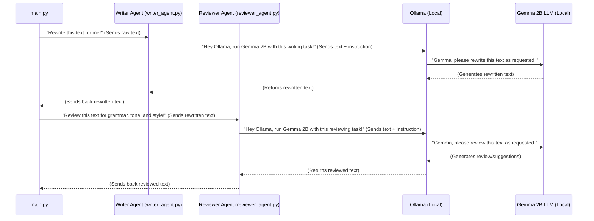

# Chapter 1: AI Text Transformation Agents

Welcome to the exciting world of automated book publishing! In this journey, we're building a system that can take raw text and transform it into a polished, engaging chapter, just like a professional writer and editor would.

Imagine you have a great idea for a book, but you're not a professional writer. You might have some rough notes or even a very basic draft. Wouldn't it be amazing if an intelligent assistant could help you turn those rough ideas into something beautiful and readable? This is exactly the problem our **AI Text Transformation Agents** solve!

These agents are like your personal creative writing team, working tirelessly behind the scenes. They take your initial text and make it shine.

---

### What are AI Text Transformation Agents?

Think of these agents as the **"brains"** of our book-writing operation. They are powered by a special kind of Artificial Intelligence called a **Large Language Model (LLM)**. In our project, we use an LLM named **Gemma 2B**. Don't worry about the "2B" part for now; just know it's a powerful AI that understands and generates human-like text.

What's really cool is that Gemma 2B runs **locally on your own computer**! We use a tool called **Ollama** to easily talk to Gemma 2B and tell it what to do. Ollama acts like a translator, letting our agents communicate with the AI brain.

Our project has two main types of these agents:

1.  **The Writer Agent (The Novelist):** This agent's job is to take plain, raw text and rewrite it into a more captivating and engaging story. It's like a novelist who knows how to hook a reader.
2.  **The Reviewer Agent (The Editor):** Once the Writer Agent has done its job, the Reviewer Agent steps in. This agent is like a meticulous editor. It checks the rewritten text for grammar mistakes, ensures the tone is consistent, and suggests improvements to make it even better.

Together, these two agents form a powerful duo for transforming text!

---

### How Do We Use These Agents?

Let's look at how these agents work together in our project's main flow. First, we get some raw text (we'll learn how in the next chapter!). Then, we hand it over to our AI agents.

In our `main.py` file, after getting some raw text, we use simple commands to activate our agents:

```python
# main.py (simplified)
from ai_writer.writer_agent import ai_writer
from ai_writer.reviewer_agent import ai_reviewer

# ... (imagine 'cleaned' is our raw text after some initial cleanup)

print("Initiating AI writer...")
spun = ai_writer(cleaned) # The Writer Agent gets to work!
print("AI writer done.")

print("Initiating AI reviewer...")
reviewed = ai_reviewer(spun) # The Reviewer Agent checks the rewritten text!
print("AI reviewer done.")

# Now 'spun' holds the rewritten text, and 'reviewed' holds the editor's improvements.
```

In this snippet:
*   `ai_writer(cleaned)` calls our Writer Agent, giving it the `cleaned` text. It then returns a new, rewritten version, which we store in the `spun` variable.
*   `ai_reviewer(spun)` calls our Reviewer Agent, giving it the `spun` (rewritten) text. It then returns a reviewed and improved version, stored in `reviewed`.

It's that simple to use them from the outside! You provide text, and they give you transformed text back.

---

### Under the Hood: How the Agents Work Their Magic

Let's peel back the layers and see what happens when you call `ai_writer()` or `ai_reviewer()`.

#### Step-by-Step Flow:

When `main.py` asks an agent to do its job, here's the basic sequence of events:



As you can see, both agents follow a similar pattern: they receive text, craft a specific request (a "prompt") for Gemma 2B, send it through Ollama, wait for Gemma's response, and then return the result.

#### Diving into the Code:

Let's look at simplified versions of the actual Python files that make these agents work.

**1. The Writer Agent (`ai_writer/writer_agent.py`):**

This agent's main job is to create a clear instruction for Gemma 2B and then send it using Ollama.

```python
# ai_writer/writer_agent.py (simplified)
import subprocess # Helps us run commands on your computer

def ai_writer(text):
    # This is the "instruction" for Gemma 2B, called a prompt
    prompt = f"Rewrite this chapter with more engaging narrative:\n{text}"

    # We tell your computer to run the 'ollama' command
    result = subprocess.run(
        ["ollama", "run", "gemma:2b"], # Run ollama with gemma:2b model
        input=prompt,                  # Give it our instruction (prompt)
        text=True,                     # Treat input/output as text
        capture_output=True            # Capture what ollama says back
    )
    return result.stdout.strip()       # Return Gemma's rewritten text
```

In this code:
*   `prompt = f"..."` creates the specific instruction for Gemma. It tells Gemma what to do ("Rewrite this chapter...") and provides the text to work on.
*   `subprocess.run(...)` is the magic command that talks to Ollama. It's like typing `ollama run gemma:2b` into your computer's terminal and then pasting the `prompt`. Ollama then passes this to Gemma 2B.
*   Gemma 2B processes the prompt and generates a rewritten version.
*   The `result.stdout.strip()` part grabs Gemma's output and sends it back to wherever `ai_writer` was called (e.g., `main.py`).

**2. The Reviewer Agent (`ai_writer/reviewer_agent.py`):**

The Reviewer Agent works almost identically to the Writer Agent, but with a different instruction (prompt) for Gemma 2B.

```python
# ai_writer/reviewer_agent.py (simplified)
import subprocess

def ai_reviewer(text):
    # This prompt tells Gemma 2B to act as an editor
    prompt = f"Check grammar, tone, and suggest improvements:\n{text}"

    # Again, we run the 'ollama' command
    result = subprocess.run(
        ["ollama", "run", "gemma:2b", prompt], # Run ollama with gemma:2b and our prompt
        capture_output=True,                   # Capture what ollama says back
        text=True
    )
    return result.stdout.strip()               # Return Gemma's reviewed text
```

Here, the key difference is the `prompt`. Instead of asking Gemma to rewrite, we ask it to "Check grammar, tone, and suggest improvements." This shows how we can guide the same AI model (Gemma 2B) to perform different tasks just by changing the instructions we give it.

---

### Conclusion

In this chapter, we've met the core "brains" of our project: the **AI Text Transformation Agents**. You learned that these agents (the Writer and Reviewer) use **Gemma 2B**, a powerful local AI model, via **Ollama** to rewrite and refine text. They are responsible for making raw information engaging and grammatically sound.

You also saw how simple it is to use them in our `main.py` and got a peek at the underlying code that allows them to communicate with Gemma 2B.

But where does this "raw text" come from in the first place? How do we get the initial book chapter that these agents will transform? That's what we'll explore in our next chapter, where we discuss the **Content Scraper**!

[Next Chapter: Content Scraper](02_content_scraper_.md)

---

Generated by [AI Codebase Knowledge Builder]