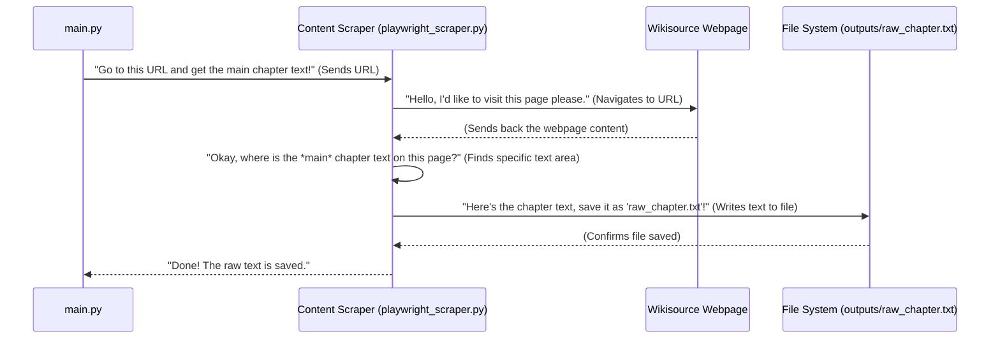

# Chapter 2: Content Scraper

Welcome back to our journey of building an automated book publishing system! In the last chapter, we met our fantastic [AI Text Transformation Agents](01_ai_text_transformation_agents_.md) – the Writer and Reviewer. They're brilliant at taking raw text and making it shine, just like a professional author and editor.

But before our AI agents can work their magic, they need something to work *on*. Where do we get that initial, raw text for a book chapter? Imagine you want to create summaries or new versions of classic literature that's freely available online, like books on Wikisource. You can't just type out an entire chapter yourself every time!

This is where our next hero comes in: the **Content Scraper**.

---

### What is a Content Scraper? (Our Digital Librarian)

Think of the **Content Scraper** as your incredibly diligent personal librarian. Instead of physically going to a library, this librarian ventures out onto the internet, specifically to online "libraries" like Wikisource. Its main job is to find a specific "book" (or in our case, a chapter) you're interested in, carefully "read" its main text, and then bring that text back to you.

In our project, the Content Scraper uses special web automation tools to:

1.  **Visit a specific webpage URL:** Like opening a book to a particular page.
2.  **Locate the main text content:** Finding the actual story or information, ignoring menus, ads, or other distractions.
3.  **Extract that content:** Copying the text.
4.  **Save it as a raw file:** Putting it into a digital notebook (a text file) for our [AI Text Transformation Agents](01_ai_text_transformation_agents_.md) to use later.

---

### How We Use the Content Scraper

Let's look at a concrete example. Our project is designed to process chapters from books, and Wikisource is a great place to find freely available texts. Imagine we want to get the first chapter of "The Gates of Morning" from Wikisource.

Our `main.py` file, which orchestrates the entire workflow, first asks the Content Scraper to do its job.

Here's how it looks in our `main.py`:

```python
# main.py (simplified)
from scraping.playwright_scraper import scrape_chapter

if __name__ == "__main__":
    # This is the URL of the chapter we want to get
    url = "https://en.wikisource.org/wiki/The_Gates_of_Morning/Book_1/Chapter_1"

    print("Scraping from webpage...")
    scrape_chapter(url) # We call our scraper with the URL!
    print("Scraping done.")

    # ... The rest of the workflow (AI agents, etc.) happens here
```

In this small snippet:

*   `url` holds the address of the specific chapter we want to "fetch" from the internet.
*   `scrape_chapter(url)` is the command that tells our Content Scraper to go to that `url` and do its work.

After this line runs, you won't see the text immediately on your screen. Instead, the scraper quietly saves the extracted text into a file named `raw_chapter.txt` inside an `outputs` folder. This file then becomes the starting point for our [AI Text Transformation Agents](01_ai_text_transformation_agents_.md).

---

### Under the Hood: How the Scraper Works Its Magic

Let's peek behind the curtain and see what happens when `scrape_chapter(url)` is called.

#### Step-by-Step Flow:

Here's a simplified sequence of events when our Content Scraper is activated:



As you can see, the `main.py` file just gives a command, and the Content Scraper takes care of all the complex steps of interacting with the web and saving the information.

#### Diving into the Code:

Our Content Scraper lives in the file `scraping/playwright_scraper.py`. It uses a powerful tool called **Playwright**, which is like a robot that can control a web browser (like Chrome, Firefox, or Edge) automatically.

Here's a simplified look at the `scrape_chapter` function:

```python
# scraping/playwright_scraper.py (simplified)
from playwright.sync_api import sync_playwright
import os

def scrape_chapter(url, output_dir="outputs"):
    # 1. Make sure the 'outputs' folder exists
    os.makedirs(output_dir, exist_ok=True)

    # 2. Start Playwright to control a web browser
    with sync_playwright() as p:
        browser = p.chromium.launch() # Launch a Chrome-like browser
        page = browser.new_page()     # Open a new tab in the browser

        # 3. Go to the specified URL
        page.goto(url)

        # 4. Find the main content area and extract its text
        # '#mw-content-text' is like a unique "signpost" on Wikisource
        # that tells us where the main chapter text is located.
        content = page.inner_text("#mw-content-text")

        # 5. Save the extracted text to a file
        with open(f"{output_dir}/raw_chapter.txt", "w", encoding="utf-8") as f:
            f.write(content)

        browser.close() # Close the browser when done
```

Let's break down this code:

1.  `os.makedirs(output_dir, exist_ok=True)`: This line simply makes sure that an `outputs` folder exists on your computer. If it doesn't, it creates it. This is where our `raw_chapter.txt` file will be saved.

2.  `with sync_playwright() as p: ...`: This part starts Playwright. It's like turning on the robot that will control your browser.
    *   `browser = p.chromium.launch()`: This tells Playwright to open a new, hidden web browser (like Google Chrome).
    *   `page = browser.new_page()`: This opens a new, empty tab within that browser.

3.  `page.goto(url)`: This is the command that tells the browser to go to the specific web address (URL) we provided. The browser loads the page, just like when you type an address into your own web browser.

4.  `content = page.inner_text("#mw-content-text")`: This is the clever part!
    *   `#mw-content-text` is a special identifier (like a street address number) that points to the main content area on Wikisource pages. Every website has different identifiers, but this one works well for Wikisource.
    *   `page.inner_text(...)` tells Playwright to find whatever is at that "signpost" and grab all the text inside it. This ensures we only get the actual chapter and not other parts of the webpage.

5.  `with open(f"{output_dir}/raw_chapter.txt", "w", encoding="utf-8") as f: f.write(content)`: Finally, this code takes all the `content` we just extracted and writes it into a new file called `raw_chapter.txt` inside our `outputs` folder. The `encoding="utf-8"` just ensures that all kinds of characters (even special ones) are saved correctly.

6.  `browser.close()`: Once the work is done, Playwright closes the browser it opened.

This entire process happens very quickly, providing the raw text needed for the rest of our system!

---

### Conclusion

In this chapter, you've learned about the **Content Scraper**, our diligent digital librarian. Its job is to automatically visit web pages, extract the main text content, and save it as a raw file for our AI agents. You saw how `main.py` triggers this process and got a peek at the `playwright_scraper.py` code that uses Playwright to perform these web automation tasks.

Now that we know how to get our raw text and how our [AI Text Transformation Agents](01_ai_text_transformation_agents_.md) can rewrite and review it, how do we make all these different parts work together smoothly, one after another? That's what we'll explore in our next chapter, where we discuss the **Automated Workflow Engine**!

[Next Chapter: Automated Workflow Engine](03_automated_workflow_engine_.md)

---

Generated by [AI Codebase Knowledge Builder]