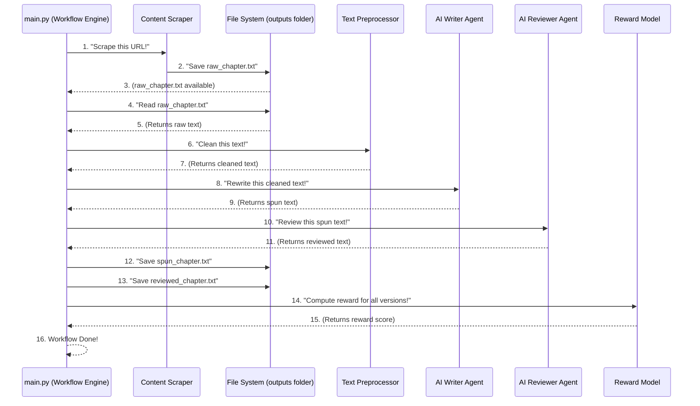

# Chapter 3: Automated Workflow Engine

Welcome back to our book publishing adventure! In [Chapter 1: AI Text Transformation Agents](01_ai_text_transformation_agents_.md), we met our clever AI Writer and Reviewer, who can transform raw text into engaging chapters. Then, in [Chapter 2: Content Scraper](02_content_scraper_.md), we learned how to gather that raw text from the internet using our digital librarian.

Now, imagine you have all these fantastic tools – a scraper to get content, and AI agents to rewrite and review it. That's great! But how do you make them all work together, one after another, in the correct order? It's like having all the ingredients for a delicious cake, but no recipe or chef to guide you. You need something to tell the scraper to go first, then pass its output to the writer, and then to the reviewer.

This is exactly where our next core concept comes in: the **Automated Workflow Engine**!

---

### What is the Automated Workflow Engine? (Our Project Manager)

Think of the **Automated Workflow Engine** as the **project manager** for our entire book publication system. It doesn't actually scrape content or write text itself. Instead, its main job is to:

1.  **Know the sequence:** Understand which step needs to happen first, second, and so on.
2.  **Call the right tools:** Tell the Content Scraper when to go, then tell the AI Writer to start, and so on.
3.  **Pass information along:** Make sure the output from one step (like the raw text from the scraper) becomes the input for the next step (like the raw text for the AI Writer).
4.  **Ensure everything runs smoothly:** Handle the overall process from start to finish, transforming an initial web page into a polished, AI-generated chapter.

In our project, the `main.py` file acts as this **Automated Workflow Engine**. It's the central script that orchestrates every single action.

---

### How We Use the Automated Workflow Engine (`main.py`)

Our `main.py` file is where all the magic of combining our different tools happens. It’s like the conductor of an orchestra, making sure each instrument plays its part at the right time.

Let's look at a simplified version of our `main.py` to see how it orchestrates the process:

```python
# main.py (simplified orchestration)
from scraping.playwright_scraper import scrape_chapter
from ai_writer.writer_agent import ai_writer
from ai_writer.reviewer_agent import ai_reviewer
from utils.text_cleaner import clean_text
from rl_model.reward_signal import compute_reward

if __name__ == "__main__":
    url = "https://en.wikisource.org/wiki/The_Gates_of_Morning/Book_1/Chapter_1"

    # Step 1: Scrape the chapter
    print("Scraping from webpage...")
    scrape_chapter(url) # The engine tells the scraper to work!
    print("Scraping done.")

    # ... more steps will follow ...
```

In this first snippet, you can see `main.py` doing a few key things:

*   **Imports:** It first `import`s all the different tools it needs, like `scrape_chapter` from our [Content Scraper](02_content_scraper_.md) and `ai_writer` from our [AI Text Transformation Agents](01_ai_text_transformation_agents_.md).
*   **Defines Input:** It sets the `url` for the chapter we want to process.
*   **Calls Scraper:** It then calls `scrape_chapter(url)`, initiating the web scraping process.

After `scrape_chapter(url)` runs, it saves the raw text into `outputs/raw_chapter.txt`. Now, our workflow engine needs to get that text to the next step.

```python
# main.py (continued orchestration)
    # ... (previous code for scraping) ...

    # Step 2: Read and clean the raw text
    print("Reading raw file...")
    with open("outputs/raw_chapter.txt", encoding="utf-8") as f:
        raw_text = f.read() # The engine reads the scraper's output
    print("Raw file read.")

    print("Cleaning text...")
    cleaned_text = clean_text(raw_text) # The engine passes it to the cleaner
    print("Text cleaned.")

    # ... more steps will follow ...
```

Here, the `main.py` engine performs two more crucial tasks:

*   **Reads File:** It reads the `raw_chapter.txt` file that the scraper just created.
*   **Cleans Text:** It then passes this `raw_text` to a helper function `clean_text` (from our [Text Preprocessing Utilities](06_text_preprocessing_utilities_.md), which we'll cover later) to make it ready for the AI. The output of `clean_text` is stored in `cleaned_text`.

Now that we have clean text, it's time for our AI agents to get to work!

```python
# main.py (continued orchestration)
    # ... (previous code for reading and cleaning) ...

    # Step 3: Let the AI agents transform the text
    print("Initiating AI writer...")
    spun_text = ai_writer(cleaned_text) # The engine gives cleaned text to writer
    print("AI writer done.")
    # print("Spun version preview:", spun_text[:200], "...") # for debugging

    print("Initiating AI reviewer...")
    reviewed_text = ai_reviewer(spun_text) # The engine gives spun text to reviewer
    print("AI reviewer done.")

    # ... more steps will follow ...
```

In this part of the orchestration:

*   **AI Writer:** The `main.py` engine calls `ai_writer(cleaned_text)`, passing the `cleaned_text` to our Writer Agent. The rewritten text (or "spun" text) is then stored in `spun_text`.
*   **AI Reviewer:** Immediately after, the engine calls `ai_reviewer(spun_text)`, taking the `spun_text` and giving it to the Reviewer Agent for improvements. The result is stored in `reviewed_text`.

Finally, the engine needs to save these new versions and evaluate them.

```python
# main.py (final orchestration steps)
    # ... (previous code for AI agents) ...

    # Step 4: Save the transformed chapters
    with open("outputs/spun_chapter.txt", "w", encoding="utf-8") as f:
        f.write(spun_text)
    with open("outputs/reviewed_chapter.txt", "w", encoding="utf-8") as f:
        f.write(reviewed_text)
    print("Spun and reviewed chapters saved to outputs/.")

    # Step 5: Calculate a reward score (we'll learn more about this later!)
    reward_score = compute_reward(cleaned_text, spun_text, reviewed_text, feedback_score=0.9)
    print("Reward score calculated:", reward_score)

    print("Workflow complete!")
```

Here, the `main.py` engine:

*   **Saves Files:** Writes the `spun_text` and `reviewed_text` into separate files in the `outputs` folder.
*   **Computes Reward:** Calls `compute_reward` (from our [Reward Model Logic](05_reward_model_logic_.md)) to evaluate how good the AI-generated content is. This is a very important step for training our system!

As you can see, the `main.py` script ties everything together, ensuring each part runs in order and passes its results to the next.

---

### Under the Hood: How the Engine Orchestrates

Let's visualize the entire process that our `main.py` (our Automated Workflow Engine) manages from start to finish.

#### Step-by-Step Flow:

Here's a simple diagram showing the flow of information and control:



This diagram shows how `main.py` is constantly communicating with and coordinating all the different components. It reads from files, passes data to functions, receives results, and writes new files, all in a carefully planned sequence.

#### Diving into the Code: (`main.py` again)

While we've already shown snippets, the full `main.py` file is the heart of the **Automated Workflow Engine**. It brings together all the pieces we've discussed:

```python
# main.py (complete simplified view)
from dotenv import load_dotenv
load_dotenv() # Load environment variables if needed

from scraping.playwright_scraper import scrape_chapter
from ai_writer.writer_agent import ai_writer
from ai_writer.reviewer_agent import ai_reviewer
from utils.text_cleaner import clean_text
from rl_model.reward_signal import compute_reward

if __name__ == "__main__":
    url = "https://en.wikisource.org/wiki/The_Gates_of_Morning/Book_1/Chapter_1"

    # Orchestration begins!
    scrape_chapter(url) # Get raw content

    with open("outputs/raw_chapter.txt", encoding="utf-8") as f:
        raw_content = f.read() # Read raw content

    cleaned_content = clean_text(raw_content) # Prepare content

    spun_content = ai_writer(cleaned_content) # AI rewrites
    reviewed_content = ai_reviewer(spun_content) # AI reviews

    with open("outputs/spun_chapter.txt", "w", encoding="utf-8") as f:
        f.write(spun_content) # Save spun version
    with open("outputs/reviewed_chapter.txt", "w", encoding="utf-8") as f:
        f.write(reviewed_content) # Save reviewed version

    reward = compute_reward(cleaned_content, spun_content, reviewed_content, feedback_score=0.9)
    print("Reward score:", reward)
    # Orchestration ends!
```

This complete `main.py` file *is* our Automated Workflow Engine. Each line represents a step in the process, called in the correct order to achieve our goal: turning a web chapter into a refined, AI-generated chapter with a calculated reward score. It demonstrates how to call different functions (our tools/agents) and how to handle the data flow between them.

---

### Conclusion

In this chapter, you've learned that the **Automated Workflow Engine** (our `main.py` script) is the project manager that coordinates all the parts of our automated book publishing system. It ensures that the [Content Scraper](02_content_scraper_.md) gets the raw text, passes it to the [AI Text Transformation Agents](01_ai_text_transformation_agents_.md) for rewriting and reviewing, and finally calculates a reward score using the [Reward Model Logic](05_reward_model_logic_.md). This orchestration is key to transforming raw online content into a refined, AI-generated chapter.

But what if the AI-generated chapter isn't quite perfect? How do we, as humans, provide our input and improve the process? That's what we'll discover in our next chapter, where we discuss the **Human Feedback Interface**!

[Next Chapter: Human Feedback Interface](04_human_feedback_interface_.md)

---

Generated by [AI Codebase Knowledge Builder]