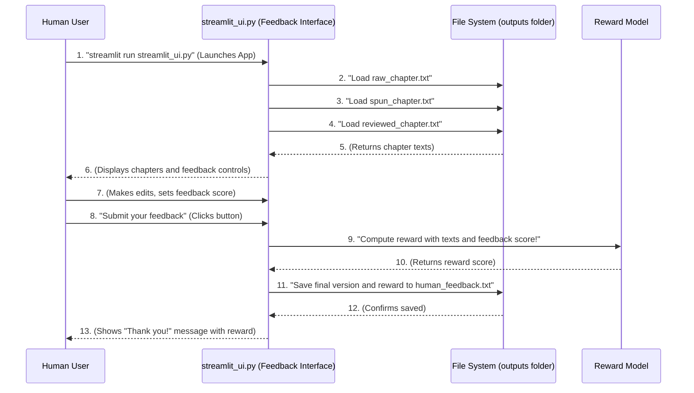

# Chapter 4: Human Feedback Interface

Welcome back to our automated book publishing journey! In our last chapter, [Automated Workflow Engine](03_automated_workflow_engine_.md), we saw how our `main.py` script orchestrates the entire process: scraping raw text, sending it to our [AI Text Transformation Agents](01_ai_text_transformation_agents_.md) for rewriting and reviewing, and finally saving these versions. The workflow engine ensures everything runs smoothly and automatically.

But here's a crucial question: What if the AI isn't perfect? What if its rewritten chapter has a few awkward phrases, or the reviewer missed a grammar error? How do we ensure the quality of the AI's work and, more importantly, how do we *teach* the AI to get better over time?

This is where our next vital component comes into play: the **Human Feedback Interface**.

---

### What is the Human Feedback Interface? (The AI's Teacher)

Imagine you're supervising a new assistant. They do their best work, but sometimes they need a bit of guidance or correction. You'd want a clear, easy way to review their work, make changes, and tell them what you liked or didn't like.

The **Human Feedback Interface** is exactly that for our AI. It's like a special "quality control panel" or a "teacher's dashboard" designed specifically for you, the human, to interact with the AI's generated content.

In our project, this interface is a user-friendly web application built with **Streamlit**. Streamlit is a fantastic Python library that lets us create interactive web apps with very little code, making it super easy to build this kind of feedback system.

With this interface, a human can:

1.  **View all versions:** See the `Original` raw text, the `AI Spun` (rewritten) text, and the `AI Reviewed` text side-by-side.
2.  **Make final edits:** Directly adjust the AI's output to make it perfect.
3.  **Provide a feedback score:** Give a subjective rating (e.g., from 0.0 to 1.0) on how good the AI's work was.
4.  **Approve content:** Signal that the content is ready.

This human input is absolutely crucial because it provides valuable "lessons" to the AI, helping it learn and improve its future performance.

---

### How to Use the Human Feedback Interface

First, remember that our [Automated Workflow Engine](03_automated_workflow_engine_.md) (the `main.py` script) runs and *produces* the AI-generated chapters. So, before you can use the feedback interface, you need to run `main.py` at least once to create the `raw_chapter.txt`, `spun_chapter.txt`, and `reviewed_chapter.txt` files in your `outputs/` folder.

Once `main.py` has finished its job, you can launch the **Human Feedback Interface**.

To use it, you'll run a simple command in your terminal:

```bash
# In your terminal, from the project's root folder
streamlit run streamlit_ui.py
```

After running this command, a new tab will automatically open in your web browser, showing the interactive feedback application.

You will see something like this (conceptually):

*   **Original Chapter:** A box showing the text scraped from the website.
*   **AI Spun Text:** A box showing the chapter rewritten by our Writer Agent.
*   **AI Reviewed Text:** A box showing the chapter improved by our Reviewer Agent (this will initially be the same as the "AI Spun Text" but with potential edits).
*   **Your Final Approved Version:** An editable box where you can make any last changes to the `AI Reviewed Text`.
*   **How do you rate the AI output?**: A slider you can drag to give a score from 0.0 (bad) to 1.0 (perfect).
*   **Submit your feedback** button: Click this after you're happy with your edits and score.

When you click "Submit your feedback", the interface will save your final version and score, and use them to calculate a "reward" for the AI – which is how we teach it!

---

### Under the Hood: How the Interface Works Its Magic

Let's see what happens behind the scenes when you launch and use the Human Feedback Interface.

#### Step-by-Step Flow:



As you can see, the `streamlit_ui.py` app first gathers all the AI-generated content. Then, it waits for you to provide your invaluable human judgment, and finally, it processes that judgment to generate a learning signal for the AI.

#### Diving into the Code: (`streamlit_ui.py`)

Our Human Feedback Interface lives in the file `streamlit_ui.py` at the root of our project. Let's break down the key parts.

**1. Loading the Chapter Content:**

The first thing the interface does is load the raw, spun, and reviewed chapter texts that were saved by our [Automated Workflow Engine](03_automated_workflow_engine_.md) into the `outputs` folder.

```python
# streamlit_ui.py (simplified)
import streamlit as st # The Streamlit library
import os # To check if files exist

# Helper to load content safely
def load_file(path):
    if os.path.exists(path):
        with open(path, "r", encoding="utf-8") as f:
            return f.read()
    return "" # Return empty string if file not found

# Load content from the 'outputs' folder
raw = load_file("outputs/raw_chapter.txt")
spun = load_file("outputs/spun_chapter.txt")
reviewed = load_file("outputs/reviewed_chapter.txt")

# ... rest of the app setup
```

Here:
*   `load_file` is a helper function that tries to read a file and returns its content. If the file isn't there, it just returns an empty string to prevent errors.
*   `raw`, `spun`, and `reviewed` variables now hold the content generated by the previous steps in our workflow.

**2. Displaying Content and Feedback Controls:**

Streamlit makes it incredibly easy to display text, input fields, and buttons.

```python
# streamlit_ui.py (simplified)

# ... (previous file loading code) ...

st.title("Automated Book Workflow, Review & Feedback") # Main title

st.subheader("Original Chapter")
st.text_area("Original Text", raw, height=200, disabled=True) # Display only

st.subheader("AI Spun text")
st.text_area("AI Rewritten Text", spun, height=200, disabled=True)

st.subheader("AI Reviewed text")
st.text_area("Reviewed Text", reviewed, height=200, disabled=True)

# Human Final Approval/Feedback - This is editable!
st.subheader("User Final Approval")
final_version = st.text_area("Your Final Approved Version", reviewed, height=200)

feedback_score = st.slider("How do you rate the AI output?", 0.0, 1.0, 0.8) # Slider for score
```

In this section:
*   `st.title()` and `st.subheader()` create headings on our web page.
*   `st.text_area()` displays our chapter content. We set `disabled=True` for the first three so you can only view them.
*   The `final_version` text area is *editable*, allowing you to make your final changes.
*   `st.slider()` creates an interactive slider for you to choose a feedback score between 0.0 and 1.0. The `0.8` is the starting value.

**3. Processing Feedback and Calculating Reward:**

Finally, we need a button to submit the feedback and logic to handle what happens when that button is clicked.

```python
# streamlit_ui.py (simplified)
from rl_model.reward_signal import compute_reward # Import our reward function
from utils.text_cleaner import clean_text # Our text cleaning utility

# ... (previous UI setup code) ...

if st.button("Submit your feedback"): # Check if the button is clicked
    # Clean the raw text again before passing to reward model
    cleaned_raw_for_reward = clean_text(raw)
    
    # Calculate the reward using human feedback
    reward = compute_reward(cleaned_raw_for_reward, spun, reviewed, feedback_score)

    # Save the final version and feedback
    with open("outputs/human_feedback.txt", "w", encoding="utf-8") as f:
        f.write(f"Final Version:\n{final_version}\n\nFeedback Score: {feedback_score}\nReward: {reward:.3f}\n")

    st.success(f"Thank you for your feedback! Reward Score: {reward:.3f}")
```

Here's what's happening:
*   `if st.button("Submit your feedback"):` This line is key. The code inside this `if` block only runs when you click the "Submit your feedback" button.
*   `clean_text(raw)`: We re-clean the original raw text just in case, ensuring consistency for the reward calculation. This `clean_text` function comes from our [Text Preprocessing Utilities](06_text_preprocessing_utilities_.md).
*   `reward = compute_reward(...)`: This calls our special `compute_reward` function from the [Reward Model Logic](05_reward_model_logic_.md). It takes the original, spun, reviewed texts, and *your feedback score* to calculate how "good" the AI's output was.
*   `with open(...) as f: f.write(...)`: This saves all the important information (your final edited version, your feedback score, and the calculated reward) into a new file called `human_feedback.txt` in the `outputs` folder. This log is super useful for tracking improvements!
*   `st.success(...)`: This displays a nice green success message on the web page, showing you the calculated reward score.

This `streamlit_ui.py` file is the bridge that allows you, the human, to guide and teach our AI system, ensuring the quality of the generated chapters improves over time!

---

### Conclusion

In this chapter, you've learned about the **Human Feedback Interface**, a critical part of our automated book workflow. This user-friendly Streamlit application acts as the AI's teacher, allowing you to view, edit, score, and approve AI-generated chapters. Your feedback is not just for quality control; it's a vital signal that helps our AI system learn and get better.

Now that we understand how human feedback is gathered, the next logical step is to explore how this feedback is translated into a measurable score that the AI can understand and use for learning. That's what we'll dive into in our next chapter, where we discuss the **Reward Model Logic**!

[Next Chapter: Reward Model Logic](05_reward_model_logic_.md)

---

Generated by [AI Codebase Knowledge Builder]