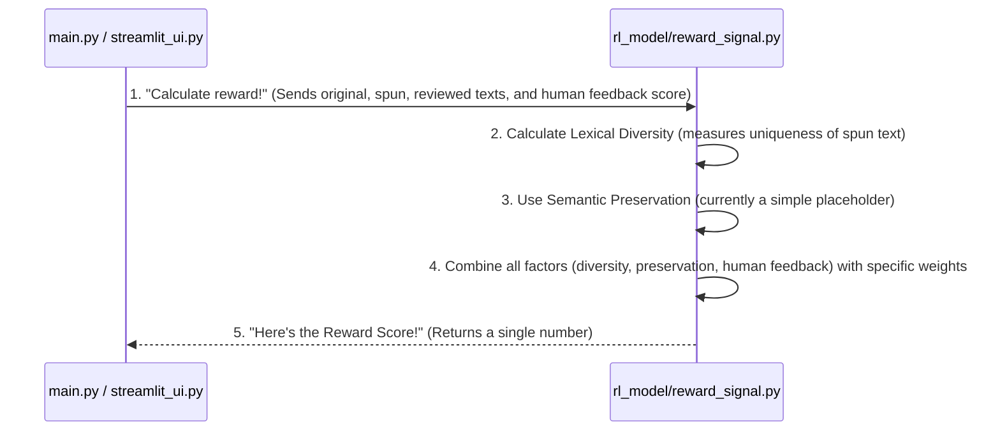

# Chapter 5: Reward Model Logic

Welcome back, aspiring AI book publishers! In our previous chapter, [Human Feedback Interface](04_human_feedback_interface_.md), we learned how you, a human, can review the AI's generated chapters, make edits, and crucially, give a "feedback score." This score is your direct way of telling the AI, "Hey, you did a great job!" or "Hmm, you need to improve here."

But how does the AI actually *understand* your feedback? How does a simple number from you translate into something the AI can learn from? Imagine a student getting a grade on an essay. That grade tells them how well they did, and helps them learn for the next essay.

This is exactly the job of our next component: the **Reward Model Logic**. It's the "grading system" for our AI, taking all sorts of information, including your valuable feedback, and boiling it down into a single, meaningful "reward score."

---

### What is the Reward Model Logic? (The AI's Grading System)

Think of the **Reward Model Logic** as a super-smart teacher who looks at everything your AI student produces and gives it a grade. This grade, or **reward score**, is a single number that tells our AI how successful its last effort was. The higher the score, the better the AI did!

Why is this "grade" so important? Because, in the future, we can use these scores to *train* our AI to get better. It's like telling a student, "Keep doing what you did to get that A!" or "Let's try a different approach to improve that C." This learning process is called **Reinforcement Learning**, and the reward score is its vital signal.

Our Reward Model calculates this score based on a few key things:

1.  **Uniqueness (Lexical Diversity):** Is the AI just copying the original text, or is it truly rewriting it with its own words? We want original, diverse language.
2.  **Meaning Preservation (Semantic Preservation):** Did the AI keep the original meaning of the chapter, or did it change the story? (For now, this is a simple placeholder, but it's a very important goal!).
3.  **Human Feedback:** This is your direct rating from the [Human Feedback Interface](04_human_feedback_interface_.md). It's incredibly valuable because it comes from a real person's judgment!

Combining these factors gives us a comprehensive grade for the AI's work.

---

### How We Use the Reward Model Logic

The Reward Model Logic is used in two main places:

1.  **In `main.py` (our [Automated Workflow Engine](03_automated_workflow_engine_.md)):** After the AI agents have done their work, `main.py` calculates an initial reward score. This gives us an immediate idea of the AI's performance based on predefined factors and a default human feedback score.
2.  **In `streamlit_ui.py` (our [Human Feedback Interface](04_human_feedback_interface_.md)):** When you, the human, provide your specific feedback score through the web interface, the Reward Model recalculates the reward using your precise input.

Let's see how `main.py` calls it to get a reward score:

```python
# main.py (simplified)
# ... (imports and previous steps like scraping, cleaning, AI writing/reviewing) ...

from rl_model.reward_signal import compute_reward

if __name__ == "__main__":
    # ... (Imagine 'cleaned', 'spun', 'reviewed' texts are ready) ...

    # Calculate a reward score with a placeholder human feedback
    reward_score = compute_reward(cleaned, spun, reviewed, feedback_score=0.9)
    print("Reward score calculated:", reward_score)
```
In this snippet, `main.py` calls the `compute_reward` function. It gives the function the `cleaned` (original) text, the `spun` (rewritten) text, the `reviewed` text, and a `feedback_score`. Here, `0.9` is used as a stand-in, meaning we're assuming a pretty good human rating for this automated run. The function then returns a single `reward_score` which is printed to the console.

And here's how `streamlit_ui.py` uses it with your actual feedback:

```python
# streamlit_ui.py (simplified)
# ... (imports, loading of texts, UI setup for displaying chapters and slider) ...

from rl_model.reward_signal import compute_reward
from utils.text_cleaner import clean_text

# ... (Assume 'raw', 'spun', 'reviewed' texts are loaded, and 'feedback_score'
#      is set by the slider, 'final' is your edited text) ...

if st.button("Submit your feedback"):
    cleaned_raw_for_reward = clean_text(raw) # Re-clean raw text for consistency

    # Calculate the reward using YOUR human feedback!
    reward = compute_reward(cleaned_raw_for_reward, spun, reviewed, feedback_score)

    st.success(f"Thank you for your feedback! Reward Score: {reward:.3f}")
    # ... (code to save feedback to file) ...
```
When you click the "Submit your feedback" button in the Streamlit app, `streamlit_ui.py` gathers all the texts and *your* chosen `feedback_score` from the slider. It then calls `compute_reward` with these inputs, and you immediately see the calculated `Reward Score` on the screen. This way, your rating directly influences the AI's grade!

---

### Under the Hood: How the Reward Model Works Its Magic

Let's peek behind the scenes to understand how `compute_reward` actually calculates this important score.

#### Step-by-Step Flow:

Here's a simple diagram showing how the reward calculation fits into the workflow:



The `RewardModel` component takes all the pieces of information it needs, does some calculations, and then spits out that single "grade" for the AI's work.

#### Diving into the Code: (`rl_model/reward_signal.py`)

Our Reward Model Logic lives in the file `rl_model/reward_signal.py`. It contains the `compute_reward` function, which is responsible for crunching the numbers.

```python
# rl_model/reward_signal.py
# This function calculates how "good" the AI's output is
def compute_reward(original, spun, reviewed, feedback_score):
    # 1. Calculate Lexical Diversity (how unique the AI's words are)
    # We split the 'spun' text into words and count how many are unique.
    # A higher number means the AI used more varied words, which is good!
    spun_words = spun.split()
    if not spun_words: # Avoid division by zero if text is empty
        lexical_diversity = 0.0
    else:
        lexical_diversity = len(set(spun_words)) / len(spun_words)

    # 2. Semantic Preservation (how well the meaning was kept)
    # For now, this is a simple placeholder. In the future, this would be
    # a more advanced AI model comparing meanings.
    semantic_preservation = 1.0  # Means we assume meaning is perfectly preserved for now

    # 3. Combine all factors into a single reward score
    # We use different "weights" to show how important each factor is.
    # Human feedback is quite important, so it gets a good weight!
    reward = (0.4 * lexical_diversity) + \
             (0.4 * semantic_preservation) + \
             (0.2 * feedback_score)

    return reward
```

Let's break down this simplified code:

1.  `def compute_reward(original, spun, reviewed, feedback_score):`: This defines our function. It takes the `original` text, the `spun` (rewritten) text from the Writer Agent, the `reviewed` text from the Reviewer Agent, and the `feedback_score` (from you!) as its inputs.

2.  `spun_words = spun.split()`: This line takes the AI's rewritten text (`spun`) and breaks it into a list of individual words. For example, "Hello world" becomes `['Hello', 'world']`.

3.  `len(set(spun_words)) / len(spun_words)`: This is how we calculate **lexical diversity**.
    *   `set(spun_words)`: This creates a "set" of words. A set only stores unique items, so if the text had "the the cat," `set()` would make it `{'the', 'cat'}`. This removes duplicate words.
    *   `len(set(spun_words))`: This counts how many *unique* words there are.
    *   `len(spun_words)`: This counts the *total* number of words.
    *   Dividing unique words by total words gives us a percentage. A higher percentage means more unique words, which usually indicates better, more original writing!

4.  `semantic_preservation = 1.0`: This is currently a simple placeholder. In a more advanced system, this would be another AI model that compares the `original` text's meaning to the `spun` text's meaning, giving a score (e.g., from 0.0 to 1.0) on how well the meaning was kept. For now, we assume it's perfect (1.0).

5.  `reward = (0.4 * lexical_diversity) + (0.4 * semantic_preservation) + (0.2 * feedback_score)`: This is the final calculation!
    *   We multiply each factor (`lexical_diversity`, `semantic_preservation`, `feedback_score`) by a "weight." These weights (0.4, 0.4, 0.2) decide how much each factor contributes to the final `reward` score.
    *   For example, we're giving equal importance (0.4) to how unique the language is and how well the meaning is preserved (even though it's a placeholder).
    *   Your `feedback_score` also contributes significantly (0.2), ensuring your human judgment is part of the final grade.
    *   These weighted scores are added together to give the final `reward`.

6.  `return reward`: The function then sends this calculated `reward` score back to wherever it was called (e.g., `main.py` or `streamlit_ui.py`).

This simple yet effective logic allows us to objectively grade the AI's output, preparing us for future learning and improvements!

---

### Conclusion

In this chapter, you've met the **Reward Model Logic**, the "grading system" for our AI. You learned that it calculates a **reward score** based on factors like the uniqueness of the AI's writing (lexical diversity), a placeholder for meaning preservation, and most importantly, your direct human feedback. This reward score is crucial for future **Reinforcement Learning**, helping our AI continuously understand what good writing means and strive to improve.

Now that we understand how content is scraped, transformed by AI, reviewed by humans, and then graded, it's time to look at some foundational tools that make all this text processing easier and more consistent. That's what we'll explore in our next chapter, where we discuss the **Text Preprocessing Utilities**!

[Next Chapter: Text Preprocessing Utilities](06_text_preprocessing_utilities_.md)

---

Generated by [AI Codebase Knowledge Builder]