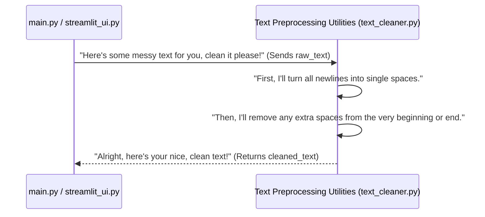

# Chapter 6: Text Preprocessing Utilities

Welcome back to our automated book publishing journey! In our previous chapter, [Reward Model Logic](05_reward_model_logic_.md), we learned how our AI's performance is graded based on factors like uniqueness and, crucially, your human feedback. The reward score helps the AI understand what "good" content looks like.

But before our brilliant AI agents can even *start* to transform text, or before any text is shown to you for feedback, there's a small but mighty step that often goes unnoticed: **making sure the text is clean and tidy!**

Imagine you're baking a cake. You wouldn't just dump all the ingredients into a bowl without first measuring them, sifting flour, or washing fruits. Similarly, our AI agents (and even your eyes!) need text that's properly prepared.

---

### What are Text Preprocessing Utilities? (Our Digital Cleaning Crew)

Think of the **Text Preprocessing Utilities** as the dedicated "cleaning crew" for all the text in our workflow. Their job is simple but essential: to take raw, messy text (like what we get directly from the internet) and make it neat, consistent, and ready for whatever comes next.

Why is this important? When we scrape content from the web using our [Content Scraper](02_content_scraper_.md), it often comes with unwanted "noise":

*   **Extra Newline Characters (`\n`):** These are like hitting "Enter" multiple times on your keyboard. Websites might use them for formatting, but for our AI, a long string of `\n` can be confusing or make the text look broken.
*   **Excess Whitespace:** This includes extra spaces at the beginning or end of a piece of text, or sometimes even multiple spaces in a row within the text.

These small imperfections can mess up how an AI understands sentences, or make the text look ugly and unprofessional when displayed to a human. Our **Text Preprocessing Utilities** ensure the text is uniform and easy to work with.

---

### How We Use the Text Preprocessing Utilities

Our cleaning crew is a simple function located in `utils/text_cleaner.py`. Its job is to take raw text, clean it up, and return the sparkling clean version.

Let's look at how our `main.py` (our [Automated Workflow Engine](03_automated_workflow_engine_.md)) and `streamlit_ui.py` (our [Human Feedback Interface](04_human_feedback_interface_.md)) use this utility.

First, in `main.py`, after the [Content Scraper](02_content_scraper_.md) has done its job and we've read the `raw_chapter.txt` file, the first thing we do is clean it before sending it to the [AI Text Transformation Agents](01_ai_text_transformation_agents_.md).

```python
# main.py (simplified)
from utils.text_cleaner import clean_text

if __name__ == "__main__":
    # ... (code for scraping and reading raw_chapter.txt into 'raw' variable) ...

    print("Cleaning text...")
    cleaned = clean_text(raw) # Our cleaning crew gets to work!
    print("Text cleaned.")

    # Now 'cleaned' text is ready for our AI agents
    # spun = ai_writer(cleaned)
    # reviewed = ai_reviewer(spun)
    # ...
```

In this snippet:
*   We `import clean_text` from our `utils` folder.
*   `cleaned = clean_text(raw)` is the magic line. We pass the `raw` text (straight from the website) to our `clean_text` function.
*   The function returns a new, tidy version of the text, which we store in the `cleaned` variable. This `cleaned` text is then passed to our AI Writer.

Similarly, in our `streamlit_ui.py`, we use `clean_text` to ensure the raw text is consistently cleaned before being used by the [Reward Model Logic](05_reward_model_logic_.md) for calculating the reward score.

```python
# streamlit_ui.py (simplified)
from utils.text_cleaner import clean_text
from rl_model.reward_signal import compute_reward

# ... (code for loading 'raw', 'spun', 'reviewed' texts and setting 'feedback_score') ...

if st.button("Submit your feedback"):
    # We clean the raw text one more time to ensure consistency for the reward model
    cleaned_raw_for_reward = clean_text(raw)
    
    # Calculate the reward using the cleaned raw text and other inputs
    reward = compute_reward(cleaned_raw_for_reward, spun, reviewed, feedback_score)
    
    # ... (code to save feedback) ...
```

Here, `cleaned_raw_for_reward = clean_text(raw)` ensures that even for the reward calculation, we are working with a consistently clean version of the original text.

---

### Under the Hood: How the Cleaning Crew Works Its Magic

Let's see what happens inside our `clean_text` function.

#### Step-by-Step Flow:

When `clean_text` is called, here's the basic sequence of events:



The `clean_text` function acts as a small but dedicated processor, transforming the input text according to its rules.

#### Diving into the Code: (`utils/text_cleaner.py`)

Our **Text Preprocessing Utilities** live in the file `utils/text_cleaner.py`. It's a very simple function:

```python
# utils/text_cleaner.py
def clean_text(raw_text):
    # Step 1: Replace all newline characters with a single space.
    # This turns multi-line text into a single continuous line.
    # Example: "Hello\nWorld" becomes "Hello World"
    cleaned = raw_text.replace("\n", " ")
    
    # Step 2: Remove any leading or trailing whitespace.
    # This gets rid of extra spaces at the very beginning or end of the text.
    # Example: "  Hello World   " becomes "Hello World"
    cleaned = cleaned.strip()
    
    return cleaned
```

Let's break down this simple code:

1.  `def clean_text(raw_text):`: This defines our cleaning function. It takes one piece of information, `raw_text`, which is the messy text we want to clean.

2.  `cleaned = raw_text.replace("\n", " ")`: This is the first cleaning step.
    *   `raw_text.replace(...)` is a built-in Python function for strings.
    *   It looks for every instance of the first argument (`"\n"`, which represents a newline character) and replaces it with the second argument (`" "`, which is a single space).
    *   This effectively takes multi-paragraph text and converts it into a single, long string of text, separated by spaces where the newlines used to be. This makes it easier for our AI to process as one continuous block.

3.  `cleaned = cleaned.strip()`: This is the second cleaning step.
    *   `.strip()` is another built-in Python string function.
    *   It removes any whitespace characters (spaces, tabs, newlines) from the very beginning and very end of the string.
    *   So, if our text ended up looking like `"  The chapter starts here.  "` after the first step, `.strip()` would remove those extra spaces, resulting in `"The chapter starts here."`.

4.  `return cleaned`: Finally, the function sends back the now-clean `cleaned` text.

This simple `clean_text` function is a crucial foundational piece, ensuring that all text flowing through our system is consistent, easy to read, and ready for advanced processing by our AI.

---

### Conclusion

In this chapter, you've learned about the **Text Preprocessing Utilities**, our project's "cleaning crew." These simple but essential tools ensure that all raw text, whether it's coming from the web or being prepared for our [Reward Model Logic](05_reward_model_logic_.md), is free of unwanted newline characters and excess whitespace. By making the text clean and consistent, we provide a solid foundation for our [AI Text Transformation Agents](01_ai_text_transformation_agents_.md) to do their best work and for you to review it without distractions.

Now that we understand how content is scraped, cleaned, transformed by AI, reviewed by humans, and then graded, we have many different versions of our chapters (raw, cleaned, spun, reviewed, human-approved). How do we keep track of all these versions and easily find them later? That's what we'll explore in our next chapter, where we discuss the **Semantic Version Store**!

[Next Chapter: Semantic Version Store](07_semantic_version_store_.md)

---

Generated by [AI Codebase Knowledge Builder]