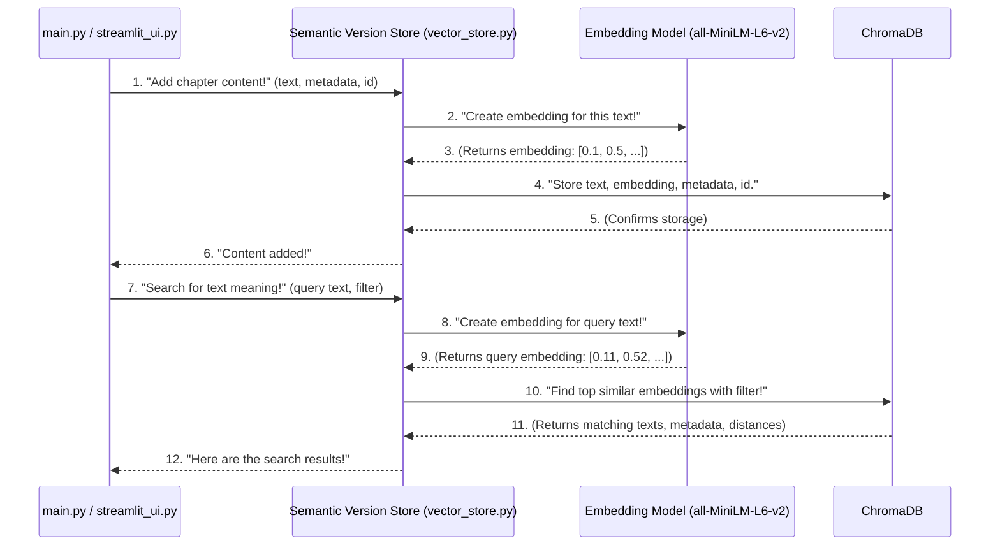

# Chapter 7: Semantic Version Store

Welcome back to the grand finale of our automated book publishing journey! Throughout this tutorial, we've explored many exciting components: from the [Content Scraper](02_content_scraper_.md) that fetches raw text, to our [AI Text Transformation Agents](01_ai_text_transformation_agents_.md) that rewrite and review, and the [Human Feedback Interface](04_human_feedback_interface_.md) that lets you guide the AI. We've even learned about the [Reward Model Logic](05_reward_model_logic_.md) that grades the AI's work and the [Text Preprocessing Utilities](06_text_preprocessing_utilities_.md) that keep our content tidy.

As you can imagine, after all these steps, we end up with many different versions of the *same* chapter:

*   The `raw` text straight from the internet.
*   The `cleaned` text after preprocessing.
*   The `AI-spun` text rewritten by our Writer Agent.
*   The `AI-reviewed` text improved by our Reviewer Agent.
*   Your `human-approved` final version.

That's a lot of text! If we just save these as separate text files, it would be difficult to manage, compare, and *find* specific versions later. Imagine trying to find "all chapters that talk about 'space exploration'" if you only have filenames like `chapter1.txt`, `chapter2.txt`, etc. You'd have to open and read every single one!

This is where our final, incredibly smart component comes in: the **Semantic Version Store**.

---

### What is the Semantic Version Store? (Our Smart Digital Archive)

Think of the **Semantic Version Store** as a highly organized and super-smart digital library, specifically designed to keep track of all the different versions of your chapters. It's not just a place to *store* files; it's a place to *understand* and *search* them based on their actual meaning.

Here's the problem it solves: How can we easily find all chapter versions that are *about* a specific topic, even if they use different words or come from different stages of our workflow? For example, you might want to find all reviewed versions that are *semantically similar* (meaning, similar in underlying topic) to a chapter about "ancient prophecies," regardless of whether the words "ancient" or "prophecies" are explicitly used.

Our Semantic Version Store acts as this intelligent archive. Instead of just saving plain text, it does something very clever:

1.  **Converts text into "Embeddings":** Each piece of text (whether it's raw, spun, or reviewed) is transformed into a unique "number-code" called an **embedding**. Think of an embedding as a mathematical fingerprint of the text's meaning. Texts with similar meanings will have very similar number-codes.
2.  **Stores Embeddings with ChromaDB:** These number-codes (embeddings) are then stored in a special database called **ChromaDB**. ChromaDB is perfect for this because it's designed to work with these numerical representations.
3.  **Enables Semantic Search:** Because we have these "meaning fingerprints," ChromaDB can quickly find chapters that are *similar in meaning* to a search query, even if the exact words don't match. It's like finding books in a library by *idea* instead of just by title or author! We can also add "metadata" (extra information like `version_type` or `chapter_id`) to make our searches even more specific.

This process allows us to create a powerful, searchable archive of all our chapter versions.

---

### Key Concepts Behind the Store

Let's break down the core ideas:

#### 1. Versions of Content

As mentioned, our system produces several versions of a chapter. The Semantic Version Store is designed to handle all of them:

*   **`raw`:** The original content from the [Content Scraper](02_content_scraper_.md).
*   **`cleaned`:** The preprocessed text from [Text Preprocessing Utilities](06_text_preprocessing_utilities_.md).
*   **`spun`:** The version rewritten by the [AI Writer Agent](01_ai_text_transformation_agents_.md).
*   **`reviewed`:** The version refined by the [AI Reviewer Agent](01_ai_text_transformation_agents_.md).
*   **`human_approved`:** The final, edited version from the [Human Feedback Interface](04_human_feedback_interface_.md).

Each of these is a distinct document we want to store and search.

#### 2. Embeddings (Text's Number-Code Fingerprints)

Imagine you want to categorize objects by their color. Instead of just writing "red," "blue," "green," you could give them numerical codes like `[1.0, 0.0, 0.0]` for red, `[0.0, 0.0, 1.0]` for blue, and `[0.0, 1.0, 0.0]` for green. These numbers are like coordinates in a color space.

**Embeddings** work similarly for text. They are lists of numbers (often hundreds of them!) that represent the meaning of a word, sentence, or even a whole chapter.
For example:
*   "cat" might become `[0.1, 0.5, -0.2, ...]`
*   "kitten" might become `[0.11, 0.52, -0.21, ...]` (very similar to "cat")
*   "car" might become `[0.9, -0.3, 0.8, ...]` (very different from "cat")

The magic is that an AI model (called an "embedding model") figures out these number-codes, ensuring that texts with similar meanings have number-codes that are "close" to each other in this mathematical space. Our project uses a pre-trained model called `all-MiniLM-L6-v2` for generating these embeddings.

#### 3. ChromaDB (Our Specialized Embedding Database)

**ChromaDB** is a special kind of database built from the ground up to store and search these embeddings very efficiently. It allows us to:
*   **Add** documents and their embeddings.
*   **Search** for documents whose embeddings are most similar to a given query's embedding. This is called **semantic search**.
*   **Filter** by "metadata" – extra tags or labels we attach to each document (e.g., `version_type="raw"`).

---

### How to Use the Semantic Version Store

Our `chromadb/vector_store.py` file sets up and provides functions to interact with our Semantic Version Store. Our `main.py` (the [Automated Workflow Engine](03_automated_workflow_engine_.md)) would integrate with this to save different versions as they are generated.

Let's look at how we would **add** chapter versions and then **search** for them.

#### 1. Initial Setup and Adding a Chapter Version

First, we need to get our ChromaDB ready and define an embedding function. This happens at the beginning of `chromadb/vector_store.py`.

```python
# chromadb/vector_store.py (simplified setup)
import chromadb
from chromadb.utils.embedding_functions import SentenceTransformerEmbeddingFunction

# 1. Define how to turn text into number-codes (embeddings)
embedding_fn = SentenceTransformerEmbeddingFunction(
    model_name="all-MiniLM-L6-v2"  # Using a pre-trained model for embeddings
)

# 2. Get our ChromaDB client
chroma_client = chromadb.Client()

# 3. Get or create a "collection" (like a table in a normal database)
collection = chroma_client.get_or_create_collection(
    name="chapters", # This is the name of our collection
    embedding_function=embedding_fn # Tell it to use our embedding function
)

# A simple function to add text to the store
def add_chapter_version(content, version_type, chapter_id, doc_id):
    collection.add(
        documents=[content],
        metadatas=[{"version_type": version_type, "chapter_id": chapter_id}],
        ids=[doc_id]
    )
    print(f"Added '{doc_id}' ({version_type}) to the Semantic Store.")

# Example: Adding a raw chapter and an AI-spun chapter
raw_content = "The sun rose over the hills, painting the sky with colors."
spun_content = "As dawn broke, a kaleidoscope of hues exploded across the sky above the undulating hills."

add_chapter_version(raw_content, "raw", "book1_chap1", "book1_chap1_raw")
add_chapter_version(spun_content, "spun", "book1_chap1", "book1_chap1_spun")
```

**Explanation:**
*   `SentenceTransformerEmbeddingFunction`: This tells ChromaDB to use the `all-MiniLM-L6-v2` model to convert our text into embeddings.
*   `chroma_client`: This is our connection to ChromaDB.
*   `collection.get_or_create_collection("chapters", ...)`: This creates a space named "chapters" where all our chapter versions will live. We also tell it which `embedding_function` to use for this collection.
*   `add_chapter_version` (our custom function): This function uses `collection.add()` to store the content.
    *   `documents`: The actual text content.
    *   `metadatas`: A dictionary of extra information (like tags). We add `version_type` (e.g., "raw", "spun") and `chapter_id` (e.g., "book1_chap1") here. This is super useful for filtering later!
    *   `ids`: A unique identifier for each piece of content.

#### 2. Searching for Chapters by Meaning

Now for the powerful part: semantic search! Let's say we want to find chapters that are semantically similar to a specific idea.

```python
# chromadb/vector_store.py (continued for searching)
# ... (previous setup and add_chapter_version function) ...

# A simple function to search the store
def search_chapter_versions(query_text, n_results=2, version_type=None):
    where_clause = {}
    if version_type:
        where_clause["version_type"] = version_type # Filter by version type if specified

    results = collection.query(
        query_texts=[query_text], # The text you want to search for
        n_results=n_results,      # How many top results to get
        where=where_clause        # Apply metadata filters
    )
    print(f"\n--- Searching for: '{query_text}' ---")
    for i, doc in enumerate(results['documents'][0]):
        metadata = results['metadatas'][0][i]
        distance = results['distances'][0][i] # How similar it is (lower is more similar)
        print(f"Result {i+1}: Chapter ID: {metadata['chapter_id']}, Version: {metadata['version_type']}, Distance: {distance:.2f}")
        print(f"  Content: {doc[:100]}...\n") # Show first 100 chars

# Example: Search for chapters about "beautiful morning" from any version
search_chapter_versions("a beautiful morning")

# Example: Search for only "spun" versions about "sunrise"
search_chapter_versions("the start of a new day", n_results=1, version_type="spun")
```

**Example Output (conceptual):**
```
--- Searching for: 'a beautiful morning' ---
Result 1: Chapter ID: book1_chap1, Version: spun, Distance: 0.25
  Content: As dawn broke, a kaleidoscope of hues exploded across the sky above the undulating hills...

Result 2: Chapter ID: book1_chap1, Version: raw, Distance: 0.32
  Content: The sun rose over the hills, painting the sky with colors....

--- Searching for: 'the start of a new day' ---
Result 1: Chapter ID: book1_chap1, Version: spun, Distance: 0.28
  Content: As dawn broke, a kaleidoscope of hues exploded across the sky above the undulating hills...
```

**Explanation:**
*   `search_chapter_versions` (our custom function): This uses `collection.query()` to perform a search.
    *   `query_texts`: The text you are searching *with*. ChromaDB will convert this into an embedding and find similar ones.
    *   `n_results`: How many of the most similar results you want back.
    *   `where`: This is a powerful feature! It allows us to filter results based on the `metadata` we stored. So, we can say "only show me `spun` versions," for example.
*   The output shows not just the content but also the `chapter_id`, `version_type`, and a `distance` score. A smaller distance means the content is more similar to your query.

This ability to quickly store and retrieve different versions, especially through semantic meaning, is incredibly powerful for managing our book content.

---

### Under the Hood: How the Semantic Version Store Works Its Magic

Let's look at the flow of how text gets into the store and how a search query finds relevant chapters.

#### Step-by-Step Flow:



**Explanation:**
1.  **Adding a Document:** When our `main.py` script (the `App`) wants to save a chapter version, it sends the text and its metadata to the `SemanticStore`. The `SemanticStore` then passes the text to the `EmbeddingModel` to get its numerical "meaning fingerprint." This embedding, along with the original text and metadata, is then stored in `ChromaDB`.
2.  **Searching for Documents:** When the `App` wants to find something, it sends a search `query text` to the `SemanticStore`. Again, the `SemanticStore` asks the `EmbeddingModel` to turn this query into an embedding. It then sends this query embedding to `ChromaDB` (along with any filters, like `version_type="spun"`). `ChromaDB` efficiently compares the query embedding to all stored embeddings, finds the most similar ones, applies any filters, and returns the matching documents, their metadata, and how "close" they are (their `distance`).

#### Diving into the Code (`chromadb/vector_store.py`)

The actual code in `chromadb/vector_store.py` is quite concise, primarily focused on setting up the ChromaDB client and collection, and using the `SentenceTransformerEmbeddingFunction` for converting text to embeddings.

```python
# chromadb/vector_store.py
import chromadb # The main ChromaDB library
from chromadb.utils.embedding_functions import SentenceTransformerEmbeddingFunction # For generating embeddings

# This line defines *how* we turn text into those "number-code fingerprints"
# We're using a pre-trained model called "all-MiniLM-L6-v2" which is good for general text.
embedding_fn = SentenceTransformerEmbeddingFunction(
    model_name="all-MiniLM-L6-v2"  # This model converts text into embeddings
)

# This creates or connects to our ChromaDB database
# It will create a local folder for the database files by default
chroma_client = chromadb.Client()

# This gets a specific "collection" (like a named folder or table) in our database
# If "chapters" collection doesn't exist, it creates it.
# We also tell it to use our 'embedding_fn' for this collection.
collection = chroma_client.get_or_create_collection(
    name="chapters", # The name of our collection
    embedding_function=embedding_fn # The function to generate embeddings for content in this collection
)

# You can add a wrapper function in your main.py or a utility file
# to make adding content easier, like the add_chapter_version example above.
# Example of directly using the collection.add() method:
# collection.add(
#     documents=["This is my chapter content."],
#     metadatas=[{"version_type": "raw", "chapter_id": "chapter_x"}],
#     ids=["chapter_x_raw"]
# )

# Example of directly using the collection.query() method:
# results = collection.query(
#     query_texts=["What is this chapter about?"],
#     n_results=1,
#     where={"version_type": "spun"}
# )
# print(results)
```

**Explanation:**
This file largely sets up the necessary components. The `collection` object is what we use in other parts of our project (like in `main.py` or a future search UI) to perform `add` and `query` operations. The `embedding_fn` is crucial because it's the bridge that turns human-readable text into the numerical format that ChromaDB understands and can efficiently search. By simply calling `collection.add()` or `collection.query()`, we are leveraging all the complex embedding and vector search logic that ChromaDB and the underlying `SentenceTransformer` provide, without needing to write it ourselves.

---

### Conclusion

In this final chapter, we've brought together all the pieces of our automated book publishing system by introducing the **Semantic Version Store**. You learned that this smart digital archive, powered by **ChromaDB** and **embeddings**, allows us to store all the different versions of our chapters (raw, spun, reviewed, human-approved) not just as plain text, but as "number-code fingerprints" that capture their meaning. This enables powerful **semantic search**, letting you find chapters based on their underlying topic, even if the exact keywords aren't present. We've seen how to add content and query it, using metadata to keep our archive organized.

This sophisticated storage and retrieval system ensures that all the valuable content generated and refined by our AI and human feedback is easily accessible and intelligently searchable, completing our journey in building an advanced automated book workflow.

Thank you for joining me on this exciting journey through the `Automatic_Book_summary` project! I hope this tutorial has provided a clear and beginner-friendly understanding of how all these powerful components work together to bring an AI-powered book publishing system to life.

---

Generated by [AI Codebase Knowledge Builder]