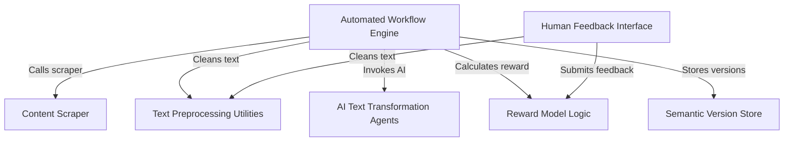

# Tutorial: Automatic_Book_summary

This project is an **AI-powered pipeline** that *automates* the process of creating improved book chapters. It starts by *scraping* raw content from websites, then uses a **local AI model** (Gemma 2B) to *rewrite* and *review* the text for better engagement and quality. A **human feedback interface** allows users to *fine-tune* the output and provide ratings, which helps a **reward model** continuously *learn and improve* the AI's performance, all while storing different versions for *semantic search*.

**Source Repository:** [https://github.com/Prathamesh282/Automatic_Book_summary](https://github.com/Prathamesh282/Automatic_Book_summary)

## Chapters

1. [AI Text Transformation Agents
](01_ai_text_transformation_agents_.md)
2. [Content Scraper
](02_content_scraper_.md)
3. [Automated Workflow Engine
](03_automated_workflow_engine_.md)
4. [Human Feedback Interface
](04_human_feedback_interface_.md)
5. [Reward Model Logic
](05_reward_model_logic_.md)
6. [Text Preprocessing Utilities
](06_text_preprocessing_utilities_.md)
7. [Semantic Version Store
](07_semantic_version_store_.md)

---

Generated by [AI Codebase Knowledge Builder]