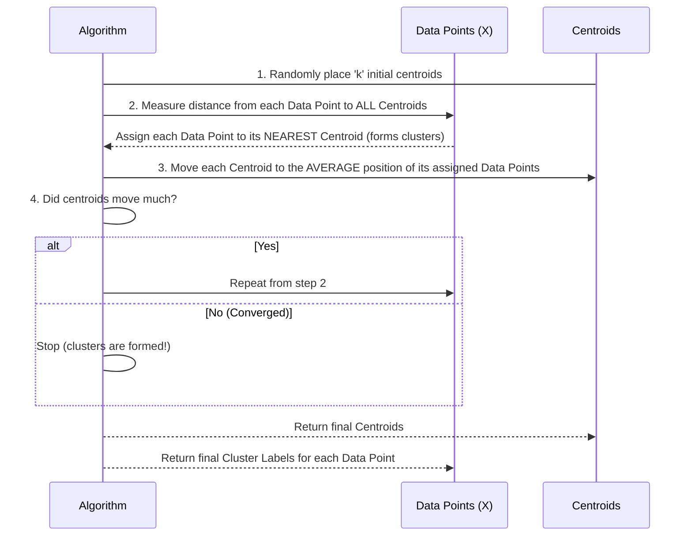

# Chapter 1: Clustering Algorithms

Welcome to the `Data-Warehouse-Algorithms` tutorial! In this chapter, we're going to start our journey into how computers can make sense of large amounts of data. Our first stop is a fascinating technique called **Clustering Algorithms**.

Imagine you're a librarian, and a huge truck just dumped thousands of brand new books into your library. The catch? None of them have subject tags, and you have no idea what they're about! You need to organize them so people can find similar books together. What do you do? You might start by picking up a few books, scanning them, and placing similar ones together. "This looks like sci-fi," you think, putting it with other books that seem to have spaceships on the cover. "This one is definitely history," you say, placing it with books about ancient civilizations. Slowly but surely, you start forming piles or "clusters" of similar books, even though you didn't have a predefined list of subjects.

This is exactly what **Clustering Algorithms** do for data! They are tools that help us find natural groupings or "clusters" within a collection of data points, without us needing to tell the algorithm what those groups should be beforehand. It's like finding hidden patterns or categories in your data.

## What Problem Does Clustering Solve?

Clustering is super useful when you have a lot of data, but you don't know how it's naturally structured. Think about a big online store:
*   They have tons of customer data (what they bought, when, how much they spent, etc.).
*   They don't necessarily know *beforehand* if there are "tech enthusiasts," "budget shoppers," or "luxury buyers" amongst them.
*   Clustering can help them automatically discover these different **customer segments** based on their shopping habits. This way, the store can then tailor marketing campaigns specifically for each group!

In this chapter, we'll focus on one of the most popular and easy-to-understand clustering algorithms: **K-Means**. We'll learn how to use it to group our data.

## Understanding K-Means Clustering

K-Means is a bit like a game of "musical chairs" for data points and their "cluster centers" (which we call **centroids**). Here's the core idea:

1.  **You decide how many groups (clusters) you want to find.** This number is `k`. For our library example, maybe you decide to make `k=3` main sections (e.g., Fiction, Non-Fiction, Kids' Books), even before you know what those sections specifically are.
2.  The algorithm then tries to put similar data points into these `k` groups. "Similar" usually means data points that are close to each other in some way (like books with similar themes).
3.  Each cluster will have a special point called a **centroid**, which is essentially the "center" or "average" of all the data points belonging to that cluster.

Let's look at a simple example to see K-Means in action.

## Using K-Means to Group Data

Imagine we have a small dataset representing customer spending on two different product categories (let's say "Gadgets" and "Books"). Each customer is a "data point" with two numbers: `[Gadget_Spend, Book_Spend]`.

```python
# Our example data: Each row is a customer, columns are spending on Gadgets and Books
X = np.array([
    [1, 2], [1, 4], [1, 0],  # Customers who spend less on gadgets, varying on books
    [4, 2], [4, 4], [4, 0]   # Customers who spend more on gadgets, varying on books
])
```
If we plot these points, we might visually see two groups: one set of points clustered around `(1, Y)` and another around `(4, Y)`. We want K-Means to find these groups for us.

In our `Data-Warehouse-Algorithms` project, we have a function called `k_means` inside `clustering.py` that can do this for us.

Let's use it to find `k=2` clusters in our example data:

```python
# --- File: clustering.py (example usage snippet) ---
import numpy as np
# ... (rest of the k_means function definition) ...

# Example usage:
if __name__ == "__main__":
    X = np.array([
        [1, 2], [1, 4], [1, 0],
        [4, 2], [4, 4], [4, 0]
    ])
    k = 2  # We want to find 2 clusters

    # Call our k_means function!
    centroids, labels = k_means(X, k)

    print("Final centroids:\n", centroids)
    print("Cluster labels:\n", labels)
```

When you run this, you'll see output similar to this:

```
Final centroids:
 [[1. 2.]
 [4. 2.]]
Cluster labels:
 [0 0 0 1 1 1]
```

What does this output mean?
*   **`Final centroids`**: These are the "centers" of our discovered clusters. Here, K-Means found two centers: one at `[1. 2.]` and another at `[4. 2.]`. This suggests it found a cluster around `Gadget_Spend=1` and another around `Gadget_Spend=4`.
*   **`Cluster labels`**: This tells you which cluster each of your original data points belongs to. For our 6 customers, the output `[0 0 0 1 1 1]` means:
    *   The first three customers (`[1,2]`, `[1,4]`, `[1,0]`) are assigned to `Cluster 0`.
    *   The last three customers (`[4,2]`, `[4,4]`, `[4,0]`) are assigned to `Cluster 1`.

This successfully grouped our customers into two distinct segments based on their spending patterns!

## How K-Means Works: Under the Hood

Let's peek behind the curtain to understand how the `k_means` function achieves this grouping. It's an iterative process, meaning it repeats a few steps over and over until it's happy with the result.

Imagine our customers (data points) and our `k` chosen cluster centers (centroids).



Let's break down the key parts of the `k_means` function from `clustering.py`.

### Step 1: Initialize Centroids (Starting Points)

First, K-Means needs `k` starting points for its centroids. It typically picks `k` random data points from your dataset to begin with.

```python
# --- File: clustering.py (snippet) ---
import numpy as np
# ... other imports ...

def k_means(X, k, max_iters=100, tol=1e-6):
    n_samples, n_features = X.shape
    # Pick 'k' random points from our data as starting centroids
    np.random.seed(0) # Ensures we get the same "random" choice every time for consistency
    centroids = X[np.random.choice(n_samples, k, replace=False)]
    labels = np.zeros(n_samples, dtype=int) # Prepare an array to store cluster assignments
    
    # ... rest of the function (loop for iterations) ...
    return centroids, labels
```
Here, `np.random.choice(n_samples, k, replace=False)` selects `k` unique row indices (customer IDs) from our data `X` to be our initial centroids. `centroids` will then hold the actual `[Gadget_Spend, Book_Spend]` values for these `k` customers.

### Step 2: Assign Data Points to the Closest Centroid

Once we have our centroids, every data point (each customer) needs to figure out which centroid it's closest to.

```python
# --- File: clustering.py (snippet inside the main loop) ---
from scipy.spatial.distance import cdist # For easy distance calculation

# ... inside k_means function, within the 'for _ in range(max_iters):' loop ...

        # Calculate how far each data point (customer) is from ALL current centroids
        # 'euclidean' is like measuring straight-line distance on a map
        dist_matrix = cdist(X, centroids, 'euclidean')

        # For each data point, find the centroid that is closest (smallest distance)
        # 'argmin' gives us the *index* of the smallest value in each row
        new_labels = np.argmin(dist_matrix, axis=1)

        # ... rest of the loop (update centroids) ...
```

*   `cdist(X, centroids, 'euclidean')` calculates the straight-line distance between every single data point in `X` and every single centroid. If you have 6 customers and 2 centroids, `dist_matrix` will be a 6x2 table of distances.
*   `np.argmin(dist_matrix, axis=1)` then looks at each row (each customer) in this distance table and tells us which centroid (column index, 0 or 1 in our example) had the smallest distance. This gives us our `new_labels` array, which assigns a cluster ID (0 or 1) to each customer.

### Step 3: Update Centroids (Move to the Center of Their Clusters)

After all data points are assigned to a cluster, the centroids need to move! Each centroid moves to the exact average position of all the data points that were assigned to its cluster.

```python
# --- File: clustering.py (snippet inside the main loop) ---
# ... after assigning points (new_labels) ...

        new_centroids = np.zeros((k, n_features))
        for i in range(k): # Loop through each of our 'k' clusters
            # Find all data points that belong to THIS cluster 'i'
            cluster_points = X[new_labels == i]

            if len(cluster_points) == 0:
                # If a cluster unexpectedly has no points, keep its centroid in place
                new_centroids[i] = centroids[i]
            else:
                # Calculate the new center of this cluster (average of all its points)
                new_centroids[i] = np.mean(cluster_points, axis=0)
        
        # ... rest of the loop (check for convergence) ...
```
For each cluster `i`, we find all the `cluster_points` that were assigned to it. Then, `np.mean(cluster_points, axis=0)` calculates the average `Gadget_Spend` and average `Book_Spend` for all those customers. This average becomes the new location of the centroid for cluster `i`.

### Step 4: Repeat Until Convergence

The algorithm keeps repeating Steps 2 and 3. Data points get reassigned, and centroids move. This continues until the centroids don't move much anymore between iterations (meaning the clusters have stabilized), or until a maximum number of iterations (`max_iters`) is reached.

```python
# --- File: clustering.py (snippet inside the main loop) ---
# ... after updating new_centroids ...

        # Check for convergence: if the centroids haven't changed much
        # 'np.linalg.norm' measures the "length" or "magnitude" of the change
        if np.all(np.linalg.norm(centroids - new_centroids, axis=1) < tol):
            break # If change is very small (less than 'tol'), we're done!
        
        centroids = new_centroids # Update centroids for the next round
        labels = new_labels       # Store the current assignments
```
The `tol` parameter (tolerance) defines how "not much" is. If the movement of all centroids is less than this tiny `tol` value, the algorithm stops.

## Conclusion

You've just taken your first step into the world of data warehouse algorithms! You learned about **Clustering Algorithms** as tools for finding natural groupings in data, much like a librarian organizing books without knowing their subjects. We focused on **K-Means**, a popular algorithm that iteratively assigns data points to clusters and updates cluster centers (centroids) until stable groups are formed. You saw how to use our `k_means` function and got a peek at the simple yet powerful logic behind its inner workings.

This ability to discover hidden patterns in data is incredibly valuable. In the next chapter, we'll explore a different but related concept: [Classification Algorithms](02_classification_algorithms_.md). While clustering finds groups in unlabeled data, classification learns from *labeled* data to predict categories for new, unseen data points. Get ready for more exciting data insights!

---

Generated by [AI Codebase Knowledge Builder]