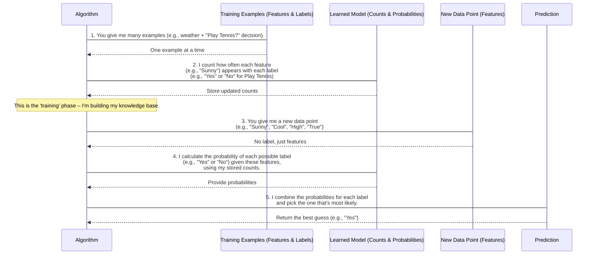

# Chapter 2: Classification Algorithms

Welcome back to the `Data-Warehouse-Algorithms` tutorial! In our last chapter, [Clustering Algorithms](01_clustering_algorithms_.md), we learned how computers can group data points that are similar to each other, even when we don't tell them what those groups should be beforehand. It was like organizing books into piles without knowing the specific subjects.

Now, we're going to explore something a bit different, but equally powerful: **Classification Algorithms**. Instead of just finding hidden groups, classification is about teaching a computer to make predictions and sort new items into *pre-defined categories* based on examples it has already seen.

## What Problem Does Classification Solve?

Imagine you have an email inbox, and some emails are clearly "spam" (junk mail) while others are "not spam" (important messages). Wouldn't it be great if your computer could automatically sort these for you? This is a perfect job for a classification algorithm!

Think of it like training a digital sorting machine:
1.  **You show it examples**: "This email with words like 'free prize' and 'urgent' is spam." "This email from my boss about a 'meeting' is not spam." You provide many such examples, each with its correct label.
2.  **It learns**: The algorithm looks for patterns. It might learn that emails containing "prize" are often spam, while emails containing "meeting" are usually not.
3.  **It predicts**: When a brand new email arrives, the sorting machine uses what it learned from past examples to predict whether it's "spam" or "not spam."

This process of learning from examples to categorize new items is what **Classification Algorithms** are all about. They are essential for tasks like:
*   **Spam detection** in emails.
*   **Sentiment analysis**: determining if a tweet is positive or negative.
*   **Image recognition**: identifying if a picture contains a cat or a dog.
*   **Medical diagnosis**: helping doctors predict the likelihood of a disease based on symptoms.

In this chapter, we'll focus on a simple yet powerful classification algorithm called **Naive Bayes**.

## Understanding Naive Bayes Classification

Naive Bayes is a very straightforward way to make predictions. It works by calculating the probability of an item belonging to a certain category (like "spam") based on the individual characteristics (features) of that item. The "naive" part comes from a simplifying assumption: it assumes that each feature contributes to the outcome independently, regardless of the other features.

Let's use a simple example (not emails, but about deciding whether to play tennis, which matches our provided code):

Imagine you want to predict if you should "Play Tennis" or "Not Play Tennis" based on the weather. The features could be `Outlook`, `Temperature`, `Humidity`, and `Windy`.

| Outlook | Temp | Humidity | Windy | Play Tennis? |
| :------ | :--- | :------- | :---- | :----------- |
| Sunny   | Hot  | High     | False | No           |
| Sunny   | Cool | Normal   | True  | Yes          |
| Overcast| Mild | High     | False | Yes          |
| Rainy   | Mild | Normal   | False | Yes          |
| ...     | ...  | ...      | ...   | ...          |

Naive Bayes would look at this data and learn:
*   How often do people "Play Tennis" overall?
*   If the `Outlook` is "Sunny", how likely is it that they "Play Tennis"?
*   If the `Temperature` is "Hot", how likely is it that they "Play Tennis"?
*   ... and so on for all features and outcomes.

Then, when you have a new day with "Sunny", "Cool", "High", "True" weather, it combines these probabilities to make an overall prediction.

## Using Naive Bayes to Predict

In our `Data-Warehouse-Algorithms` project, we have a `NaiveBayesClassifier` implemented in `classifiers.java`. This class lets us train the classifier with examples and then use it to make predictions.

Let's look at how we can use it with our "Play Tennis" example.

### Step 1: Create the Classifier

First, you need to create an instance of the `NaiveBayesClassifier`.

```java
// --- File: classifiers.java (example usage snippet) ---
public class NaiveBayesClassifier {
    // ... (internal fields and methods) ...

    public static void main(String[] args) {
        // Create a new Naive Bayes classifier
        NaiveBayesClassifier nb = new NaiveBayesClassifier();

        // ... rest of the main method ...
    }
}
```
This line simply creates an empty "sorting machine" ready to learn.

### Step 2: Train the Classifier with Examples

Next, we feed our examples to the classifier using the `train` method. Each example consists of an array of `features` (like `{"sunny", "hot", "high", "false"}`) and its corresponding `label` (like `"no"` for "play tennis").

```java
// --- File: classifiers.java (example usage snippet) ---
        // ... inside main method ...
        NaiveBayesClassifier nb = new NaiveBayesClassifier();

        // Train the classifier with examples
        nb.train(new String[]{"sunny", "hot", "high", "false"}, "no");
        nb.train(new String[]{"sunny", "hot", "high", "true"}, "no");
        nb.train(new String[]{"overcast", "hot", "high", "false"}, "yes");
        nb.train(new String[]{"rainy", "mild", "high", "false"}, "yes");
        // ... (many more training examples follow in the actual file) ...
        nb.train(new String[]{"rainy", "mild", "high", "true"}, "no");
```
Each call to `train` makes the `nb` object "smarter" by updating its internal counts of how often different features appear with different labels. It's like showing the sorting machine another labeled example.

### Step 3: Make a Prediction for a New Item

After training, our classifier is ready to predict. We provide it with the features of a *new* item (a new day's weather conditions), and it tells us its best guess for the label.

```java
// --- File: classifiers.java (example usage snippet) ---
        // ... after all training calls ...

        // Now, let's predict for a new day's weather!
        String[] testFeatures = {"sunny", "cool", "high", "true"};
        String prediction = nb.predict(testFeatures);

        System.out.println("Prediction: " + prediction);
```
When you run this code with the full training data provided in `classifiers.java`, the output might be:

```
Prediction: yes
```

This means that based on all the examples it learned, the classifier predicts that with "sunny", "cool", "high", "true" weather, you *should* "Play Tennis" (`yes`).

## How Naive Bayes Works: Under the Hood

Let's peek behind the curtain to understand how our `NaiveBayesClassifier` learns and makes predictions. It has two main phases: **Training** and **Prediction**.



Now let's look at the key parts of the `NaiveBayesClassifier` implementation in `classifiers.java`.

### The Learning Phase: `train` Method

The `train` method is where the classifier "learns." It simply keeps track of counts:
*   How many times each `label` (`"yes"` or `"no"`) appears overall.
*   How many times each `feature` (`"sunny"`, `"hot"`, etc.) appears *together with* each `label`.

```java
// --- File: classifiers.java (snippet) ---
import java.util.HashMap;
import java.util.Map;

public class NaiveBayesClassifier {
    // These maps store our learned knowledge:
    private Map<String, Integer> classCounts = new HashMap<>(); // e.g., {"yes": 9, "no": 5}
    private Map<String, Map<String, Integer>> featureCounts = new HashMap<>(); // e.g., {"yes": {"sunny": 2, "overcast": 4}, "no": {"sunny": 3, "rainy": 2}}
    private int totalInstances = 0; // Total number of examples seen so far

    public void train(String[] features, String label) {
        // Increment the count for this specific label
        classCounts.put(label, classCounts.getOrDefault(label, 0) + 1);
        totalInstances++; // Keep track of total examples

        // Get or create the map for features belonging to this label
        Map<String, Integer> featureMap = featureCounts.computeIfAbsent(label, k -> new HashMap<>());
        for (String feature : features) {
            // Increment the count for this feature under this label
            featureMap.put(feature, featureMap.getOrDefault(feature, 0) + 1);
        }
    }
    // ... rest of the class ...
}
```
The `train` method updates these `HashMap`s with every example. It's essentially building a giant tally of all the patterns it sees in the training data. For example, if it sees `"sunny"` with `"yes"`, it increases the count for `"sunny"` inside the `"yes"` label's feature map.

### The Prediction Phase: `predict` Method

The `predict` method takes a new set of `features` and uses the counts learned during training to figure out the most likely `label`. It does this by calculating a "score" for each possible label.

```java
// --- File: classifiers.java (snippet) ---
    // ... after train method ...

    public String predict(String[] features) {
        if (features == null) return null;

        double maxProbability = Double.NEGATIVE_INFINITY; // We want to find the LARGEST probability
        String bestLabel = null; // The label with the largest probability

        // Loop through each possible label (e.g., "yes", "no")
        for (String label : classCounts.keySet()) {
            // Start with the overall probability of this label (e.g., P("yes"))
            // We use Math.log to handle very small numbers more easily
            double labelProbability = Math.log((double) classCounts.get(label) / totalInstances);

            // Now, for each feature in our NEW item, adjust the probability
            for (String feature : features) {
                // Get how many times this 'feature' was seen with this 'label'
                int featureCountForLabel = featureCounts.getOrDefault(label, new HashMap<>()).getOrDefault(feature, 0);

                // Add 1 (Laplace smoothing) to avoid zero probabilities if a feature hasn't been seen with this label before
                // This prevents the entire calculation from becoming zero!
                double featureProbability = (featureCountForLabel + 1.0) / 
                                            (classCounts.get(label) + featureCounts.getOrDefault(label, new HashMap<>()).size()); // Simplified denominator
                
                labelProbability += Math.log(featureProbability); // Add to the total log probability
            }

            // If this label's probability is higher than any seen before, it's our new best guess
            if (labelProbability > maxProbability) {
                maxProbability = labelProbability;
                bestLabel = label;
            }
        }
        return bestLabel; // Return the label with the highest probability
    }
    // ... main method ...
}
```

Here's a breakdown of what happens:
1.  **Initialize**: It starts with a `maxProbability` that's very small and `bestLabel` as `null`.
2.  **Loop through Labels**: For each possible label (like `"yes"` or `"no"`), it calculates a score.
3.  **Overall Label Probability**: It first considers the overall likelihood of that `label` occurring (`classCounts.get(label) / totalInstances`). It uses `Math.log` for numerical stability, which is common when multiplying many small probabilities.
4.  **Feature Probabilities**: Then, for each `feature` in the *new item* we're trying to predict, it calculates the probability of seeing that feature *given* the current `label`.
    *   The `+ 1.0` in the numerator is called **Laplace Smoothing**. It's a trick to make sure that if a feature in the new item was *never* seen with a particular label during training, we don't end up with a probability of zero (which would make the entire score zero and prevent accurate comparisons).
    *   The denominator ensures the probability is correctly calculated based on the total counts for that label.
5.  **Combine Probabilities**: It combines these individual feature probabilities (by adding their logs) to get a total log probability for that label.
6.  **Find Best Label**: After checking all labels, the one with the highest calculated probability (`maxProbability`) is chosen as the `bestLabel` and returned.

This probabilistic approach, even with its "naive" independence assumption, often performs surprisingly well in many real-world classification tasks!

## Conclusion

You've now explored **Classification Algorithms**, a powerful set of tools that teach computers to categorize new items based on examples. We focused on the **Naive Bayes** algorithm, understanding how it learns patterns from labeled data and then uses those patterns to predict labels for unseen data, much like an automated spam filter or a tennis-playing predictor! You saw how our `NaiveBayesClassifier` learns by counting occurrences and predicts by combining probabilities.

This ability to predict categories is fundamental in many data-driven applications. In our next chapter, we'll shift gears slightly to discover patterns in how items are frequently found together. Get ready to explore [Association Rule Mining](03_association_rule_mining_.md)!

---

Generated by [AI Codebase Knowledge Builder]