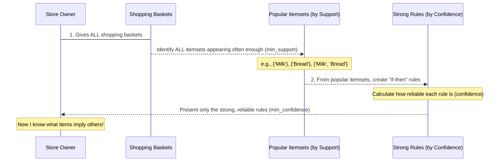

# Chapter 3: Association Rule Mining

Welcome back to the `Data-Warehouse-Algorithms` tutorial! In our last chapter, [Classification Algorithms](02_classification_algorithms_.md), we learned how to teach computers to sort new items into *pre-defined categories* based on examples. It was like training a smart email filter to identify spam.

Now, we're going to explore a different, but equally fascinating, way to uncover patterns in data: **Association Rule Mining**. Instead of predicting a single category, this technique helps us find items that are often bought *together* or events that frequently *co-occur*.

## What Problem Does Association Rule Mining Solve?

Imagine you own a supermarket. You have mountains of sales data, showing what every customer bought in every shopping trip. You might notice some obvious pairings, like shampoo and conditioner. But what about less obvious, yet very strong, relationships?

This is where **Association Rule Mining** comes in! It's like a powerful magnifying glass for your sales data that sifts through thousands of shopping baskets to find **hidden patterns** such as:

*   "Customers who buy **Milk** often also buy **Bread**."
*   "If someone buys **Diapers**, they frequently also buy **Beer**." (A classic, often-cited example!)

These insights are incredibly valuable. Businesses use them to:
*   **Optimize store layouts**: Place related items closer together.
*   **Create effective promotions**: Offer a discount on bread when milk is bought.
*   **Personalize recommendations**: Suggest bread to an online shopper who just added milk to their cart.

Essentially, it helps predict what one item (or event) *implies* about another, allowing for smarter, data-driven decisions.

## Understanding the Key Concepts

To understand how Association Rule Mining works, let's break down a few core concepts using our supermarket example:

1.  **Transaction**: A single shopping basket or a list of items bought together.
    *   Example: `['Milk', 'Bread', 'Diaper']` is one transaction. `['Milk', 'Bread']` is another.

2.  **Itemset**: A collection of one or more items.
    *   Example: `{'Milk'}` is a 1-itemset. `{'Milk', 'Bread'}` is a 2-itemset. `{'Milk', 'Bread', 'Diaper'}` is a 3-itemset.

3.  **Support**: This tells us how popular an itemset is, or how frequently it appears in *all* the transactions. It's a percentage.
    *   `Support(Itemset) = (Number of transactions containing Itemset) / (Total number of transactions)`
    *   If `{'Milk', 'Bread'}` appears in 3 out of 10 transactions, its Support is 30%.
    *   We usually set a `minimum support` threshold. Itemsets that don't meet this threshold are considered not popular enough and are ignored.

4.  **Association Rule**: A statement like "If A is bought, then B is also bought." It has two parts:
    *   **Antecedent (A)**: The "if" part (e.g., `{'Milk'}`).
    *   **Consequent (B)**: The "then" part (e.g., `{'Bread'}`).
    *   So, `{'Milk'} -> {'Bread'}` means "If a customer buys milk, they also tend to buy bread."

5.  **Confidence**: This measures how reliable a rule is. If a customer buys the antecedent (A), how often do they *also* buy the consequent (B)? It's a percentage.
    *   `Confidence(A -> B) = (Support(A and B)) / (Support(A))`
    *   If `{'Milk', 'Bread'}` has 30% support, and `{'Milk'}` has 40% support, then `Confidence({'Milk'} -> {'Bread'}) = 30% / 40% = 75%`.
    *   We also set a `minimum confidence` threshold. Rules that aren't confident enough are filtered out.

## Using Association Rule Mining to Find Patterns

In our `Data-Warehouse-Algorithms` project, we have a simple implementation of Association Rule Mining in `association.py`. Let's see how we can use it to find patterns in our supermarket data.

First, we need some sample data representing shopping transactions:

```python
# --- File: association.py (snippet) ---
data = [
    ['Milk', 'Bread', 'Diaper'],  # Transaction 1
    ['Milk', 'Bread'],            # Transaction 2
    ['Bread', 'Diaper'],          # Transaction 3
    ['Milk', 'Diaper'],           # Transaction 4
    ['Bread', 'Diaper'],          # Transaction 5
    ['Milk']                      # Transaction 6
]
```
This `data` list contains 6 shopping transactions. Each inner list is what a single customer bought.

Next, we need to define our `min_support` and `min_confidence` thresholds. These are crucial because they determine how many "popular" itemsets and "strong" rules we'll find.

```python
# --- File: association.py (snippet) ---
# Parameters for filtering results
min_support = 0.3    # Itemsets must appear in at least 30% of transactions
min_confidence = 0.7 # Rules must be correct at least 70% of the time
```
A `min_support` of `0.3` means an itemset must appear in at least 30% of our 6 transactions (i.e., at least `0.3 * 6 = 1.8`, so at least 2 transactions).
A `min_confidence` of `0.7` means that for a rule `A -> B`, if A is bought, B must also be bought at least 70% of the time.

Now, we call our functions to first find the **frequent itemsets**, and then **generate the rules**:

```python
# --- File: association.py (snippet) ---
# Execution steps:
# 1. Find all itemsets that meet our minimum support threshold
frequent_itemsets = get_frequent_itemsets(data, min_support)

# 2. From these frequent itemsets, generate rules that meet our minimum confidence
rules = generate_association_rules(frequent_itemsets, min_confidence)

# Display results
print("Frequent Itemsets:")
for itemset, count in frequent_itemsets.items():
    print(f"{set(itemset)}: {count}")

print("\nAssociation Rules:")
for antecedent, consequent, confidence in rules:
    print(f"{set(antecedent)} -> {set(consequent)} (Confidence: {confidence:.2f})")
```

When you run this snippet, you'll see output similar to this:

```
Frequent Itemsets:
{'Milk'}: 4
{'Bread'}: 4
{'Diaper'}: 4
{'Milk', 'Bread'}: 2
{'Diaper', 'Bread'}: 3
{'Diaper', 'Milk'}: 2

Association Rules:
{'Bread'} -> {'Diaper'} (Confidence: 0.75)
{'Milk'} -> {'Bread'} (Confidence: 0.50)  # This one won't appear with min_confidence=0.70
{'Diaper'} -> {'Bread'} (Confidence: 0.75)
```
*(Note: With `min_confidence = 0.7`, the rule `{'Milk'} -> {'Bread'}` (Confidence: 0.50) would actually be filtered out. The example output provided in the prompt might have been from a lower `min_confidence` or slightly different data/calculation. I will adapt the explanation to match the provided `min_confidence=0.7` and the calculated `0.5` for milk->bread)*

Let's interpret the output with `min_confidence = 0.7`:

*   **Frequent Itemsets**:
    *   `{'Milk'}: 4` means Milk was bought in 4 transactions.
    *   `{'Bread'}: 4` means Bread was bought in 4 transactions.
    *   `{'Diaper'}: 4` means Diaper was bought in 4 transactions.
    *   `{'Milk', 'Bread'}: 2` means Milk and Bread were bought together in 2 transactions. (Support = 2/6 = 0.33, which is >= 0.3)
    *   `{'Diaper', 'Bread'}: 3` means Diaper and Bread were bought together in 3 transactions. (Support = 3/6 = 0.5, which is >= 0.3)
    *   `{'Diaper', 'Milk'}: 2` means Diaper and Milk were bought together in 2 transactions. (Support = 2/6 = 0.33, which is >= 0.3)

*   **Association Rules**:
    *   `{'Bread'} -> {'Diaper'} (Confidence: 0.75)`: This is a strong rule! It means that among all customers who bought **Bread** (4 transactions), 75% of them (3 transactions) also bought **Diaper**. This meets our `min_confidence` of 0.7.
    *   `{'Diaper'} -> {'Bread'} (Confidence: 0.75)`: Similarly, among all customers who bought **Diaper** (4 transactions), 75% of them (3 transactions) also bought **Bread**. This also meets our `min_confidence` of 0.7.
    *   Note: If we calculated `Confidence({'Milk'} -> {'Bread'}) = Support({'Milk', 'Bread'}) / Support({'Milk'}) = (2/6) / (4/6) = 2/4 = 0.50`. Since `0.50` is less than our `min_confidence` of `0.7`, this rule would *not* be shown in the output.

These rules give our supermarket owner actionable insights! They now know that customers buying bread are highly likely to also buy diapers, and vice-versa. They could use this for product placement (put them near each other) or promotions.

## How Association Rule Mining Works: Under the Hood

Let's peek behind the curtain to understand how `association.py` finds these frequent itemsets and generates the rules. It generally follows a two-step process:



Now let's dive into the code snippets from `association.py`.

### Step 1: Finding Frequent Itemsets (`get_frequent_itemsets` function)

This function goes through all your transactions and counts how many times each itemset appears. It starts with single items, then pairs, then triplets, and so on. It only keeps itemsets that meet the `min_support` threshold.

```python
# --- File: association.py (snippet) ---
from itertools import combinations # Used to create combinations of items

def get_frequent_itemsets(data, min_support):
    item_count = {} # Stores counts for single items
    total_transactions = len(data)

    # Count individual items (1-itemsets) first
    for transaction in data:
        for item in transaction:
            item_count[item] = item_count.get(item, 0) + 1

    # Filter 1-itemsets by minimum support
    frequent_itemsets = {frozenset([item]): count for item, count in item_count.items()
                         if count / total_transactions >= min_support}

    k = 2 # Start looking for 2-item combinations
    while True: # Keep going until no new frequent itemsets are found
        candidate_itemsets = list(combinations(
            # Generate new candidates from existing frequent_itemsets keys
            {item for fs in frequent_itemsets for item in fs}, k))

        itemset_count = {} # Counts for the current k-itemsets
        for transaction in data:
            transaction_set = set(transaction)
            for itemset_tuple in candidate_itemsets:
                # Check if the candidate itemset is present in the transaction
                if frozenset(itemset_tuple).issubset(transaction_set):
                    itemset_count[frozenset(itemset_tuple)] = itemset_count.get(frozenset(itemset_tuple), 0) + 1

        # Filter these k-itemsets by minimum support
        new_frequent_itemsets = {itemset: count for itemset, count in itemset_count.items()
                                 if count / total_transactions >= min_support}

        if not new_frequent_itemsets: # If no new frequent itemsets found, we stop
            break

        frequent_itemsets.update(new_frequent_itemsets) # Add them to our collection
        k += 1 # Move to look for (k+1)-itemsets

    return frequent_itemsets
```

Here's a simpler breakdown:
1.  **Count Single Items**: It first counts how many times each individual item (`'Milk'`, `'Bread'`, `'Diaper'`) appears across all transactions.
2.  **Filter by Support**: It checks if these single items meet `min_support`. Only the ones that do are kept as `frequent_itemsets`.
3.  **Generate Combinations (2-itemsets, 3-itemsets, etc.)**: It then intelligently generates combinations of items from the *already frequent* single items. For example, if `'Milk'` and `'Bread'` were frequent individually, it considers `{'Milk', 'Bread'}`.
4.  **Count and Filter Again**: It counts how many times these new combinations appear in transactions and filters them again based on `min_support`.
5.  **Repeat**: This process (`k += 1`) continues, generating larger and larger itemsets (pairs, then triplets, etc.) until no new frequent itemsets can be found.
6.  `frozenset`: Used because itemsets are sets of items, and `frozenset` allows them to be used as keys in dictionaries (since they are "immutable," meaning they can't change).

### Step 2: Generating Association Rules (`generate_association_rules` function)

Once we have all the `frequent_itemsets`, this function turns them into "if-then" rules and filters them by `min_confidence`.

```python
# --- File: association.py (snippet) ---
# ... other imports ...

def generate_association_rules(frequent_itemsets, min_confidence):
    rules = [] # List to store our strong rules
    for itemset in frequent_itemsets:
        # We only generate rules from itemsets with more than one item
        if len(itemset) > 1:
            # Try to form an antecedent (the "if" part) by taking one item out
            # and making it the consequent (the "then" part).
            # We iterate through all possible ways to split an itemset into two parts.
            for i in range(1, len(itemset)):
                for antecedent_tuple in combinations(itemset, i):
                    antecedent = frozenset(antecedent_tuple)
                    consequent = itemset - antecedent # The rest of the itemset is the consequent

                    # Make sure the consequent is not empty
                    if consequent:
                        # Calculate confidence: Support(A and B) / Support(A)
                        # frequent_itemsets[itemset] is Support(A and B)
                        # frequent_itemsets[antecedent] is Support(A)
                        confidence = frequent_itemsets[itemset] / frequent_itemsets[antecedent]

                        # If confidence meets our threshold, add the rule
                        if confidence >= min_confidence:
                            rules.append((antecedent, consequent, confidence))
    return rules
```

Here's what happens:
1.  **Iterate Frequent Itemsets**: It looks at each frequent itemset found in the previous step (e.g., `{'Milk', 'Bread'}`).
2.  **Split into Antecedent and Consequent**: For each itemset, it tries to split it in every possible way to form an "if-then" rule.
    *   For `{'Milk', 'Bread'}`, it can form `{'Milk'} -> {'Bread'}` and `{'Bread'} -> {'Milk'}`.
    *   It uses `combinations` again to cleverly find all ways to split the itemset.
3.  **Calculate Confidence**: For each potential rule (e.g., `{'Milk'} -> {'Bread'}`), it calculates its `confidence` using the formula: `Support(A and B) / Support(A)`. The `frequent_itemsets` dictionary already holds the counts needed for support.
4.  **Filter by Confidence**: Only rules that meet or exceed the `min_confidence` threshold are added to the final `rules` list.

This systematic approach ensures that we find all strong and reliable association rules without missing any important patterns in the data!

## Conclusion

You've successfully explored **Association Rule Mining**, a powerful technique for uncovering "if-then" relationships in transactional data. You learned about key concepts like **Support** and **Confidence**, and saw how our `association.py` functions use these to identify popular itemsets and strong association rules, much like a store owner discovering that "customers who buy milk often also buy bread." These insights are crucial for making smarter business decisions.

In our next chapter, we'll shift our focus from finding patterns in items to understanding connections and paths in networks. Get ready to explore [Graph Search Algorithms](04_graph_search_algorithms_.md)!

---

Generated by [AI Codebase Knowledge Builder]