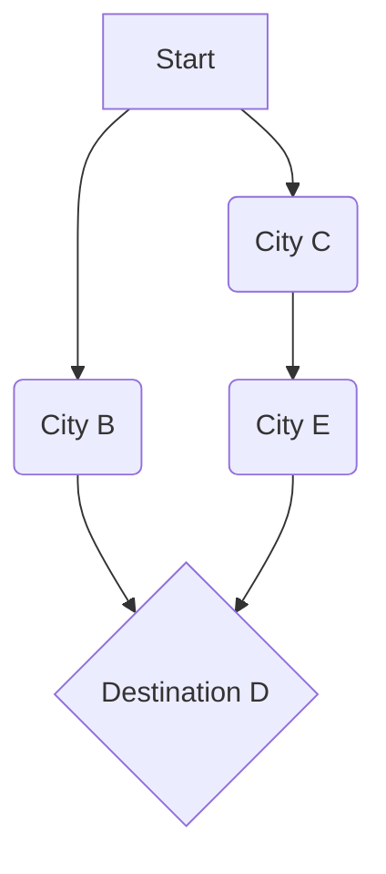
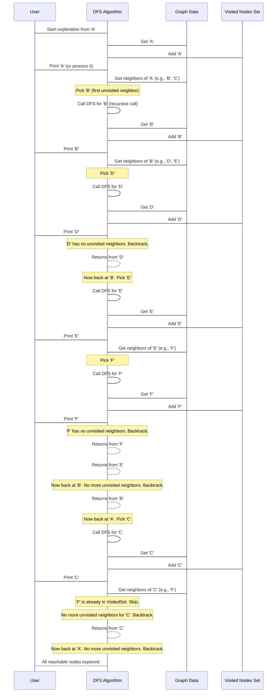

# Chapter 4: Graph Search Algorithms

Welcome back to the `Data-Warehouse-Algorithms` tutorial! In our last chapter, [Association Rule Mining](03_association_rule_mining_.md), we explored how to find hidden "if-then" relationships between items, like discovering that customers who buy milk often also buy bread. We were connecting items based on co-occurrence.

Now, we're going to shift our focus to understanding connections in a more structured way: by exploring **Graph Search Algorithms**. Imagine these algorithms as digital explorers navigating a map to find a specific destination or to ensure every connected location is visited. We're moving from finding patterns *within* transactions to finding paths and connections *across* a network.

## What Problem Do Graph Search Algorithms Solve?

Think about your everyday life. You use graph search all the time without realizing it!

*   **Finding the shortest route on Google Maps**: You enter your starting point and destination, and the app calculates the best path. This is a graph search problem where cities are "locations" (nodes) and roads are "connections" (edges).
*   **Social media networks**: How are you connected to a friend of a friend of a friend? Graph search can find these paths.
*   **Website crawling**: Search engines explore the internet by following links from one webpage to another. This is exploring a massive graph!
*   **Solving mazes or puzzles**: Each possible move or state is a "location," and valid moves are "connections."

Essentially, **Graph Search Algorithms** are fundamental tools for problems involving networks, connections, and finding paths. They help us answer questions like:
*   "What's the quickest way from point A to point B?"
*   "Can I even reach point B from point A?"
*   "Have I visited every reachable part of this network?"

In this chapter, we'll look at two powerful types of graph search: **A\* Search** (a smart pathfinder) and **Depth-First Search (DFS)** (a thorough explorer).

## Understanding Graphs: The Map for Our Explorers

Before we dive into the algorithms, let's understand what a "graph" is in computer science terms. It's much simpler than it sounds!

A **Graph** is a collection of:
1.  **Nodes (or Vertices)**: These are the individual points or locations. Think of them as cities on a map, people in a social network, or webpages.
2.  **Edges (or Connections)**: These are the links between the nodes. Think of them as roads connecting cities, friendships between people, or hyperlinks between webpages. Edges can sometimes have a "weight" (like the distance of a road or cost of travel).

Here's a small example of a graph:


In this graph:
*   `A`, `B`, `C`, `D`, `E` are the **nodes**.
*   The arrows (`-->`) are the **edges**.

Now, let's see how our digital explorers navigate these maps!

## A\* Search: The Smart Pathfinding Explorer

Imagine you're trying to find the quickest route from your house to a new restaurant. You don't just randomly drive around. You use your GPS, which constantly estimates the remaining time or distance and tries to pick the most promising road. **A\* Search** works much like this smart GPS.

A\* is designed to find the **shortest path** between a starting node and a goal node in a graph. What makes it "smart" is its use of a **heuristic**.

*   **Heuristic**: This is like a "hunch" or an educated guess about how far away the goal is from your current position. For example, if you're driving, the straight-line distance to the restaurant is a good heuristic – you can't get there faster than that! A\* uses this hunch to prioritize which paths to explore first, making it very efficient.

### Using A\* Search to Find the Shortest Path

In our `Data-Warehouse-Algorithms` project, the `A*.py` file contains an implementation of the A\* algorithm. Let's use it to find the shortest path on a simple grid-like map.

Our graph will use `(x, y)` coordinates as nodes, and the edges will connect adjacent coordinates with a certain `cost` (like distance).

```python
# --- File: A*.py (example usage snippet) ---
# Our example graph where nodes are (x, y) coordinates
# Each node lists its neighbors and the "cost" to get there
graph = {
    (0, 0): {(1, 0): 1, (0, 1): 1}, # From (0,0) you can go to (1,0) with cost 1, or (0,1) with cost 1
    (1, 0): {(1, 1): 1, (2, 0): 2},
    (0, 1): {(1, 1): 1},
    (1, 1): {(2, 1): 1},
    (2, 0): {(2, 1): 1},
    (2, 1): {} # This is our goal, it has no outgoing paths in this example
}

start = (0, 0)
goal = (2, 1)

# Call our a_star function!
path = a_star(graph, start, goal)
print("Shortest path:", path)
```
When you run this, the output will show the sequence of nodes that form the shortest path:

```
Shortest path: [(0, 0), (1, 0), (2, 0), (2, 1)]
```
This tells us that the A\* algorithm found the path starting at `(0,0)`, going to `(1,0)`, then `(2,0)`, and finally reaching the `goal` at `(2,1)`. It considered the costs and its heuristic to efficiently find this best route!

## Depth-First Search (DFS): The Deep Dive Explorer

Now, let's look at a different kind of explorer: **Depth-First Search (DFS)**. Instead of trying to find the shortest path, DFS is like plunging deep into one path until it hits a dead end, then backtracking to try another. It's excellent for making sure every corner of a connected part of the graph is explored.

Imagine you're exploring a maze. DFS is like picking one path, walking as far as you can down it, and only when you hit a wall do you turn around and try the next path from the last junction.

DFS is often used for:
*   **Checking connectivity**: Can you reach all parts of a network from a starting point?
*   **Topological sorting**: Ordering tasks with dependencies.
*   **Finding cycles**: Detecting loops in a graph.

### Using DFS to Explore a Graph

In our `Data-Warehouse-Algorithms` project, the `dfs.py` file contains an implementation of Depth-First Search. Let's use it to explore a simple network.

Our graph here will use letters (like A, B, C) as nodes, representing connections in a tree-like structure.

```python
# --- File: dfs.py (example usage snippet) ---
# Our example graph with letter nodes
graph = {
    'A': ['B', 'C'], # From A, you can go to B or C
    'B': ['D', 'E'],
    'C': ['F'],
    'D': [], # D is a dead end
    'E': ['F'],
    'F': []  # F is also a dead end
}

start_node = 'A'

# Call our dfs function!
print(f"DFS traversal starting from {start_node}:")
dfs(graph, start_node)
```
When you run this, you'll see the nodes printed in the order DFS visits them:

```
DFS traversal starting from A:
A
B
D
E
F
C
```
Notice how it went deep down the 'A' -> 'B' path (visiting A, then B, then D), hit a dead end at 'D', backtracked to 'B' to try 'E', went deep down 'E' (visiting F), and only then backtracked all the way to 'A' to try the 'C' path (visiting C, then F again, but F would already be marked as visited). This "go deep first" behavior is characteristic of DFS!

## How A\* Search Works: Under the Hood

Let's peek behind the curtain to understand how `A*.py` finds that shortest path. It's a bit like a smart, organized search party.

```mermaid
sequenceDiagram
    participant User
    participant AStar as A* Algorithm
    participant GraphData as Graph Data (Nodes & Edges)
    participant OpenList as Priority Queue (Potential Paths)
    participant ClosedList as Visited Nodes
    participant Path

    User->AStar: Find shortest path from Start to Goal
    AStar->GraphData: Get Start node, Goal node
    AStar->OpenList: Add (0, Start) to prioritize
    loop While OpenList is not empty
        AStar->OpenList: Pick node 'Current' with lowest "estimated total cost" (f_cost)
        OpenList-->>AStar: Current node
        alt Current is Goal
            AStar->Path: Reconstruct path backwards from Current
            Path-->>User: Shortest Path Found!
            break loop
        end
        AStar->ClosedList: Add Current to visited
        AStar->GraphData: Get neighbors of Current
        loop For each Neighbor of Current
            AStar->GraphData: Calculate cost to reach Neighbor (g_cost)
            alt Better path found to Neighbor OR Neighbor not yet explored
                AStar->GraphData: Update g_cost for Neighbor
                AStar->AStar: Calculate estimated total cost (f_cost = g_cost + heuristic)
                AStar->OpenList: Add (f_cost, Neighbor) to prioritize
                AStar->GraphData: Remember Current as parent of Neighbor
            end
        end
    end
    AStar-->>User: No path found (if loop finishes)
```

The core idea is to balance two things:
1.  **`g_cost`**: The actual cost (distance) from the start node to the current node.
2.  **`h_cost` (heuristic)**: The estimated cost (distance) from the current node to the goal node.
3.  **`f_cost`**: The sum of `g_cost` and `h_cost` (`f_cost = g_cost + h_cost`). This is the "estimated total cost" of a path through the current node to the goal. A\* always tries to explore the node with the lowest `f_cost` first.

Let's look at the key parts of the `a_star` function from `A*.py`.

### Step 1: Initialization

We use a `heapq` (a special list that keeps the smallest item at the top, acting as a "priority queue") to store nodes we need to visit, ordered by their `f_cost`.

```python
# --- File: A*.py (snippet) ---
import heapq

def a_star(graph, start, goal):
    # 'open_list' stores (f_cost, node) - we always pick the one with lowest f_cost
    open_list = []
    heapq.heappush(open_list, (0, start)) # Start node has 0 cost, f_cost = 0 + heuristic

    # 'g_costs' stores the actual cost from start to a node
    g_costs = {start: 0}
    # 'f_costs' stores the estimated total cost (g_cost + heuristic)
    f_costs = {start: heuristic(start, goal)}

    # 'came_from' helps us reconstruct the path at the end
    came_from = {}

    # ... rest of the function (main loop) ...
    return None # No path found
```
`g_costs` tracks the best *actual* path cost found so far to any node. `f_costs` is our "smart guess" for the total cost. `came_from` keeps track of how we got to each node, so we can trace back the path later.

### Step 2: Main Search Loop

The algorithm keeps picking the most promising node (lowest `f_cost`) from the `open_list` until the goal is reached or no more paths can be explored.

```python
# --- File: A*.py (snippet inside a_star function) ---
    # ... initializations ...

    while open_list:
        # Get the node with the lowest f_cost (our current best guess)
        current = heapq.heappop(open_list)[1]

        if current == goal:
            # If we reached the goal, reconstruct and return the path
            return reconstruct_path(came_from, current)

        # Explore neighbors of the current node
        for neighbor, cost in graph[current].items():
            # Calculate cost to reach this neighbor through the current path
            tentative_g_cost = g_costs[current] + cost

            # If this path to neighbor is better or new
            if neighbor not in g_costs or tentative_g_cost < g_costs[neighbor]:
                g_costs[neighbor] = tentative_g_cost # Update actual cost
                f_costs[neighbor] = tentative_g_cost + heuristic(neighbor, goal) # Update estimated total cost
                came_from[neighbor] = current # Remember how we got here
                heapq.heappush(open_list, (f_costs[neighbor], neighbor)) # Add neighbor to consider

    return None # If loop finishes, no path found
```
Inside the loop, `heapq.heappop` gives us the `current` node with the lowest `f_cost`. If it's the `goal`, we're done! Otherwise, we look at its `neighbor`s. If we find a better path to a neighbor (`tentative_g_cost < g_costs[neighbor]`), we update its costs and parent, and add it to `open_list` to be considered.

### Helper Functions: Heuristic and Path Reconstruction

The `heuristic` function provides the "hunch" and `reconstruct_path` traces back the found route.

```python
# --- File: A*.py (snippet) ---
# Heuristic function (Manhattan distance for (x,y) coordinates)
def heuristic(node, goal):
    x1, y1 = node
    x2, y2 = goal
    return abs(x1 - x2) + abs(y1 - y2) # Sum of absolute differences

# Function to reconstruct the path
def reconstruct_path(came_from, current):
    path = [current]
    while current in came_from: # Trace back from goal to start
        current = came_from[current]
        path.append(current)
    path.reverse() # Reverse to get path from start to goal
    return path
```
The `heuristic` function here calculates the Manhattan distance, which is suitable for grid-like movements (like moving up, down, left, right). `reconstruct_path` simply follows the `came_from` links backward from the goal until it reaches the start, then reverses the list.

## How Depth-First Search (DFS) Works: Under the Hood

Now, let's look at the `dfs.py` implementation. DFS is typically implemented using recursion (a function calling itself) or a stack, and it ensures that each node is visited only once.



The key components of DFS are:
1.  **`visited` set**: A collection to keep track of nodes we've already seen, preventing infinite loops in graphs with cycles and redundant work.
2.  **Recursion**: The algorithm calls itself for each unvisited neighbor, creating the "deep dive" effect.

Let's look at the `dfs` function from `dfs.py`.

```python
# --- File: dfs.py (snippet) ---
def dfs(graph, start, visited=None):
    if visited is None:
        visited = set() # Initialize visited set if not provided (for the first call)

    visited.add(start) # Mark the current node as visited
    print(start)       # Process the node (e.g., print it)

    # For each neighbor of the current node
    for neighbor in graph[start]:
        # If the neighbor hasn't been visited yet, dive deeper!
        if neighbor not in visited:
            dfs(graph, neighbor, visited) # Recursive call for the neighbor

    return visited # Return all visited nodes
```
This simple recursive function perfectly captures the essence of DFS: visit a node, then for each of its children, recursively do the same until you can't go any deeper, then the function calls unwind (backtrack). The `visited` set ensures that each node is processed only once, even if there are multiple paths to it.

## Conclusion

You've successfully embarked on a journey into **Graph Search Algorithms**, learning how digital explorers navigate networks to find paths and discover connections. You learned about **A\* Search**, a smart algorithm that finds the shortest path by using an intelligent "hunch" (heuristic). You also explored **Depth-First Search (DFS)**, which dives deep into a path before backtracking, ensuring every reachable part of a network is explored. These algorithms are fundamental for everything from GPS navigation to social network analysis.

In our next chapter, we'll continue our exploration of network analysis, focusing on how to determine the importance of nodes within a graph using sophisticated techniques. Get ready to explore [Link Analysis Algorithms (HITS)](05_link_analysis_algorithms__hits__.md)!

---

Generated by [AI Codebase Knowledge Builder]