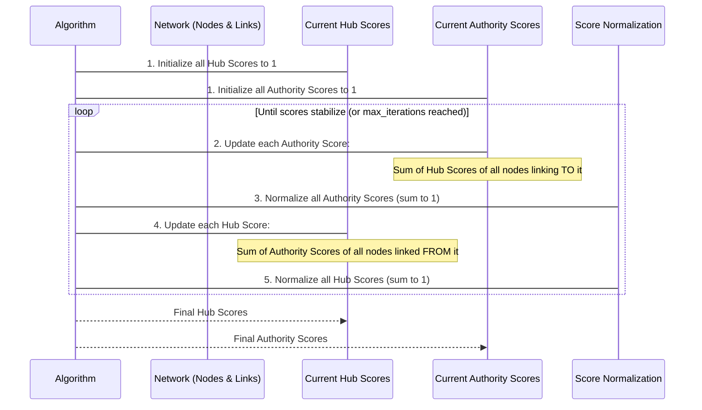

# Chapter 5: Link Analysis Algorithms (HITS)

Welcome back to the `Data-Warehouse-Algorithms` tutorial! In our last chapter, [Graph Search Algorithms](04_graph_search_algorithms_.md), we learned how to navigate networks to find paths and connections, like a digital explorer finding the shortest route or visiting every reachable location. We were focused on *how* things are connected.

Now, we're going to use those connections in a new, exciting way: to figure out **importance** and **influence** within a network. This brings us to **Link Analysis Algorithms**, specifically **HITS (Hyperlink-Induced Topic Search)**.

## What Problem Do Link Analysis Algorithms Solve?

Imagine the internet. Billions of web pages linked together. How does a search engine decide which pages are most relevant or important for a particular search query? It's not just about finding pages with your keywords; it's about finding *authoritative* pages.

Think of it like a reputation system:
*   If a lot of reliable sources recommend a restaurant, that restaurant probably has a good reputation.
*   If a highly respected expert (who is themselves recommended by many other experts) recommends a specific article, that article is likely very important.

**Link Analysis Algorithms** are like these digital reputation systems. They analyze the connections (links) between entities to determine their significance. They help us answer questions like:
*   "Which web pages are considered important sources of information?"
*   "Which pages are good directories or resource lists that point to important sources?"
*   "Who are the most influential people in a social network?"

In this chapter, we'll dive into HITS, which identifies two distinct but interconnected types of important entities: "Hubs" and "Authorities."

## Understanding the Key Concepts: Hubs and Authorities

HITS identifies two kinds of "important" pages (or nodes in any network):

1.  **Authorities**: These are entities (like web pages) that are recognized as important, high-quality sources of information on a specific topic. They get their "authority" because many other good pages (especially "Hubs") link *to* them.
    *   **Analogy**: Think of a well-researched Wikipedia page or a highly cited scientific paper. Many reliable sources would link to them.

2.  **Hubs**: These are entities (like web pages) that serve as excellent resource lists or directories. They are important because they link *to* many high-quality "Authority" pages. A good hub is like a curated list of the best resources on a topic.
    *   **Analogy**: Think of a "Top 10 Research Papers on AI" list curated by an expert, or a university library's subject guide. These pages don't necessarily contain the primary information themselves, but they point you to the best places to find it.

The magic of HITS is that Hubs and Authorities mutually reinforce each other:
*   A good Authority is linked to by many good Hubs.
*   A good Hub links to many good Authorities.

This interplay helps HITS rank entities based on their connectivity patterns, not just how many links they have.

## Using HITS to Rank Entities

In our `Data-Warehouse-Algorithms` project, the `pagerank.py` file contains an example that uses a library called `networkx` to compute HITS scores. While the file name says `pagerank.py`, it specifically uses the `nx.hits` function to demonstrate HITS.

Let's use it to analyze a small network of interconnected entities (think of them as web pages or even people in a small social group).

### Step 1: Define Our Network (Graph)

First, we need to create our network, which we call a "graph." The entities are `nodes`, and the connections between them are `edges`. Since links typically go from one page to another, this is a "directed" graph (an arrow from X to Y means X links to Y, but Y doesn't necessarily link back to X).

```python
# --- File: pagerank.py (example usage snippet) ---
import networkx as nx

# Create a directed graph (links go one way)
G = nx.DiGraph()

# Add edges (links) to our graph
# 'X' -> 'Y' means X links to Y
G.add_edges_from([
    ('X', 'Y'), ('Y', 'Z'), ('Z', 'X'), ('X', 'W'),
    ('W', 'Z'), ('Y', 'W'), ('Z', 'V'), ('V', 'Y'), 
    ('W', 'V')
])

# Let's visualize our graph (optional, but helpful!)
# import matplotlib.pyplot as plt
# plt.figure(figsize=(6, 6))
# nx.draw_networkx(G, with_labels=True)
# plt.title("Our Example Network")
# plt.show()
```
Here, `G.add_edges_from([...])` defines our network. For example, `('X', 'Y')` means node `X` links to node `Y`.

### Step 2: Calculate Hub and Authority Scores

Now that our graph is defined, we can simply call the `hits` function from `networkx` to calculate the scores.

```python
# --- File: pagerank.py (example usage snippet) ---
# ... (graph definition from above) ...

# Calculate HITS scores!
# max_iter: how many times to refine the scores
# normalized: ensures scores sum to 1, making them easy to compare
hubs, authorities = nx.hits(G, max_iter=50, normalized=True)

# Print the results
print("Hub Scores:", hubs)
print("Authority Scores:", authorities)
```
When you run this part of the code, you'll see output similar to this:

```
Hub Scores: {'X': 0.16333, 'Y': 0.05444, 'Z': 0.05444, 'W': 0.44889, 'V': 0.27889}
Authority Scores: {'X': 0.05444, 'Y': 0.27889, 'Z': 0.44889, 'W': 0.05444, 'V': 0.16333}
```

What do these numbers mean?
*   **Hub Scores**: The higher the score, the more of a "Hub" that node is. A high hub score means it links to many good authorities. In this example, node 'W' has the highest hub score, suggesting it's a good resource list.
*   **Authority Scores**: The higher the score, the more of an "Authority" that node is. A high authority score means it's linked to by many good hubs. Here, node 'Z' has the highest authority score, indicating it's considered a highly authoritative source.

This output gives us a clear ranking of which nodes in our network are considered good hubs and which are good authorities, purely based on how they are linked!

## How HITS Works: Under the Hood

Let's peek behind the curtain to understand how the HITS algorithm calculates these scores. It's an iterative process, meaning it repeats a few simple steps over and over until the scores stabilize.

Imagine each node starts with a little bit of "Hubness" and "Authorityness." Then, they start "transferring" these qualities to each other through their links.



Let's break down the key ideas that `networkx.hits` implements:

### Step 1: Initialization
Every node in the network starts with an equal initial Hub score and Authority score (often set to 1). This is just a starting guess.

### Step 2: Iterative Updates
The core of HITS involves repeatedly updating the scores. In each step (or iteration):

1.  **Update Authority Scores**:
    *   A node's **Authority score** is increased by the **Hub scores** of all the nodes that link *to* it.
    *   *Intuition*: If many pages that are themselves considered good "hubs" (resource lists) point to your page, your page must be a good "authority."

2.  **Update Hub Scores**:
    *   A node's **Hub score** is increased by the **Authority scores** of all the nodes that it links *to*.
    *   *Intuition*: If your page links to many pages that are considered good "authorities," then your page must be a good "hub" (resource list).

### Step 3: Normalization
After each update of Authority scores and Hub scores, they are "normalized." This means we adjust all scores so they sum up to 1. This prevents the scores from growing infinitely large and makes them comparable (e.g., if one node has a score of 0.5, it means it has 50% of the total "Hubness" or "Authorityness" in the network).

### Step 4: Repeat Until Convergence
These updates (Authority -> Normalization -> Hub -> Normalization) are repeated many times. With each iteration, the scores get more and more refined. Eventually, the scores will change very little from one iteration to the next, meaning the algorithm has "converged" to a stable set of scores.

### Inside `networkx.hits`

While we won't show the full internal code of `networkx.hits` (it's quite complex), understanding the above iterative process explains exactly what that function does. When you call:

```python
# --- File: pagerank.py (snippet) ---
hubs, authorities = nx.hits(G, max_iter=50, normalized=True)
```
*   `nx.hits(G, ...)` takes our network `G` as input.
*   `max_iter=50` tells it to perform up to 50 rounds of score updates.
*   `normalized=True` ensures the scores are scaled to sum to 1 after each update, as described above.

The function efficiently performs these many iterations behind the scenes, effectively propagating "hubness" and "authority" through the network until it finds the most stable and representative scores for each node.

## Conclusion

You've now explored **Link Analysis Algorithms** through the lens of **HITS (Hyperlink-Induced Topic Search)**. You learned how HITS identifies two crucial types of importance in a network: **Hubs** (pages that link to many authorities) and **Authorities** (pages linked to by many hubs). This powerful technique allows us to determine influence and relevance purely based on the structure of connections, which is fundamental to search engines, recommendation systems, and social network analysis.

In our next chapter, we'll shift our focus to algorithms that help us find the best possible solutions or make optimal decisions under various constraints. Get ready to explore [Optimization Algorithms](06_optimization_algorithms_.md)!

---

Generated by [AI Codebase Knowledge Builder]