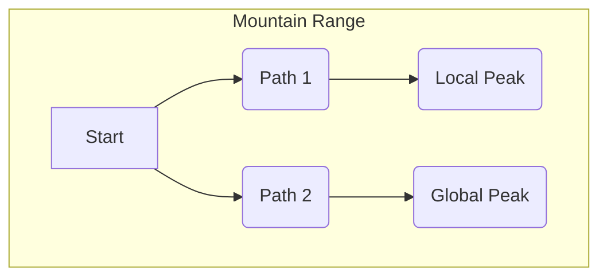

# Chapter 6: Optimization Algorithms

Welcome back to the `Data-Warehouse-Algorithms` tutorial! In our last chapter, [Link Analysis Algorithms (HITS)](05_link_analysis_algorithms__hits__.md), we learned how to assess the importance and influence of entities in a network based on their connections. We were figuring out *who* was most significant.

Now, we're going to shift our focus to finding the **best possible solution** to a problem. This brings us to **Optimization Algorithms**. Imagine these algorithms as intelligent problem-solvers trying to find the highest peak in a vast mountain range, or the lowest valley, depending on what they're looking for.

## What Problem Do Optimization Algorithms Solve?

Think about common challenges where you want to achieve the "best" outcome:

*   **Manufacturing**: How should we arrange machines on a factory floor to minimize the time it takes to produce a product?
*   **Delivery Routes**: What's the shortest route for a delivery truck to visit 10 different locations?
*   **Resource Allocation**: How should we assign employees to tasks to maximize productivity?
*   **Machine Learning**: How do we tweak a model's settings to make it as accurate as possible?

In all these scenarios, you're trying to **optimize** something – either maximize a good outcome (like profit or speed) or minimize a bad one (like cost or error). **Optimization algorithms** are the tools that help us systematically search through many possible solutions to find the one that performs the "best" according to our criteria.

They help us answer questions like:
*   "What's the absolute maximum value I can get for this function?"
*   "What combination of choices leads to the lowest cost?"
*   "Where is the 'sweet spot' for this problem?"

In this chapter, we'll explore a straightforward optimization technique called **Hill Climbing**. It's like a hiker who always takes the path that goes immediately uphill, hoping to reach the summit.

## Understanding the Key Concepts

To understand Hill Climbing, let's break down a few core ideas:

1.  **Objective Function**: This is the "ruler" we use to measure how good a solution is. If you're looking for the highest mountain peak, the objective function tells you the *height* at any given point. If you're minimizing cost, it tells you the *cost* of a particular setup. Our goal is usually to maximize or minimize this function.

2.  **Current Solution (State)**: This is where we are right now, our current guess at the best solution. It's like our current position on the mountain.

3.  **Neighbors**: These are the other solutions that are "close by" or immediately reachable from our current solution. If we're at a certain point on a mountain, our neighbors are the points we can step to next.

4.  **Hill Climbing Strategy**: This is the core rule: always move to the neighbor that gives the best *immediate* improvement. If we're maximizing (climbing uphill), we always pick the steepest uphill path.

### The Challenge: Local vs. Global Peaks

While simple, Hill Climbing has a potential limitation: it can get stuck on a "local peak." Imagine there are several peaks in our mountain range, but only one is the absolute highest (the "global optimum").


If our Hill Climbing hiker starts at 'A' and takes 'Path 1', they might reach 'Local Peak D' and stop, thinking it's the highest, because all paths immediately around 'D' go downhill. They might never discover 'Global Peak E' because they didn't explore other directions from 'A'. This is a common characteristic of greedy algorithms like Hill Climbing.

## Using Hill Climbing to Find the Best Solution

In our `Data-Warehouse-Algorithms` project, the `hillclimb.py` file contains a basic implementation of the Hill Climbing algorithm. Let's use it to find the maximum value of a simple mathematical function.

Our goal will be to maximize the `objective_function(x)`. This function is designed to have a single peak.

### Step 1: Define Our Objective Function

This is the function we want to find the maximum value for.
```python
# --- File: hillclimb.py (snippet) ---
def objective_function(x):
    # This is a parabola that opens downwards, so it has a single peak.
    # The peak is around x = 2.5
    return -(x ** 2) + 5 * x + 10
```
This function `objective_function(x)` will give us a numerical "height" for any given `x` value. Our goal is to find the `x` that makes this height as large as possible.

### Step 2: Define How to Generate Neighbors

Next, we need a way to define what "nearby" solutions are from our current `x`. For our simple numerical example, we can just take a small step left or right.

```python
# --- File: hillclimb.py (snippet) ---
def generate_neighbors(x):
    step_size = 1 # We'll look at x-1 and x+1
    return [x - step_size, x + step_size]
```
So, if our current `x` is `5`, its neighbors would be `4` and `6`.

### Step 3: Run the Hill Climbing Algorithm

Now, we can put it all together. We pick a `start_point` (our initial guess) and let the `hill_climbing` function do its work.

```python
# --- File: hillclimb.py (example usage snippet) ---
import random
# ... (objective_function and generate_neighbors definitions) ...

# Starting point - a random integer between -10 and 10
start_point = random.randint(-10, 10) 

# Call our hill_climbing function!
best_solution, best_value = hill_climbing(objective_function, generate_neighbors, start_point)

print("Starting point:", start_point)
print("Best Solution (x):", best_solution)
print("Best Value (y):", best_value)
```
When you run this, you might get output similar to this (the `start_point` will vary due to `random.randint`):

```
Starting point: -7
Best Solution (x): 3
Best Value (y): 16
```
This output tells us that starting from `x = -7`, the Hill Climbing algorithm found `x = 3` as the point that gives the highest value (16) for our `objective_function` using the defined neighbors. If you were to plot `-(x ** 2) + 5 * x + 10`, you'd see its peak is indeed at `x = 2.5`, and `x=3` is the closest integer peak.

## How Hill Climbing Works: Under the Hood

Let's peek behind the curtain to understand how the `hill_climbing` function finds this "best" solution. It's an iterative process, much like a hiker repeatedly looking around and taking the best step.

```mermaid
sequenceDiagram
    participant Algorithm
    participant CurrentSolution as Current Position (x)
    participant Neighbors as Nearby Steps
    participant ObjectiveFunction as Mountain Height (f(x))

    Algorithm->CurrentSolution: 1. Start at a random point (Initial x)
    CurrentSolution-->>ObjectiveFunction: Get its height (f(x))
    ObjectiveFunction-->>Algorithm: Store Current Value

    loop While a better neighbor exists
        Algorithm->Neighbors: 2. Generate all nearby steps
        Neighbors-->>ObjectiveFunction: For each step, ask for its height
        ObjectiveFunction-->>Algorithm: Get all neighbor heights

        Algorithm->Algorithm: 3. Find the neighbor with the highest height
        alt Is the best neighbor better than Current Solution?
            Algorithm->CurrentSolution: 4. Move to that best neighbor
            CurrentSolution-->>ObjectiveFunction: Get its new height
            ObjectiveFunction-->>Algorithm: Update Current Value
        else No better neighbor
            Algorithm->Algorithm: 5. Stop (we're at a peak!)
            break
        end
    end
    Algorithm-->>User: Return Current Solution and Value
```

Now let's look at the key parts of the `hill_climbing` function from `hillclimb.py`.

### Step 1: Initialization

We start with a `current` solution (our `start_point`) and calculate its `current_value` using the `function` (our `objective_function`).

```python
# --- File: hillclimb.py (snippet) ---
# Hill Climbing Algorithm
def hill_climbing(function, neighbors_fn, start): # Renamed 'neighbors' to 'neighbors_fn' for clarity
    current = start
    current_value = function(current) # Evaluate the starting point

    # ... rest of the function (loop for iterations) ...
    return current, current_value
```
The `current` variable keeps track of our best position, and `current_value` stores its height.

### Step 2: The Main Loop - Exploring and Moving

The algorithm continues in a `while True` loop, repeatedly looking at neighbors and deciding whether to move.

```python
# --- File: hillclimb.py (snippet inside the main loop) ---
    while True:
        # Generate neighbors and evaluate their values
        # For each neighbor, we get its (neighbor_point, neighbor_height)
        neighbor_values = [(neighbor, function(neighbor)) for neighbor in neighbors_fn(current)]
        
        # Find the best neighbor (maximization)
        # 'key=lambda x: x[1]' means find the tuple where the *second* element (the height) is largest
        best_neighbor, best_value = max(neighbor_values, key=lambda x: x[1])

        # If no better neighbor, return the current best state
        if best_value <= current_value:
            return current, current_value # We've found a peak!

        # Otherwise, move to the best neighbor
        current, current_value = best_neighbor, best_value
```

Let's break down the important lines:
1.  `neighbor_values = [(neighbor, function(neighbor)) for neighbor in neighbors_fn(current)]`: This line first generates all the immediate `neighbors` of our `current` position using `neighbors_fn`. Then, for each neighbor, it calls our `objective_function` (`function`) to get its `value` (height). It creates a list of `(neighbor, value)` pairs.
2.  `best_neighbor, best_value = max(neighbor_values, key=lambda x: x[1])`: This is where the "hill climbing" happens! It looks at all the `neighbor_values` and finds the pair `(neighbor, value)` that has the *highest* `value` (the `x[1]` part). This becomes our `best_neighbor` and `best_value`.
3.  `if best_value <= current_value: return current, current_value`: This is our **stopping condition**. If the `best_value` among our neighbors is *not* better (it's less than or equal to) our `current_value`, it means we're at a peak. All paths around us go downhill or flat. So, we stop and return our `current` position and its `value`.
4.  `current, current_value = best_neighbor, best_value`: If there *was* a better neighbor, we update our `current` position and `current_value` to that better neighbor. The loop then repeats, and we look for neighbors from this new, higher position.

This simple, greedy approach of always moving to the immediately best option is what defines Hill Climbing. It's effective for finding local optima quickly, though it might miss the true global optimum.

## Conclusion

You've successfully explored **Optimization Algorithms** through the lens of **Hill Climbing**. You learned how these algorithms aim to find the "best" possible solution by maximizing or minimizing an **objective function**. We focused on **Hill Climbing**, understanding its greedy strategy of always moving towards immediate improvement, much like a hiker always going uphill. You saw how our `hill_climbing` function systematically explores neighbors and updates its current best solution until a local peak is found.

This ability to systematically search for optimal solutions is crucial in countless fields, from engineering to economics. In our next chapter, we'll delve into algorithms that help us understand and predict strategic interactions between different "players" in a system. Get ready to explore [Game Theory Algorithms](07_game_theory_algorithms_.md)!

---

Generated by [AI Codebase Knowledge Builder]