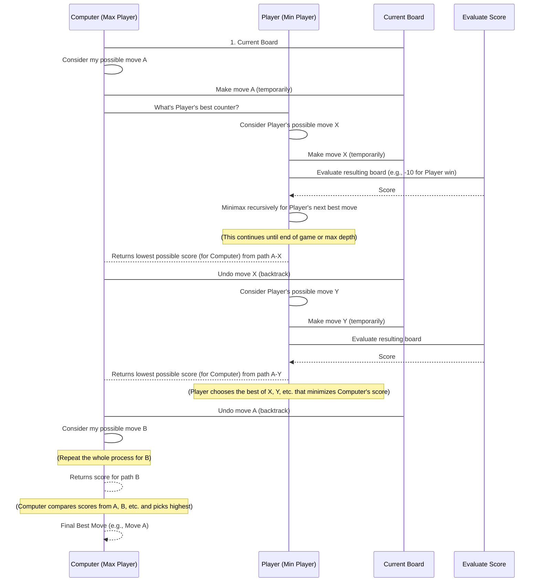

# Chapter 7: Game Theory Algorithms

Welcome back to the `Data-Warehouse-Algorithms` tutorial! In our last chapter, [Optimization Algorithms](06_optimization_algorithms_.md), we learned how to find the single "best" solution for a problem, like finding the highest peak on a mountain. This was about making optimal decisions in a solo effort.

Now, we're going to dive into a fascinating area where "optimal" becomes a bit more complex because you're not playing alone! This brings us to **Game Theory Algorithms**. Imagine you're playing a game, like chess or Tic-Tac-Toe, and you need to make the best move. But the "best" move isn't just about what's good for you; it's also about anticipating what your opponent will do to counter you.

## What Problem Do Game Theory Algorithms Solve?

Think about any competitive situation:
*   **A chess match**: You make a move, then your opponent makes a move, and so on. You're constantly trying to predict their strategy and choose your moves to maximize your chances of winning, assuming they're trying to do the same.
*   **Negotiations**: Each side tries to make decisions that benefit them, while also considering how the other side will react.
*   **Resource allocation in a marketplace**: Companies make strategic pricing decisions knowing their competitors will react.

**Game Theory Algorithms** are tools that help us make optimal decisions in these **competitive situations** where multiple "players" are involved, and each player's outcome depends on the actions of all players. They help us answer questions like:
*   "What's the best move I can make right now, assuming my opponent will also play perfectly?"
*   "How can I minimize my worst possible outcome, no matter what my opponent does?"

In this chapter, we'll focus on **Minimax**, a core Game Theory algorithm used by "intelligent" players to navigate competitive games. We'll use the classic game of Tic-Tac-Toe to see Minimax in action.

## Understanding the Key Concepts: Minimax

Minimax is a strategy for choosing the best move in a two-player game by exploring all possible future moves up to a certain depth. It assumes that:
1.  **You (the "maximizing" player)** want to maximize your score (e.g., win the game).
2.  **Your opponent (the "minimizing" player)** wants to minimize your score (e.g., prevent you from winning, or make you lose).

Here's how it works intuitively:
*   **"What if I make this move?"**: The algorithm considers a possible move for itself.
*   **"What's the *best* my opponent can do if I make that move?"**: It then assumes the opponent will pick the move that minimizes the first player's advantage (or maximizes their own).
*   **"Okay, given that, which of my initial moves leads to the *least bad* outcome for me?"**: The algorithm then chooses its initial move that minimizes this maximum potential loss from the opponent.

This approach is like looking ahead several turns, identifying the worst possible situation for yourself in each scenario, and then choosing the path that avoids the absolute worst situation.

## Using Minimax to Play Tic-Tac-Toe

In our `Data-Warehouse-Algorithms` project, the `minimax.py` file contains an implementation of the Minimax algorithm applied to Tic-Tac-Toe. Let's see how the computer uses it to find its best move.

We'll imagine a situation in a Tic-Tac-Toe game where it's the computer's turn. The computer plays as 'X', and the human player as 'O'.

### Step 1: Set Up the Board

The game starts with an empty 3x3 board.
```python
# --- File: minimax.py (example usage snippet) ---
# Function to print the board (simplified from actual file)
def print_board(board):
    for row in board:
        print(' | '.join(row))
        print("-" * 5)

# Example: An empty Tic-Tac-Toe board
initial_board = [
    [' ', ' ', ' '],
    [' ', ' ', ' '],
    [' ', ' ', ' ']
]

print("Initial Board:")
print_board(initial_board)
```
Output:
```
Initial Board:
  |   |  
-----
  |   |  
-----
  |   |  
```

### Step 2: The Computer Finds Its Best Move

Now, let's say it's the computer's turn to make a move on this board. The `find_best_move` function uses Minimax to decide where to place its 'X'.

```python
# --- File: minimax.py (example usage snippet) ---
# ... (initial_board and print_board definition) ...

# Let's say the board has a few moves already
current_board = [
    ['X', 'O', ' '],
    [' ', 'X', 'O'],
    [' ', ' ', ' ']
]
print("\nBoard before computer's move:")
print_board(current_board)

# Call our find_best_move function!
# This function applies Minimax to figure out the optimal spot for 'X'
best_move = find_best_move(current_board) 

# Apply the best move to the board
current_board[best_move[0]][best_move[1]] = 'X'

print("\nComputer's Best Move (row, col):", best_move)
print("Board after computer's move:")
print_board(current_board)
```
When you run this snippet, the computer will analyze the `current_board` and identify the best spot to place its 'X' to either win or prevent the player ('O') from winning.

Example output:
```
Board before computer's move:
X | O |   
-----
  | X | O
-----
  |   |  

Computer's Best Move (row, col): (2, 0)
Board after computer's move:
X | O |   
-----
  | X | O
-----
X |   |  
```
In this example, the computer found that placing 'X' at `(2, 0)` was its best move to potentially set up a win or block the opponent. The `find_best_move` function is the "brain" that uses Minimax to figure this out!

## How Minimax Works: Under the Hood

Let's peek behind the curtain to understand how `minimax.py` makes these "intelligent" decisions. It essentially explores all possible game outcomes from the current board state, much like building a massive "decision tree" in its mind.



Now let's look at the key functions in `minimax.py`.

### 1. `evaluate(board)`: Scoring the Game

This function checks the current `board` and assigns a score:
*   `+10`: If the computer ('X') has won.
*   `-10`: If the human player ('O') has won.
*   `0`: If it's a draw or the game is still ongoing.

```python
# --- File: minimax.py (snippet) ---
def evaluate(board):
    # Check rows for win
    for row in range(3):
        if board[row][0] == board[row][1] == board[row][2] != ' ':
            return 10 if board[row][0] == 'X' else -10
    # Check columns for win
    for col in range(3):
        if board[0][col] == board[1][col] == board[2][col] != ' ':
            return 10 if board[0][col] == 'X' else -10
    # Check diagonals for win
    if board[0][0] == board[1][1] == board[2][2] != ' ':
        return 10 if board[0][0] == 'X' else -10
    if board[0][2] == board[1][1] == board[2][0] != ' ':
        return 10 if board[0][2] == 'X' else -10
    return 0 # No winner yet or draw
```
This is the heart of telling "who's winning" at any point in the game tree.

### 2. `minimax(board, depth, is_max)`: The Core Decision Engine

This is the main recursive function that performs the Minimax search.
*   `board`: The current state of the Tic-Tac-Toe board.
*   `depth`: How many moves deep into the future we've explored (not strictly used for stopping here, but for tracking).
*   `is_max`: `True` if it's the "maximizing" player's turn (Computer 'X'), `False` if it's the "minimizing" player's turn (Human 'O').

```python
# --- File: minimax.py (snippet) ---
def minimax(board, depth, is_max):
    score = evaluate(board) # 1. Check if game is over (base case)
    if score != 0: return score
    # 2. Check if board is full (draw)
    if all(board[i][j] != ' ' for i in range(3) for j in range(3)): return 0
    
    if is_max: # If it's the maximizing player's turn ('X')
        best = -float('inf') # Start with a very low score
        for i in range(3):
            for j in range(3):
                if board[i][j] == ' ': # For each empty spot
                    board[i][j] = 'X'  # Try making a move
                    best = max(best, minimax(board, depth + 1, False)) # Recursively call for opponent (Min)
                    board[i][j] = ' '  # Undo the move (backtrack)
        return best
    else: # If it's the minimizing player's turn ('O')
        best = float('inf') # Start with a very high score
        for i in range(3):
            for j in range(3):
                if board[i][j] == ' ': # For each empty spot
                    board[i][j] = 'O'  # Try making a move
                    best = min(best, minimax(board, depth + 1, True)) # Recursively call for computer (Max)
                    board[i][j] = ' '  # Undo the move (backtrack)
        return best
```
Let's break this down:
1.  **Base Cases**: It first checks if the game is already over (`evaluate(board) != 0`) or if the board is full (a draw). If so, it returns the score immediately. This stops the recursion.
2.  **Maximizing Player's Turn (`is_max` is True)**:
    *   It aims to find the *highest* possible score. It starts `best` at a very low number.
    *   It tries every empty spot on the board, temporarily making its move (`'X'`).
    *   It then *recursively calls `minimax` for the opponent* (`is_max` becomes `False`). The score returned from this recursive call is what the opponent would achieve.
    *   It updates `best` with the *maximum* of its current `best` and the score from the recursive call. This ensures it's picking the path that leads to the best outcome for itself, assuming the opponent plays optimally.
    *   Crucially, it `undoes` the move (`board[i][j] = ' '`) before trying the next empty spot. This is called **backtracking**.
3.  **Minimizing Player's Turn (`is_max` is False)**:
    *   It aims to find the *lowest* possible score *for the maximizing player* (which means a good outcome for itself). It starts `best` at a very high number.
    *   It works similarly, trying moves (`'O'`) and recursively calling `minimax` for the maximizing player (`is_max` becomes `True`).
    *   It updates `best` with the *minimum* of its current `best` and the score from the recursive call.

This `minimax` function explores every possible game branch from the current point until a game ends, then propagates the scores back up the "decision tree" to determine the optimal path.

### 3. `find_best_move(board)`: Putting it all Together

This function is called by the main game loop to get the computer's actual move. It iterates through all empty spots on the board, *tries* each move, and then uses the `minimax` function to evaluate how good that move truly is.

```python
# --- File: minimax.py (snippet) ---
def find_best_move(board):
    best_val = -float('inf') # Computer wants to maximize its score
    best_move = (-1, -1)     # Store the best move found so far

    for i in range(3):
        for j in range(3):
            if board[i][j] == ' ': # If the spot is empty
                board[i][j] = 'X'  # Try placing 'X' here
                # Evaluate this move assuming the opponent (Min) plays optimally
                move_val = minimax(board, 0, False) 
                board[i][j] = ' '  # Undo the temporary move
                
                # If this move's value is better than our current best_val
                if move_val > best_val:
                    best_move = (i, j) # Update the best move
                    best_val = move_val
    return best_move # Return the coordinates of the best move
```
This function essentially wraps the `minimax` function, allowing the computer to make a concrete decision by testing each of its immediate possible moves and seeing which one leads to the highest score if both players play perfectly.

## Conclusion

You've now explored **Game Theory Algorithms** through the lens of **Minimax**. You learned how these algorithms help make optimal decisions in competitive, multi-player situations by anticipating the opponent's best moves. We dove into **Minimax**, understanding its core principle of maximizing your own score while assuming the opponent will minimize it, and saw how it systematically explores future game states using recursion and backtracking in Tic-Tac-Toe.

This ability to model and predict strategic interactions is invaluable, not just in games, but in fields like economics, military strategy, and artificial intelligence, enabling systems to make "smart" choices in complex environments.

---

Generated by [AI Codebase Knowledge Builder]