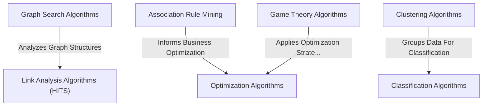

# Tutorial: Data-Warehouse-Algorithms

This project is a diverse *toolbox* of **powerful algorithms** designed to help understand and solve complex problems across various data domains. It includes methods for finding optimal paths like a *digital explorer* (Graph Search), discovering hidden shopping patterns (Association Rule Mining), sorting data into categories (Classification & Clustering), finding the best solutions (Optimization), strategizing in competitive scenarios (Game Theory), and ranking importance in networks (Link Analysis).

**Source Repository:** [https://github.com/Prathamesh282/Data-Warehouse-Algorithms](https://github.com/Prathamesh282/Data-Warehouse-Algorithms)

## Chapters

1. [Clustering Algorithms
](01_clustering_algorithms_.md)
2. [Classification Algorithms
](02_classification_algorithms_.md)
3. [Association Rule Mining
](03_association_rule_mining_.md)
4. [Graph Search Algorithms
](04_graph_search_algorithms_.md)
5. [Link Analysis Algorithms (HITS)
](05_link_analysis_algorithms__hits__.md)
6. [Optimization Algorithms
](06_optimization_algorithms_.md)
7. [Game Theory Algorithms
](07_game_theory_algorithms_.md)

---

Generated by [AI Codebase Knowledge Builder]