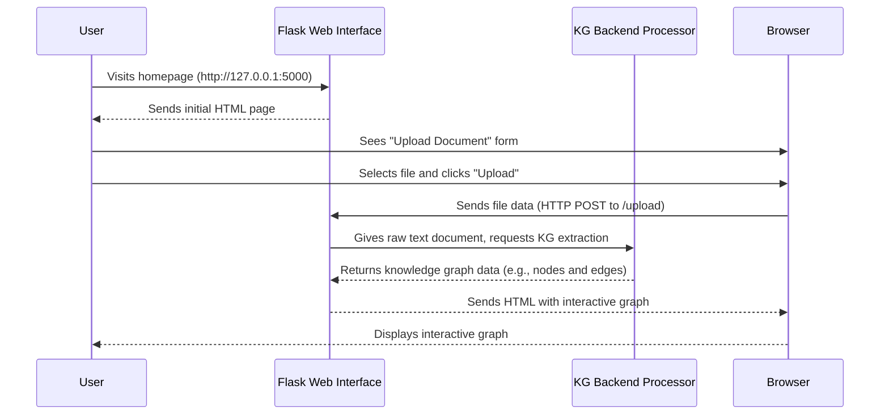

# Chapter 1: Flask Web Interface

Welcome to the `knowledge-graph` project! We're going to start by looking at the very first thing you'll interact with: the **Flask Web Interface**. Think of this as the "dashboard" or "control panel" for our entire system.

### What Problem Does the Flask Web Interface Solve?

Imagine you have a powerful engine that can read complex text and turn it into a beautiful, insightful knowledge graph. That's what our project does! But how do you *talk* to this engine? How do you give it a document, tell it to process it, and then see the results?

This is where the Flask Web Interface comes in. It provides a simple, user-friendly way for you to:

1.  **Upload Text Documents:** You can easily send your `.txt` (or `.pdf`, `.docx` in some versions) files to the system through your web browser.
2.  **Initiate Knowledge Graph Extraction:** Once uploaded, the web interface tells the powerful backend (which we'll explore in later chapters) to start building the knowledge graph from your text.
3.  **Display Interactive Graphs:** After the processing is done, the web interface shows you an interactive visual representation of the knowledge graph right in your browser. You can zoom, drag, and explore the connections!

In short, the Flask Web Interface makes our advanced knowledge graph system accessible and easy to use, translating your clicks into complex backend operations and presenting the outcomes visually.

### What is Flask?

Flask is a "micro" web framework for Python. Don't let "micro" fool you; it's incredibly powerful but designed to be lightweight and simple to get started with. It provides the basic tools you need to build a web application, handling things like:

*   **Routing:** Deciding what to do when someone visits a specific web address (like `/` for the homepage or `/upload` for handling file uploads).
*   **Request Handling:** Receiving data from your browser (like an uploaded file).
*   **Response Generation:** Sending back HTML, images, or data to be displayed in your browser.

### How to Use the Flask Web Interface

Let's get our hands dirty and see how you can start and use this interface.

#### 1. Installation

First, you need to make sure you have the necessary tools installed. Open your terminal or command prompt (or use a code cell in Google Colab) and run:

```bash
pip install -q \
  flask \
  pyvis \
  networkx \
  chardet # for the simpler CPU-based app (app.py)

# If running the full GPU version (gpu-app.py), you'd also need:
# transformers torch bitsandbytes accelerate polars xxhash
```

The `pip install -q` command quietly installs the required Python libraries.

#### 2. Running the Application

This project has two main Flask applications: a simpler CPU-based one (`app.py`) and the more advanced GPU-accelerated one (`gpu-app.py`). Both provide a web interface, but the GPU version handles the complex [GPU-First KG Pipeline](03_gpu_first_kg_pipeline_.md) that we'll discuss later.

**For a simple local test (CPU-based):**

```bash
python app.py
```

You'll see output like: `Starting local KG web app. Open http://127.0.0.1:5000 in your browser.`

**For the full GPU-accelerated version (especially in Google Colab):**

```bash
python gpu-app.py
```

In Google Colab, `localhost` (127.0.0.1) isn't directly accessible from your browser. You'll typically use tools like `ngrok` or Colab's built-in port forwarding feature. The `GPU-README.md` mentions this:

```
Since Colab does **not expose `localhost`**, use:

*   **ngrok** (recommended), or
*   Colab’s built-in port proxy
```

Once running, open your web browser and navigate to `http://127.0.0.1:5000` (or the `ngrok` URL if you're in Colab).

#### 3. Uploading a Document

You'll see a simple page like this:

```html
<!doctype html>
<title>Local KG Builder</title>
<h2 style="font-family:Arial">Local Knowledge Graph Builder</h2>
<form method=post enctype=multipart/form-data action="/upload">
  <label>Upload a document (.txt .pdf .docx):</label><br>
  <input type=file name=file required>
  <input type=submit value="Build KG">
</form>
```

1.  Click the "Choose File" button.
2.  Select a `.txt` file from your computer.
3.  Click "Build KG" or "Upload & Process".

#### 4. Viewing the Graph

After you upload your file, the Flask web interface sends it to the backend for processing. Once the knowledge graph is built, the interface will display an interactive graph directly in your browser!

For example, if you upload a file with the content:

```
Alice went to Paris. Bob met Alice in London. Charlie knows Bob.
```

The web interface will display a graph with nodes like `Alice`, `Bob`, `Charlie`, `Paris`, `London`, and edges showing relationships between them (like `Alice` went to `Paris`, `Bob` met `Alice`, etc.). You'll be able to drag the nodes around, zoom in and out, and see the connections visually.

### How the Flask Web Interface Works Under the Hood

Let's take a simplified look at what happens when you interact with the web interface.

#### The User's Journey (High-Level Sequence)



In this sequence:
*   The **User** is you, operating your computer.
*   The **Flask Web Interface** (`FlaskApp`) is the Python application running on your server, handling web requests.
*   The **KG Backend Processor** (`KGProcessor`) represents the core knowledge graph building logic (which could be the CPU-based system in `app.py` or the GPU-accelerated system in `gpu-app.py`).
*   The **Browser** is Chrome, Firefox, or Safari, displaying the web pages.

#### Diving into the Code (Simplified `app.py` examples)

Both `app.py` and `gpu-app.py` use Flask. Let's look at some simplified snippets from `app.py` to understand the core Flask parts.

1.  **Creating the Flask Application:**

    ```python
    # app.py
    from flask import Flask

    app = Flask(__name__) # This creates our Flask web application!
    # ... other configurations like app.secret_key ...
    ```

    The `Flask(__name__)` line is the magic that initializes our web server.

2.  **Defining the Homepage (`/`)**

    ```python
    # app.py
    from flask import render_template_string

    # ... app = Flask(__name__) ...

    INDEX_HTML = """
    <!doctype html>
    <title>Local KG Builder</title>
    <h2>Local Knowledge Graph Builder</h2>
    <form method=post enctype=multipart/form-data action="{{ url_for('upload') }}">
      <label>Upload a document:</label><br>
      <input type=file name=file required>
      <input type=submit value="Build KG">
    </form>
    """

    @app.route("/") # This decorator tells Flask: "When someone visits '/', run this function!"
    def index():
        return render_template_string(INDEX_HTML) # We send back our simple HTML form
    ```

    The `@app.route("/")` decorator links the root URL (`/`) to the `index()` function. When you visit `http://127.0.0.1:5000`, this function runs, and it returns the HTML defined in `INDEX_HTML`.

3.  **Handling File Uploads (`/upload`)**

    ```python
    # app.py
    from flask import request # We need 'request' to get uploaded files
    # ... other imports ...

    # ... app = Flask(__name__) ...

    @app.route("/upload", methods=["POST"]) # This route handles files sent via the "POST" method
    def upload():
        file = request.files["file"] # This gets the uploaded file from the request
        # ... save the file to a temporary location ...
        # For example, text = file.read().decode('utf-8')

        # This is where the Flask web interface hands over the text
        # to the core Knowledge Graph logic, which will be covered
        # in chapters like [GPU-First KG Pipeline](03_gpu_first_kg_pipeline_.md)
        # or [CPU-based KG Extraction (SpaCy)](04_cpu_based_kg_extraction__spacy__.md).
        # It's like pressing a button on the control panel!

        # G = build_graph(text) # <-- The actual KG building logic (simplified)
        # html_content = graph_to_pyvis(G).generate_html() # <-- Visualization prep (simplified)

        # For this chapter, let's just confirm success
        return f"<h1>File '{file.filename}' uploaded successfully!</h1><p><a href='/'>Upload another</a></p>"
    ```

    The `@app.route("/upload", methods=["POST"])` decorator ensures this function only runs when a file is "posted" to the `/upload` address. Inside, `request.files["file"]` grabs the document you uploaded. The web interface then passes this data to our knowledge graph building functions. In the `gpu-app.py` version, it might put the job into a queue for a dedicated worker thread (see [Single GPU Worker Thread](05_single_gpu_worker_thread_.md)).

    Finally, after the knowledge graph is built, the Flask application will generate an HTML page containing the interactive graph visualization and send it back to your browser. This part directly relates to the [Interactive Graph Visualization](02_interactive_graph_visualization_.md) chapter.

### Conclusion

You've just completed your first step into the `knowledge-graph` project! You now understand that the Flask Web Interface is the friendly face of our powerful system. It allows you to easily upload documents and visually explore the knowledge graphs created from them. While the web interface handles user interaction, the real magic of graph building and display happens behind the scenes.

Next, we'll dive into how those knowledge graphs are actually *displayed* in your browser in an interactive way.

[Next Chapter: Interactive Graph Visualization](02_interactive_graph_visualization_.md)

---

Generated by [AI Codebase Knowledge Builder]