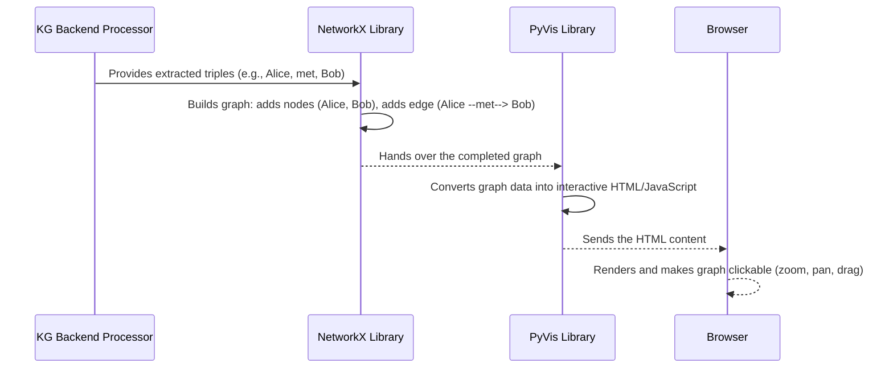

# Chapter 2: Interactive Graph Visualization

In the [previous chapter](01_flask_web_interface_.md), we learned about the Flask Web Interface – the friendly "dashboard" where you upload text documents and, eventually, *see* the resulting knowledge graph. But how does the system take raw information and turn it into that engaging, clickable map of relationships? That's exactly what **Interactive Graph Visualization** handles!

### What Problem Does Interactive Graph Visualization Solve?

Imagine you've fed a long document to our `knowledge-graph` system. The system works its magic and extracts hundreds or even thousands of individual "facts" – like "Alice went to Paris" or "Bob met Alice in London." If we just listed these facts one after another, it would be a huge wall of text! It would be incredibly difficult for a human to spot patterns, understand connections, or discover new insights.

This is where Interactive Graph Visualization steps in. It solves the problem of **making complex relationships intuitive and easy to explore.** Instead of a boring list, it's like creating an interactive map from raw location data. Suddenly, you can see Alice, Bob, Paris, and London as interconnected points, visually understand who went where, and grasp the bigger picture at a glance. You can zoom in on details, pan across the graph, and even drag individual "nodes" (the people, places, or things) around to better arrange them.

### Key Concepts for Visualizing Graphs

To turn raw data into an interactive visual, we rely on a few core ideas:

1.  **Nodes and Edges:** The basic building blocks of any graph.
    *   **Nodes:** These are the "things" or "entities" in your data. In our knowledge graph, nodes represent people (Alice, Bob), places (Paris, London), organizations, dates, etc.
    *   **Edges:** These are the "connections" or "relationships" between nodes. An edge might show "Alice *went to* Paris" or "Bob *met* Alice."

2.  **Graph Data Structure (NetworkX):** Inside Python, we need a way to represent these nodes and edges programmatically. The `networkx` library is excellent for this. It allows us to build a graph in memory, adding nodes with their properties (like type or size) and edges with their relationships (like "met" or "co_occurs").

3.  **Interactive HTML Output (PyVis):** Once we have our graph structured in `networkx`, we need to display it. `PyVis` is a powerful tool that takes a `networkx` graph and transforms it into a self-contained HTML file. This HTML file can be opened directly in any web browser and comes with built-in interactivity, no extra coding required!

### How to Create a Simple Interactive Graph

Let's look at a very simplified example to understand how `NetworkX` and `PyVis` work together. You won't run this code directly in the main app, but it shows the core idea.

First, you'd typically install these libraries (if you haven't already, as mentioned in [Chapter 1: Flask Web Interface](01_flask_web_interface_.md)):

```bash
pip install -q networkx pyvis
```

Now, let's build a tiny graph in Python:

```python
import networkx as nx
from pyvis.network import Network

# 1. Create a NetworkX graph (our data structure)
G = nx.DiGraph() # DiGraph means directed graph (edges have a direction)

# 2. Add nodes (entities)
G.add_node("Alice", size=20, color="blue", title="A Person")
G.add_node("Bob", size=20, color="blue", title="Another Person")
G.add_node("Paris", size=15, color="green", title="A City")

# 3. Add edges (relationships)
G.add_edge("Alice", "Paris", label="went to")
G.add_edge("Bob", "Alice", label="met")

# 4. Create a PyVis network from our NetworkX graph
net = Network(height="400px", width="100%", bgcolor="#222222", font_color="white", notebook=True)
net.from_nx(G) # This magic line converts our NetworkX graph to a PyVis one!

# 5. Generate an interactive HTML file
net.show("my_first_graph.html")
```

**What happens when you run this?**
This code creates a file named `my_first_graph.html` in the same folder where your Python script is located. If you open this HTML file in your web browser, you'll see a small, dark background with three colored circles (nodes for Alice, Bob, and Paris) and two arrows (edges for "went to" and "met"). You can click and drag the nodes, zoom in and out with your mouse wheel, and see how they're connected!

### How Interactive Graph Visualization Works Under the Hood

When you upload a document in our `knowledge-graph` application and it displays the graph, a series of steps occur to make that visualization possible.

#### The Visualization Journey (High-Level Sequence)



In this flow:
*   The **KG Backend Processor** (which we'll cover in detail in [Chapter 3: GPU-First KG Pipeline](03_gpu_first_kg_pipeline_.md) and [Chapter 4: CPU-based KG Extraction (SpaCy)](04_cpu_based_kg_extraction__spacy__.md)) is responsible for analyzing your text and figuring out who and what is connected. It then provides this information as a list of nodes and relationships.
*   The `networkx` library takes this raw list and builds a proper graph data structure in Python.
*   The `pyvis` library then takes this `networkx` graph and, like a skilled architect, designs and builds the interactive HTML page.
*   Finally, your **Browser** receives this HTML and brings the graph to life, allowing you to explore it.

#### Diving into the Code (Simplified Examples from `app.py`)

Let's look at how the `app.py` (our simpler, CPU-based Flask application) uses these libraries to create the visualization.

1.  **Building the `NetworkX` Graph from Text:**

    ```python
    # app.py (simplified)
    import networkx as nx
    import spacy # Used for text processing

    nlp = spacy.load("en_core_web_sm") # Loads a language model

    def build_graph(text: str):
        doc = nlp(text) # Process the text with SpaCy
        G = nx.DiGraph() # Start an empty directed graph

        # Simplified: Add entities as nodes and co-occurrence as edges
        for ent in doc.ents:
            G.add_node(str(ent.text), type=ent.label_, size=18)
        
        # Simplified: Find connections (edges)
        for sent in doc.sents:
            # Example: if "Alice" and "Paris" are in the same sentence
            # G.add_edge("Alice", "Paris", relationship="co_occurs", weight=1)
            pass # More complex logic here to add edges

        return G
    ```
    This `build_graph` function is the crucial first step. It uses `spaCy` (a Natural Language Processing library) to understand your text, identify important "entities" (like people or places), and then adds them as nodes to a `NetworkX` graph (`G`). It also tries to find relationships and adds them as edges. This function ultimately gives us a `NetworkX` graph object.

2.  **Converting `NetworkX` to `PyVis` and Generating HTML:**

    ```python
    # app.py (simplified)
    from pyvis.network import Network
    # ... other imports ...

    def graph_to_pyvis(G: nx.Graph, title="KG", bgcolor="#0f0f0f", font_color="white"):
        net = Network(height="700px", width="100%", bgcolor=bgcolor, font_color=font_color)
        net.barnes_hut() # Applies a layout algorithm for better node arrangement
        net.toggle_physics(True) # Makes nodes "bouncy" and interactive

        # Loop through NetworkX nodes and add them to PyVis network
        for n, attr in G.nodes(data=True):
            net.add_node(n, label=n, title=f"{n} ({attr.get('type','UNK')})", color=attr.get('color', '#9e9e9e'))

        # Loop through NetworkX edges and add them to PyVis network
        for u, v, attr in G.edges(data=True):
            net.add_edge(u, v, title=attr.get("relationship", ""), value=attr.get("weight", 1))
        
        return net # Returns the configured PyVis network object

    # ... later in the upload function ...
    # G = build_graph(text) # Our graph from previous step
    # net = graph_to_pyvis(G, title=orig_name) # Convert it for visualization
    # html_content = net.generate_html() # Get the actual HTML string
    # return html_content # Flask sends this HTML to your browser
    ```
    The `graph_to_pyvis` function takes the `NetworkX` graph (`G`) we just built. It then creates a `PyVis Network` object (`net`), copies all the nodes and edges from `G` into `net` (applying colors, sizes, and labels based on their properties), and finally, `net.generate_html()` creates the entire interactive HTML string. This HTML is then sent back to your browser by Flask.

    It's important to note that for very large graphs, such as those processed by the GPU-accelerated pipeline (`gpu-app.py`), we often need to limit the number of nodes and edges displayed to prevent your web browser from becoming slow or crashing. This is done by selecting only the most important parts of the graph (e.g., nodes with the highest [PageRank](08_gpu_side_triple_aggregation_.md) score or highest degree). These limits, like `MAX_VIS_NODES` and `MAX_VIS_EDGES`, ensure a smooth user experience even with massive underlying data.

### Conclusion

You've now seen how our `knowledge-graph` system transforms raw text into an engaging, interactive visual map. The **Interactive Graph Visualization** abstraction takes the structured data (nodes and edges) produced by our backend and, using libraries like `NetworkX` and `PyVis`, crafts a dynamic HTML display. This allows you to effortlessly explore complex relationships directly in your web browser, making complex information intuitive and accessible.

Next, we'll journey deeper into how the system actually *extracts* all that valuable knowledge graph data from your documents, focusing on our powerful GPU-first approach.

[Next Chapter: GPU-First KG Pipeline](03_gpu_first_kg_pipeline_.md)

---

Generated by [AI Codebase Knowledge Builder]