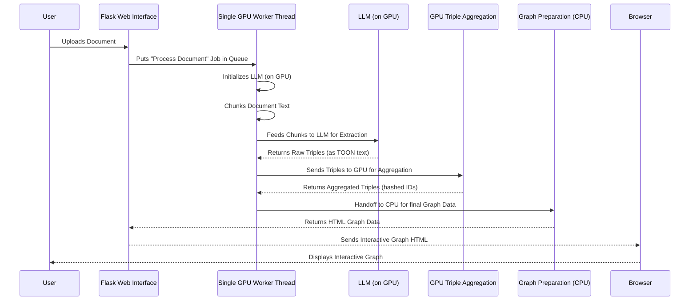

# Chapter 3: GPU-First KG Pipeline

In the [previous chapter](02_interactive_graph_visualization_.md), you learned how our system takes raw facts and displays them as a beautiful, interactive graph in your browser. But before we can *see* a graph, we need to *create* it! How does our system magically read a document and figure out all those "nodes" and "edges" with super speed?

That's where the **GPU-First KG Pipeline** comes in. Think of this as the high-speed, automated factory behind the scenes.

### What Problem Does the GPU-First KG Pipeline Solve?

Imagine you have a huge stack of books, and you need to find every single fact and relationship mentioned in them – like "Alice went to Paris" or "the company was founded in 1999." Doing this manually would take ages!

Now imagine doing this with a computer. Standard computers (using their **CPU**, or Central Processing Unit) are great for handling one task very precisely. But extracting knowledge from massive text documents involves many repetitive, complex calculations, especially when using advanced Artificial Intelligence models like Large Language Models (LLMs). If we used a CPU for all these steps, it would be like having one person trying to build a massive LEGO castle all by themselves, piece by piece. It would be very slow.

The **GPU-First KG Pipeline** solves this speed problem. It's like bringing in a team of highly specialized, super-fast robots (the **GPU**, or Graphics Processing Unit) that can work on many parts of the castle *at the same time*. This pipeline ensures that the most demanding tasks—like having an LLM read the text and figure out relationships, or counting how often certain facts appear—are all handled by these powerful GPU robots. This makes the entire process incredibly fast and efficient, especially for large documents.

### Key Concepts of the GPU-First Pipeline

Let's break down the main ideas that make this pipeline so fast:

1.  **GPU (Graphics Processing Unit):**
    *   **Analogy:** If a CPU is a brilliant scientist who solves problems one by one very deeply, a GPU is like a thousand fast workers who can each do a simple calculation at the same time.
    *   **Purpose:** GPUs are fantastic at doing many similar calculations in parallel. This makes them perfect for powering AI models (like the LLMs we use) and crunching numbers very quickly.
    *   Our pipeline is "GPU-First" because it tries to use this super-fast worker team for *every* heavy task.

2.  **"Pipeline" and "GPU-First":**
    *   **Pipeline:** This refers to the series of steps our system takes, one after another, to transform raw text into a knowledge graph. It's like an assembly line in a factory.
    *   **"GPU-First":** This is the core philosophy. It means we try to perform as many steps as possible directly on the GPU, right from the start. Why? Because moving data back and forth between the CPU (your computer's main brain) and the GPU (the super-fast calculator) is slow. By keeping the data on the GPU for as long as possible, we minimize these slow transfers, just like keeping all your tools in one spot on the assembly line saves time.

3.  **LLM-based Relation Extraction:**
    *   This is the "brain" of our pipeline. We use a [Quantized LLM Inference](06_quantized_llm_inference_.md) (a powerful, specially optimized AI model) to read your text.
    *   The LLM's job is to identify "entities" (like people, places, things) and the "relationships" between them (like "Alice *went to* Paris"). It extracts these as "triples" (source, predicate, target).
    *   This is a heavy task, so it absolutely needs the GPU!

4.  **Document Chunking:**
    *   LLMs have a limit on how much text they can read at once. So, before feeding your document to the LLM, the pipeline breaks it down into smaller, manageable "chunks" of text. This is like cutting a long book into smaller chapters before giving them to different readers.

5.  **GPU-side Triple Aggregation:**
    *   When the LLM extracts triples, it might find the same fact multiple times (e.g., "Alice went to Paris" mentioned in different sentences).
    *   Instead of moving all these raw facts to the CPU to count them up, our pipeline counts and combines identical facts (aggregates them) directly on the GPU. This is highly efficient and is covered in detail in [GPU-side Triple Aggregation](08_gpu_side_triple_aggregation_.md).

### How the GPU-First Pipeline Works (Behind the Scenes)

When you upload a document through the [Flask Web Interface](01_flask_web_interface_.md) and click "Build KG" (using `gpu-app.py`), here's the high-level sequence of what happens:



Let's dive into some simplified code snippets to see how these steps connect in `gpu-app.py`. Remember, these are simplified examples focusing on the core idea, not the full complexity.

#### 1. Document Chunking

The pipeline first takes your entire document and breaks it into smaller pieces that the LLM can handle. This ensures that even very long texts can be processed.

```python
# Simplified snippet from gpu-app.py
# 'raw' is the text from your uploaded document
# 'tokenizer' is a tool that understands how to break text into 'tokens'
enc_all = tokenizer.encode(raw, add_special_tokens=False) # Convert text to numerical tokens
chunks = []
i = 0
while i < len(enc_all):
    j = min(i + CHUNK_TOKENS, len(enc_all)) # Grab a section of tokens
    # Convert tokens back to readable text for the LLM
    chunks.append(tokenizer.decode(enc_all[i:j], skip_special_tokens=True))
    i = j
print(f"Document split into {len(chunks)} manageable chunks.")
```
This code segment takes the entire document (`raw`), converts it into numerical tokens (like words are mapped to numbers), and then creates `chunks` by decoding these token sequences back into text. Each `chunk` is now a smaller, digestible piece of your document.

#### 2. LLM-based Relation Extraction (on GPU)

Next, each chunk is fed to the powerful LLM. The LLM reads the text and extracts factual triples in a specific, machine-friendly format called [Token-Oriented Object Notation (TOON)](07_token_oriented_object_notation__toon__.md). This step is entirely GPU-powered for speed.

```python
# Simplified snippet from gpu-app.py
# 'model' is our powerful LLM, already loaded on the GPU
# 'PROMPT_TEMPLATE' guides the LLM on how to extract triples
extracted_triples_gpu_batches = [] # To store triples from all chunks

for chunk in chunks:
    prompt = PROMPT_TEMPLATE.format(text=chunk) # Prepare the instruction for the LLM
    # Encode the prompt and move it to the GPU where the model is
    inputs = tokenizer(prompt, return_tensors="pt").to(model.device)
    with torch.no_grad(): # Don't track changes, just generate output
        # Ask the LLM to generate text (the triples)
        outputs = model.generate(**inputs, max_new_tokens=MAX_NEW_TOKENS, do_sample=False)
    # Decode the LLM's output back into human-readable text
    extracted_text = tokenizer.decode(outputs[0], skip_special_tokens=True)
    
    # Parse the TOON text into structured Python triples
    triples = parse_toon_block(extracted_text)
    # Convert text triples to numerical hashes and keep them on GPU if possible
    # (Details are simplified here, actual hash conversion happens just before GPU aggregation)
    extracted_triples_gpu_batches.append(triples) 

# Ensure memory is cleared after each batch of LLM calls to prevent crashes
torch.cuda.empty_cache() 

print("LLM has extracted raw triples from all chunks on the GPU.")
```
Here, for each `chunk`, a `prompt` is created to tell the LLM what to do. The prompt and chunk are sent to the `model` (which runs on the GPU). The `model.generate` function then produces the extracted facts, which are then parsed into a structured format. This whole process stays on the GPU as much as possible.

#### 3. GPU-side Triple Aggregation

The raw triples extracted by the LLM might contain duplicates or similar facts. This step efficiently counts and combines them *directly on the GPU* to avoid slow data transfers. This process is further explained in [GPU-side Triple Aggregation](08_gpu_side_triple_aggregation_.md).

```python
# Simplified snippet from gpu-app.py
# 'extracted_triples_gpu_batches' contains triples like (source, predicate, target, confidence)
# We convert these string entities to unique numerical IDs (hashes) first.
# hash_to_text = {} # A map to remember what each numerical ID stands for

# For simplicity, imagine 'batch_hash_arrays' contains numerical IDs for S, P, O and confidence.
# E.g., batch_hash_arrays = [([101, 102], [201, 202], [301, 302], [0.9, 0.8]), ...]

# This function does the heavy lifting of counting and averaging confidence on GPU
aggregated_results = aggregate_triples_gpu(batch_hash_arrays, device=model.device)

# 'aggregated_results' now contains tuples like:
# (source_hash_ID, target_hash_ID, predicate_hash_ID, average_confidence, count_of_occurrences)
print("Triples have been aggregated and counted on the GPU for efficiency.")
```
In this step, the individual string parts of each triple (source, predicate, target) are converted into numerical "hash IDs." These hash IDs, along with their confidence scores, are sent to the `aggregate_triples_gpu` function. This function uses the GPU's power to efficiently find all unique triples, sum their confidences, and count their occurrences, returning the result as a list of aggregated numerical data.

#### 4. Single CPU Handoff & Graph Preparation

After all the heavy lifting on the GPU, a minimal amount of aggregated data (the numerical hash IDs and their counts) is transferred back to the CPU. The CPU then uses this data to:
*   Convert the numerical hash IDs back into readable text (e.g., "Alice" instead of `101`).
*   Calculate additional graph statistics like [PageRank](08_gpu_side_triple_aggregation_.md).
*   Build a small [NetworkX](02_interactive_graph_visualization_.md) graph (a data structure for graphs).
*   Finally, use [PyVis](02_interactive_graph_visualization_.md) to generate the interactive HTML for your browser.

This entire process, from queuing the job to handling the GPU operations, is managed by a dedicated [Single GPU Worker Thread](05_single_gpu_worker_thread_.md) to ensure stability.

```python
# Simplified snippet from gpu-app.py
# 'aggregated_results' contains numerical hash IDs and counts from GPU
# 'hash_to_text' is used to convert hash IDs back to actual words
final_rows = []
for src_h, dst_h, rel_h, mean_conf, count in aggregated_results:
    s = hash_to_text.get(src_h, str(src_h)) # Convert hash back to source text
    p = hash_to_text.get(rel_h, str(rel_h)) # Convert hash back to predicate text
    o = hash_to_text.get(dst_h, str(dst_h)) # Convert hash back to target text
    final_rows.append({"source": s, "predicate": p, "target": o, "confidence": mean_conf, "count": count})

# Use 'final_rows' to build a NetworkX graph and then a PyVis interactive HTML file.
# This part is similar to what you saw in [Chapter 2: Interactive Graph Visualization](02_interactive_graph_visualization_.md).
print("Final graph data prepared for visualization and sent to your browser.")
```
This final step converts the efficient numerical results back into human-readable text and constructs the graph that you ultimately see in your web browser.

### Conclusion

The **GPU-First KG Pipeline** is the powerful engine that transforms raw text into a rich knowledge graph. By strategically using the GPU for the most demanding tasks—like LLM-based extraction and triple aggregation—and minimizing slow data transfers, it achieves remarkable speed and efficiency. This "assembly line" approach, where powerful GPU robots do the heavy lifting, is what allows our `knowledge-graph` project to process documents quickly and prevent resource issues, especially in environments like Google Colab.

Next, we'll explore an alternative, CPU-based approach to knowledge graph extraction, giving you a contrast to our GPU-first strategy.

[Next Chapter: CPU-based KG Extraction (SpaCy)](04_cpu_based_kg_extraction__spacy__.md)

---

Generated by [AI Codebase Knowledge Builder]