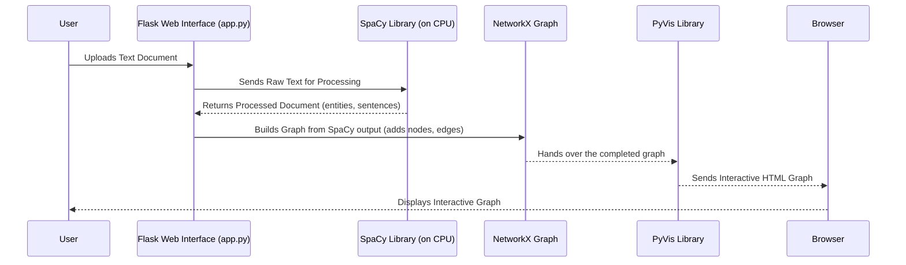

# Chapter 4: CPU-based KG Extraction (SpaCy)

In the [previous chapter](03_gpu_first_kg_pipeline_.md), we explored the powerful **GPU-First KG Pipeline**, a high-speed factory designed for processing massive documents with advanced AI models. But what if you don't have a super-powerful GPU, or if your needs are simpler and you just want a quick, robust way to extract knowledge graphs from smaller documents?

This is where the **CPU-based KG Extraction (SpaCy)** approach comes in. It's like having a skilled artisan meticulously craft a beautiful piece by hand, rather than a large automated factory. It's perfect for when you prioritize simplicity, reliability, and lower hardware requirements.

### What Problem Does CPU-based KG Extraction (SpaCy) Solve?

Imagine you have a research paper, an article, or a few paragraphs of text, and you want to quickly identify the key people, organizations, locations, and how they relate to each other. You don't need the bleeding-edge AI power of a large language model (LLM), nor do you want to worry about complex GPU setup.

This abstraction solves the problem of **extracting a foundational knowledge graph from text using widely accessible CPU resources and proven Natural Language Processing (NLP) techniques.** It's like having a meticulous librarian who reads a document, highlights key terms (persons, places, organizations), and notes down simple relationships – for example, if two terms appear in the same sentence or if one term performs an action on another. This creates a basic, yet valuable, index of relationships without needing advanced hardware.

### Key Concepts of SpaCy-based Extraction

Our simpler `app.py` application uses the `spaCy` library for this extraction. Let's break down its core ideas:

1.  **SpaCy Library:**
    *   **Analogy:** Think of `spaCy` as a powerful, ready-to-use toolkit for understanding human language. It comes with pre-trained "brains" (called models) that can perform various language tasks very efficiently on your computer's CPU.
    *   **Purpose:** We use `spaCy` to process text, understand its structure, and identify meaningful parts.

2.  **Entity Recognition (NER):**
    *   **Analogy:** This is like the librarian's ability to spot all the "proper nouns" in a text and categorize them. "Alice" is a PERSON, "Google" is an ORGANIZATION, "Paris" is a GPE (Geo-Political Entity like a city).
    *   **Purpose:** `spaCy` automatically identifies these "entities" in your text. These entities become the **nodes** in our knowledge graph.

3.  **Relationship Extraction (Simple Patterns):**
    *   **Analogy:** After identifying key terms, the librarian looks for simple ways they connect.
    *   **Co-occurrence:** If "Alice" and "Paris" are mentioned in the same sentence, they are "co-occurring." This suggests a relationship, even if the exact nature isn't specified.
    *   **Subject-Verb-Object (SVO):** This is a basic grammar pattern. If a sentence says "Alice *went to* Paris," `spaCy` can often identify "Alice" as the Subject, "went to" as the Verb (the relationship), and "Paris" as the Object. This directly forms a "triple" (Alice, went to, Paris), which becomes an **edge** in our graph.

### How to Use CPU-based KG Extraction

You've already interacted with this version if you followed the instructions in [Chapter 1: Flask Web Interface](01_flask_web_interface_.md) and ran `python app.py`. This `app.py` file is our simpler, CPU-based application.

Here's a quick recap of how to use it:

1.  **Run the `app.py` application:**
    ```bash
    python app.py
    ```
    You'll see output like: `Starting local KG web app. Open http://127.0.0.1:5000 in your browser.`

2.  **Open your browser** to `http://127.0.0.1:5000`.

3.  **Upload a `.txt` document.** Let's use a simple example text:

    ```
    Alice works at Google. She lives in London. Bob also works there.
    ```

4.  **Click "Build KG".**

**Expected Output:**
The system will process the text using `spaCy` on your CPU. The Flask web interface (as discussed in [Chapter 1: Flask Web Interface](01_flask_web_interface_.md)) will then display an [Interactive Graph Visualization](02_interactive_graph_visualization_.md) with:
*   **Nodes:** `Alice`, `Google`, `London`, `Bob`
*   **Edges:**
    *   `Alice` --`works at`--> `Google` (SVO)
    *   `Alice` --`lives in`--> `London` (SVO)
    *   `Bob` --`co_occurs`--> `Google` (from "Bob also works there" - `Bob` and `there` (referring to Google) are in the same sentence).

### How CPU-based Extraction Works Under the Hood

When you upload a document to `app.py`, here's a simplified sequence of events:

#### The SpaCy Extraction Journey (High-Level Sequence)



In this sequence, the **Flask Web Interface** receives your document. Instead of sending it to a GPU pipeline, it hands the raw text directly to the **SpaCy Library** running on your computer's **CPU**. `SpaCy` then performs its language analysis. The results are used to build a **NetworkX Graph**, which is then converted by **PyVis** into the interactive HTML you see in your **Browser**.

#### Diving into the Code (Simplified `app.py` examples)

Let's look at the core functions in `app.py` that implement this CPU-based extraction:

1.  **Loading the SpaCy Model:**
    First, the `app.py` script loads a `spaCy` language model. This "brain" allows `spaCy` to understand English text.

    ```python
    # app.py
    import spacy
    # ... other imports ...

    # Load spaCy model once when the app starts
    nlp = spacy.load("en_core_web_sm")
    ```
    The `spacy.load("en_core_web_sm")` line loads a small English model. This operation happens only once and prepares `spaCy` for text processing.

2.  **Processing Text and Building the Graph (`build_graph` function):**
    This is the heart of the CPU-based extraction. The `build_graph` function takes your document's text, processes it with `spaCy`, and then systematically adds nodes and edges to a `NetworkX` graph.

    ```python
    # app.py (simplified)
    import networkx as nx
    # ... other imports, including nlp = spacy.load(...) ...

    def build_graph(text: str):
        doc = nlp(text) # SpaCy processes the text! This is where the magic happens.
        G = nx.DiGraph() # Start an empty directed graph

        # 1. Add entities as nodes
        for ent in doc.ents: # Loop through all entities SpaCy found
            key = str(ent.text).strip()
            if not G.has_node(key):
                G.add_node(key, type=ent.label_, size=18) # Add it as a node with its type

        # 2. Add co-occurrence edges
        for sent in doc.sents: # Loop through each sentence
            sent_entities = [e.text.strip() for e in sent.ents]
            for i in range(len(sent_entities)):
                for j in range(i+1, len(sent_entities)):
                    a, b = sent_entities[i], sent_entities[j]
                    if not G.has_node(a): G.add_node(a) # Ensure nodes exist
                    if not G.has_node(b): G.add_node(b)
                    # Add/update co-occurrence edge
                    if G.has_edge(a,b): G[a][b]["weight"] += 1
                    else: G.add_edge(a,b, relationship="co_occurs", weight=1)
        
        # 3. Add SVO edges
        for token in doc: # Loop through all tokens (words)
            if token.dep_ == "nsubj": # Check if it's a nominal subject
                subj = token.text
                verb = token.head # The verb that the subject is performing
                # Simplified: find a direct object or prepositional object
                dobj = next((c.text for c in verb.children if c.dep_ in ("dobj", "pobj")), None)
                if dobj:
                    G.add_edge(subj, dobj, relationship=verb.lemma_.lower(), weight=1) # Add SVO triple

        return G
    ```
    The `doc = nlp(text)` line is crucial; `spaCy` parses the text, giving us `doc.ents` (identified entities), `doc.sents` (sentences), and `token.dep_` (grammatical dependencies for SVO). We then iterate through these `spaCy` outputs to populate our `NetworkX` graph `G` with nodes and edges.

3.  **Generating the Interactive HTML:**
    Finally, the `graph_to_pyvis` function (which you saw in [Chapter 2: Interactive Graph Visualization](02_interactive_graph_visualization_.md)) takes the `NetworkX` graph built by `build_graph` and turns it into an interactive HTML string, ready to be sent to your browser.

    ```python
    # app.py (simplified)
    from pyvis.network import Network
    # ... other imports ...

    def graph_to_pyvis(G: nx.Graph, title="KG", bgcolor="#0f0f0f", font_color="white"):
        net = Network(height="700px", width="100%", bgcolor=bgcolor, font_color=font_color)
        net.barnes_hut() # Applies a layout algorithm for better node arrangement

        # Add nodes with colors based on their type
        type_color = {"PERSON":"#ffffff", "ORG":"#b3e5fc", "GPE":"#a5d6a7", "UNK":"#9e9e9e"}
        for n, attr in G.nodes(data=True):
            ntype = attr.get("type", "UNK")
            color = type_color.get(ntype, "#9e9e9e")
            size = max(10, int(attr.get("size", 12))) # Adjust node size for visibility
            net.add_node(n, label=n, title=f"{n} ({ntype})", color=color, size=size)

        # Add edges with labels and width based on weight
        for u, v, attr in G.edges(data=True):
            label = attr.get("relationship", "")
            width = min(6, 1 + attr.get("weight", 1)) # Make thicker for higher weight
            net.add_edge(u, v, title=label, value=width)
        
        return net # Returns the configured PyVis network object
    
    # ... later in the upload function in app.py ...
    # G = build_graph(text) # We just built this graph!
    # net = graph_to_pyvis(G, title=orig_name) # Convert it for visualization
    # html_content = net.generate_html() # Get the actual HTML string
    # return html_content # Flask sends this HTML to your browser
    ```
    This function creates the visual representation you interact with, ensuring that the extracted knowledge is presented clearly and intuitively.

### Conclusion

You've now seen how the **CPU-based KG Extraction (SpaCy)** provides a robust and accessible way to build knowledge graphs. By leveraging the `spaCy` library on your computer's CPU, it efficiently identifies entities and establishes relationships based on simple patterns like co-occurrence and Subject-Verb-Object structures. This approach is fantastic for quick local tests and simpler applications where the full power of a GPU-accelerated LLM pipeline isn't necessary.

Next, we'll dive into how the more complex GPU-first pipeline manages its demanding tasks and coordinates its operations through a specialized worker.

[Next Chapter: Single GPU Worker Thread](05_single_gpu_worker_thread_.md)

---

Generated by [AI Codebase Knowledge Builder]