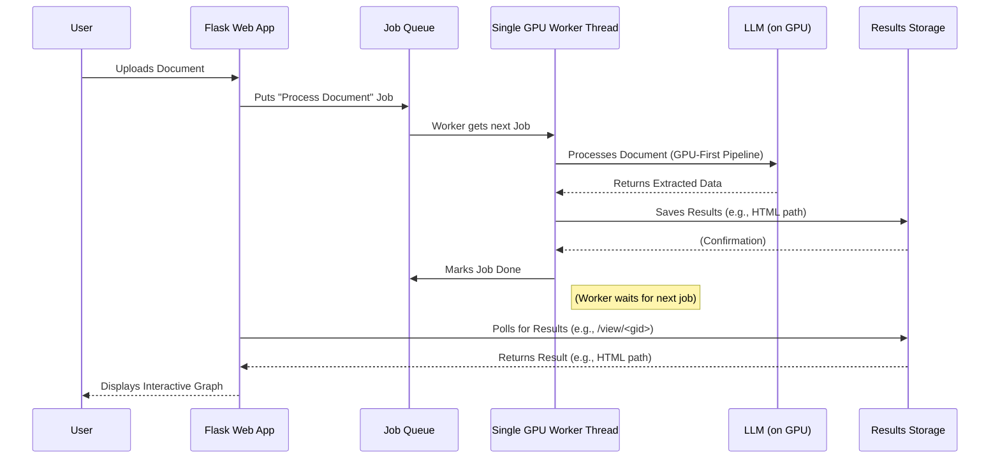

# Chapter 5: Single GPU Worker Thread

In the [previous chapters](03_gpu_first_kg_pipeline_.md) we learned about the powerful **GPU-First KG Pipeline**, which uses your graphics card (GPU) to rapidly extract knowledge graphs. We also saw how the [Flask Web Interface](01_flask_web_interface_.md) allows you to upload documents and see the results.

But what happens when many users (or even just one user making multiple fast requests) try to use that powerful GPU at the same time through the web interface? GPUs, especially in shared environments like Google Colab, are delicate. If multiple parts of a program try to access the GPU simultaneously, it can lead to confusing errors, memory issues, or even program crashes. This is a common challenge for web applications that use GPUs.

This is where the **Single GPU Worker Thread** comes in! It's a crucial design pattern that ensures our `knowledge-graph` project runs smoothly and reliably, especially when dealing with GPU-intensive tasks.

### What Problem Does the Single GPU Worker Thread Solve?

Imagine a very important and delicate machine in a factory – let's say a super-fast 3D printer (our GPU). This printer can only handle one design job at a time. If multiple people try to send their designs to it simultaneously, the printer might get confused, break down, or print corrupted objects.

In our `knowledge-graph` web application, the "3D printer" is the GPU, and the "design jobs" are your requests to process documents and build knowledge graphs using powerful Large Language Models (LLMs). These LLMs run on the GPU.

The **Single GPU Worker Thread** solves this problem by acting like a highly responsible manager. Instead of letting every user request directly access the GPU, the manager:

1.  **Collects all requests** in an organized "to-do" list (a queue).
2.  **Processes them one by one, in order.**
3.  **Never allows more than one task** to interact with the GPU at any given moment.

This disciplined approach ensures the GPU always operates in a stable environment, preventing conflicts, errors, and crashes. It's particularly important in environments like Google Colab, where GPU resources can be limited and shared.

### Key Concepts of the Single GPU Worker Thread

To understand how this "manager" works, let's look at a few core ideas:

1.  **GPU (Graphics Processing Unit):** As we know from [Chapter 3: GPU-First KG Pipeline](03_gpu_first_kg_pipeline_.md), this is the super-fast calculator that excels at parallel processing, making it ideal for AI tasks. But it needs careful handling.

2.  **Threads:** In a computer program, a "thread" is like a separate mini-program running within the main program. Imagine your main program is a busy office. One thread might be answering emails, while another thread is making coffee. They can do different things, sometimes at the same time, but they share the same office resources.

3.  **Worker Thread:** A special kind of thread that's dedicated to doing a specific, often heavy or long-running, task in the background. While the main program keeps interacting with users (like your Flask web interface), the worker thread silently crunches numbers.

4.  **Single GPU Worker:** This is the key. We deliberately create *only one* worker thread that is allowed to talk to the GPU. This thread is responsible for initializing the LLM (our powerful AI model) and performing all GPU-intensive tasks. Because it's the *only* one, we guarantee that GPU access is serialized (one after another), preventing clashes.

5.  **Job Queue:** This is the "to-do" list where all requests wait. When a user uploads a document, the Flask app doesn't immediately send it to the GPU. Instead, it adds the "process this document" instruction to the job queue. The Single GPU Worker Thread then picks up tasks from this queue whenever it's ready.

### How to Use the Single GPU Worker Thread (from a User's Perspective)

As a user, you actually **don't directly interact** with the Single GPU Worker Thread. It operates entirely behind the scenes! This is a good thing, as it means the system is handling the complex GPU management for you.

When you run `gpu-app.py` (as explained in [Chapter 1: Flask Web Interface](01_flask_web_interface_.md)):

```bash
python gpu-app.py
```

...and then open your browser to `http://127.0.0.1:5000` (or your Colab URL) to upload a document, here's what happens:

1.  Your browser sends your document to the Flask web application.
2.  The Flask application receives your request.
3.  Instead of directly calling the GPU, the Flask app *puts your processing request into a queue*.
4.  The **Single GPU Worker Thread**, running in the background, eventually picks up your request from the queue.
5.  It then performs the entire [GPU-First KG Pipeline](03_gpu_first_kg_pipeline_.md) – chunking, LLM extraction, GPU-side aggregation – all safely within its dedicated execution space.
6.  Once done, it makes the results available for the Flask app to display to you.

The output you see in your browser (the interactive knowledge graph) is the result of this dedicated worker thread doing its job efficiently and safely.

Let's look at a simplified code snippet from `gpu-app.py` showing how a job is added to the queue:

```python
# gpu-app.py (simplified)
# ... imports ...
import threading
import queue

JOB_QUEUE = queue.Queue() # This is our "to-do" list!
RESULTS = {} # This will store the results once done

# ... other Flask routes ...

@app.route("/upload", methods=["POST"])
def upload():
    f = request.files.get("file")
    # ... file saving logic ...
    gid = "unique-graph-id" # A unique ID for this job
    saved_file_path = "path/to/your/document.txt"

    RESULTS[gid] = "queued" # Mark this job as waiting
    JOB_QUEUE.put((gid, saved_file_path)) # Add the job to the queue!

    return "Your document is being processed! Check back soon."
```
When you click "Upload & Process" in the web interface, your file is saved, a unique ID is created for your job (`gid`), and then this job (the `gid` and the `saved_file_path`) is placed into the `JOB_QUEUE`. The Flask app immediately responds, letting you know the job is "queued," rather than making you wait for the entire GPU process to complete.

### How the Single GPU Worker Thread Works Under the Hood

Let's trace the journey of your document processing request:



#### Diving into the Code (Simplified `gpu-app.py` examples)

Let's look at the key parts of `gpu-app.py` that implement this worker thread pattern.

1.  **Setting up the Queue and Results Storage:**

    ```python
    # gpu-app.py
    import threading
    import queue
    from typing import Dict, Optional

    JOB_QUEUE = queue.Queue() # The queue for incoming tasks
    RESULTS: Dict[str, Optional[str]] = {} # Dictionary to store processing results
                                           # (key: job ID, value: path to HTML or None if failed)
    ```
    `JOB_QUEUE` is where all processing requests are put. `RESULTS` is a way for the main Flask application to check if a specific job has finished and where its output (like the path to the generated HTML graph) can be found.

2.  **The `gpu_worker_loop` Function (The Manager's Brain):**
    This function contains the endless loop that the worker thread runs. It constantly checks the `JOB_QUEUE` for new tasks.

    ```python
    # gpu-app.py (simplified)
    # ... imports for torch, transformers, etc. ...

    def gpu_worker_loop():
        tokenizer = None
        model = None # Model will be loaded *inside* this thread
        
        while True: # This loop runs forever (or until the program exits)
            job = JOB_QUEUE.get() # Wait here until a job is available in the queue
            if job is None: # A special 'None' job can signal the worker to stop
                break
            
            gid, doc_path = job # Unpack the job: graph ID and document path
            RESULTS[gid] = "processing" # Mark the job as currently being processed

            try:
                # IMPORTANT: Initialize LLM (tokenizer, model) *inside* the worker thread.
                # This ensures the GPU's CUDA context is owned by this thread, preventing
                # common multi-threading issues with GPU libraries like PyTorch.
                if model is None:
                    # Refer to model loading in GPU-README.md
                    tokenizer, model, _ = load_model_safe(MODEL_NAME)
                    # Optionally compile the model for extra speed
                    # if USE_TORCH_COMPILE: model = torch.compile(model, ...)

                raw_text = doc_path.read_text(encoding="utf-8", errors="replace")
                
                # --- This is where the GPU-intensive work happens! ---
                # 1. Document Chunking (preparation for LLM)
                #    (See [GPU-First KG Pipeline](03_gpu_first_kg_pipeline_.md))
                chunks = [] # ... code to chunk raw_text ...

                # 2. LLM-based Relation Extraction (on GPU)
                #    (See [GPU-First KG Pipeline](03_gpu_first_kg_pipeline_.md) &
                #    [Quantized LLM Inference](06_quantized_llm_inference_.md))
                extracted_triples_batches = [] # ... code to process chunks with LLM ...
                
                # 3. GPU-side Triple Aggregation
                #    (See [GPU-First KG Pipeline](03_gpu_first_kg_pipeline_.md) &
                #    [GPU-side Triple Aggregation](08_gpu_side_triple_aggregation_.md))
                aggregated_results = aggregate_triples_gpu(extracted_triples_batches, model.device)

                # 4. Final Graph Preparation (CPU handoff)
                #    Convert numerical results back to text and build PyVis HTML.
                #    (See [Interactive Graph Visualization](02_interactive_graph_visualization_.md))
                html_output_path = "path/to/generated/graph.html"
                # ... code to generate html_output_path ...
                
                RESULTS[gid] = str(html_output_path) # Store the successful result
                print(f"Job {gid} completed successfully!")

                # Proactively clear GPU memory after each batch and job
                torch.cuda.empty_cache()

            except Exception as e:
                print(f"Error processing job {gid}: {e}")
                RESULTS[gid] = None # Mark job as failed
            finally:
                JOB_QUEUE.task_done() # Signal that this job is finished
    ```
    This `gpu_worker_loop` is the core. It ensures that only one GPU-intensive task runs at a time. Notice how the `tokenizer` and `model` are loaded *inside* this function. This is a critical detail for multi-threading with GPU libraries like PyTorch, as it helps prevent complex CUDA context errors that can arise if the model is initialized in one thread and then accessed by another.

3.  **Starting the Worker Thread:**
    At the very end of `gpu-app.py`, when the application starts, the worker thread is launched:

    ```python
    # gpu-app.py
    # ... previous code ...

    # Spawn single worker thread (model loaded inside worker)
    worker_thread = threading.Thread(target=gpu_worker_loop, daemon=True)
    worker_thread.start()

    # ... Flask app definition ...

    if __name__ == "__main__":
        print("Starting app on http://127.0.0.1:5000 (threaded=False)")
        app.run(debug=True, port=5000, host="0.0.0.0", threaded=False)
    ```
    `threading.Thread(target=gpu_worker_loop, daemon=True)` creates our worker, telling it to run the `gpu_worker_loop` function. `worker_thread.start()` kicks it off. The `threaded=False` argument in `app.run` is also important; it tells Flask to handle web requests sequentially, which, combined with our single GPU worker, further reinforces safe GPU access.

4.  **Retrieving Results (`/view/<gid>` route):**
    When you visit the `/view/<gid>` URL (e.g., `/view/1701234567-abcdef12`), the Flask app checks the `RESULTS` dictionary. It might have to wait a little (`time.sleep(0.5)`) if the worker thread is still busy processing your request.

    ```python
    # gpu-app.py (simplified)
    # ... imports ...
    import time
    from flask import send_from_directory

    @app.route("/view/<gid>")
    def view_graph(gid):
        # Poll for result up to 60 seconds (for a real app, you'd use websockets)
        for _ in range(120): # Try for up to 120 * 0.5 = 60 seconds
            if gid in RESULTS and isinstance(RESULTS[gid], str):
                # If the result is a string, it's the path to the HTML file
                path = Path(RESULTS[gid])
                if path.exists():
                    return send_from_directory(str(HTML_DIR), path.name)
            elif gid in RESULTS and RESULTS[gid] is None:
                return "Processing failed", 500 # If it's None, the job failed
            time.sleep(0.5) # Wait half a second before checking again
        return "Timeout waiting for processing", 504 # If it took too long
    ```
    This shows the basic polling mechanism: the Flask app repeatedly checks `RESULTS` until the worker thread has stored a successful HTML path or marked the job as failed.

### Conclusion

The **Single GPU Worker Thread** is a fundamental architectural choice in our `knowledge-graph` project, especially for the `gpu-app.py` version. By dedicating a single background thread to handle all GPU operations and serializing access through a job queue, we ensure stability, prevent errors, and maintain high performance for our demanding [GPU-First KG Pipeline](03_gpu_first_kg_pipeline_.md). It's the silent, responsible manager that keeps the GPU factory running smoothly.

Next, we'll dive into how we make those powerful LLMs fit onto your GPU without crashing by using a technique called "quantization."

[Next Chapter: Quantized LLM Inference](06_quantized_llm_inference_.md)

---

Generated by [AI Codebase Knowledge Builder]