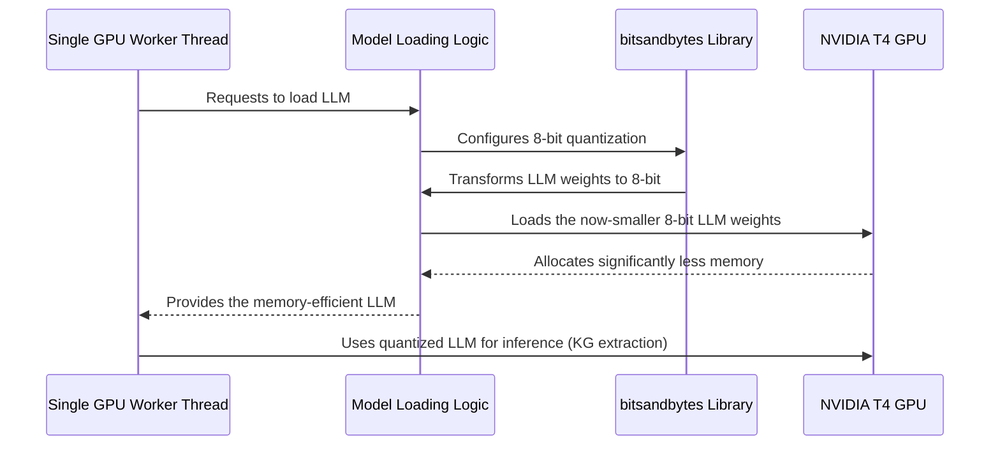

# Chapter 6: Quantized LLM Inference

In the [previous chapter](05_single_gpu_worker_thread_.md), we learned how the **Single GPU Worker Thread** acts as a crucial manager, ensuring our powerful GPU processes knowledge graph extraction jobs one by one, preventing crashes and instability. But even with a perfect manager, what if the "machine" itself—our Large Language Model (LLM)—is just too big to fit in the GPU's memory in the first place?

### What Problem Does Quantized LLM Inference Solve?

Imagine you have a beautiful, incredibly high-resolution photograph (our powerful LLM), but your computer's hard drive (your GPU's memory) is quite small. If you try to save the original, massive photo, your computer will likely run out of space and crash! You won't be able to view or edit the photo at all.

This is exactly the challenge we face with Large Language Models (LLMs) and common GPUs like the NVIDIA T4 found in Google Colab's free tier. LLMs are incredibly powerful, but they are also **massive**. Loading them normally can require 20GB, 40GB, or even hundreds of gigabytes of GPU memory, far exceeding what's available on a typical consumer or cloud-free-tier GPU (which often have 16GB or less). If we try to load such a model directly, our application will immediately stop with an "out of memory" (OOM) error.

**Quantized LLM Inference** solves this critical memory problem. It's like compressing that huge photograph into a smaller, more manageable file (e.g., a JPEG). You can still open, view, and understand the picture, but it takes up far less space. In our `knowledge-graph` project, this technique allows us to load very large LLMs, like `Nemotron-Mini-4B-Instruct` (a 4-billion parameter model), onto GPUs with limited memory, such as an NVIDIA T4, without crashing. This makes advanced LLM capabilities accessible even on resource-constrained hardware.

### Key Concepts of Quantization

Let's break down the main ideas behind this memory-saving superpower:

1.  **Large Language Models (LLMs):** These are complex AI models that have "learned" from vast amounts of text. They consist of billions of numerical "parameters" or "weights" that define their knowledge and reasoning ability. Each of these numbers takes up space.

2.  **GPU Memory (VRAM):** This is the special, very fast memory directly on your Graphics Processing Unit. It's crucial for running LLMs quickly. However, it's a limited resource, and larger models simply won't fit if they exceed this limit.

3.  **Numerical Precision:**
    *   Computers store numbers with a certain "precision." Traditionally, LLMs are loaded using 32-bit floating-point numbers (`float32`). Think of this as using a very detailed ruler with many decimal places (e.g., 3.14159265). Each `float32` number takes up 4 bytes of memory.
    *   Even 16-bit floating-point numbers (`float16`), or "half-precision," are common, taking up 2 bytes.

4.  **Quantization (specifically 8-bit):**
    *   This is the technique of reducing the precision of the numbers (weights) in the LLM. Instead of using `float32` (4 bytes) or `float16` (2 bytes), we convert them to 8-bit integers (`int8`).
    *   An `int8` number only takes up **1 byte** of memory!
    *   By converting most of the LLM's parameters to `int8`, we can reduce the model's memory footprint by up to 75% compared to `float32` models, making it much smaller and allowing it to fit into limited GPU memory. It's like simplifying that detailed ruler to just whole numbers (e.g., 3, 4, 5).

5.  **The Trade-off:** While 8-bit quantization dramatically saves memory, there's usually a very slight reduction in the model's accuracy or a minor impact on inference speed. For practical purposes like knowledge graph extraction, this trade-off is often well worth it because the alternative is not being able to run the model at all.

### How to Use Quantized LLM Inference

From a user's perspective, the great news is that you **don't have to do anything special** to use quantized LLM inference! Our `gpu-app.py` application is specifically designed to automatically load LLMs in this memory-efficient 8-bit format.

When you follow the instructions from [Chapter 1: Flask Web Interface](01_flask_web_interface_.md) and run `python gpu-app.py` (especially in Google Colab), the system implicitly uses quantization:

```bash
python gpu-app.py
```

The application will automatically attempt to load the `nvidia/Nemotron-Mini-4B-Instruct` model (or a fallback model) using 8-bit quantization. This is why you can process documents and build knowledge graphs with powerful LLMs, even on a modest NVIDIA T4 GPU. The system handles the complex memory management behind the scenes, allowing you to focus on the results.

### How Quantized LLM Inference Works Under the Hood

When the [Single GPU Worker Thread](05_single_gpu_worker_thread_.md) needs to load an LLM, it doesn't just ask for the full, massive model. Instead, it instructs the `transformers` library (with help from the `bitsandbytes` library) to perform quantization during the loading process.

#### The Quantization Journey (High-Level Sequence)



In this sequence, the **Single GPU Worker Thread** initiates the LLM loading. The **Model Loading Logic** (from the `transformers` library) receives instructions to apply quantization. It then uses the `bitsandbytes` **Quantization Library** to convert the LLM's huge parameters into a compact 8-bit format *before* sending them to the **GPU**. This significantly reduces the memory footprint on the GPU, allowing the model to fit.

#### Diving into the Code (Simplified `gpu-app.py` examples)

Let's look at the `load_model_safe` function within `gpu-app.py`. This is where the magic of quantization happens.

1.  **Importing Quantization Tools:**
    First, we need the right tools from the `transformers` library, especially `BitsAndBytesConfig`, which helps us define our quantization strategy.

    ```python
    # From gpu-app.py (simplified)
    from transformers import AutoTokenizer, AutoModelForCausalLM, BitsAndBytesConfig
    import torch # For GPU operations
    # ... other imports ...
    ```
    `BitsAndBytesConfig` is the configuration object that tells the model loading function how to quantize.

2.  **Configuring and Loading the Quantized Model:**
    Inside the `load_model_safe` function, we create a `BitsAndBytesConfig` object and then pass it to the `AutoModelForCausalLM.from_pretrained` function.

    ```python
    # From gpu-app.py (simplified)
    # ... inside gpu_worker_loop or load_model_safe ...
    from transformers import BitsAndBytesConfig

    # 1. Define our quantization strategy: load in 8-bit
    bnb_config = BitsAndBytesConfig(load_in_8bit=True) 

    # 2. Load the model using this configuration
    #    The 'model_name' is something like "nvidia/Nemotron-Mini-4B-Instruct"
    model = AutoModelForCausalLM.from_pretrained(
        model_name,
        quantization_config=bnb_config,  # <-- This is the instruction for 8-bit loading!
        device_map="auto",               # <-- Automatically distributes model parts across available GPU memory
        torch_dtype=torch.float16,       # <-- Uses half-precision for any parts not 8-bit quantized, further saving memory
        low_cpu_mem_usage=True,          # <-- Helps reduce RAM usage during loading
        trust_remote_code=True
    )
    # ... model.eval() ...
    return tokenizer, model, model_name # Return the loaded, quantized model
    ```
    The `BitsAndBytesConfig(load_in_8bit=True)` line is crucial; it instructs the `transformers` library to use the `bitsandbytes` library to convert the model's weights to 8-bit integers during loading. `device_map="auto"` then intelligently places different parts of this now-smaller model onto the GPU. Finally, `torch_dtype=torch.float16` ensures that any remaining parts of the model (or computations) use half-precision floating-point numbers, further optimizing memory usage.

This robust and memory-efficient loading strategy is foundational to running large LLMs on the constrained hardware available in environments like Google Colab, directly enabling the powerful [GPU-First KG Pipeline](03_gpu_first_kg_pipeline_.md).

### Conclusion

You've now uncovered the secret behind running massive AI models on smaller GPUs! **Quantized LLM Inference** is a vital technique that compresses the memory footprint of Large Language Models, allowing our `knowledge-graph` project to leverage powerful LLMs for knowledge extraction without running into "out of memory" errors. By reducing the precision of the model's internal numbers to 8-bit, we make these advanced capabilities accessible and efficient on everyday hardware.

Next, we'll explore the special format that our quantized LLM uses to output the extracted facts, ensuring they are always clean and easy for our system to understand.

[Next Chapter: Token-Oriented Object Notation (TOON)](07_token_oriented_object_notation__toon__.md)

---

Generated by [AI Codebase Knowledge Builder]