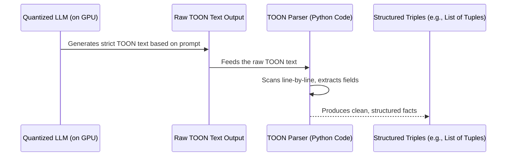

# Chapter 7: Token-Oriented Object Notation (TOON)

In the [previous chapter](06_quantized_llm_inference_.md), we explored how **Quantized LLM Inference** allows us to run powerful Large Language Models (LLMs) on GPUs with limited memory. These LLMs are incredibly smart at reading text and understanding relationships. But there's a catch: LLMs are also *creative* by nature. If you just tell an LLM to "extract facts," it might give you a free-form summary, a JSON object that changes its structure, or even completely "hallucinate" an output format.

This inconsistency is a nightmare for computer programs that need to automatically process the LLM's output. How can our system reliably understand what the LLM is saying if the format changes every time?

This is exactly the problem that **Token-Oriented Object Notation (TOON)** solves!

### What Problem Does Token-Oriented Object Notation (TOON) Solve?

Imagine you're trying to fill out a really important form, but the form keeps changing its layout, adding new sections, or using different labels for the same information every time you look at it. It would be impossible to consistently fill it out or for someone to automatically process your answers!

Our `knowledge-graph` system faces a similar challenge with LLMs. We need the LLM to read a document and consistently tell us facts like:
*   "Alice went to Paris"
*   "Bob met Alice"
*   "The company was founded in 1999"

If the LLM outputs these facts in a different style each time (sometimes as a sentence, sometimes as JSON, sometimes as bullet points), our program won't be able to automatically understand and add them to the knowledge graph.

**TOON solves this problem by providing a super-strict, predictable "fill-in-the-blanks" form for the LLM.** It forces the LLM to output extracted relationships in an exact, line-based text format. This guarantees that the LLM's output is always consistent and incredibly easy for our system to automatically parse and understand, preventing confusing "hallucinations" or unexpected formats.

### Key Concepts of TOON

Let's break down the main ideas behind TOON:

1.  **"Token-Oriented":** This refers to how LLMs process text in small units called "tokens" (which can be words, parts of words, or punctuation). TOON is designed to be very simple and repetitive, making it easy for LLMs to generate token-by-token in a consistent pattern.
2.  **"Object Notation":** It's a structured way to represent data, similar to how programming languages represent objects or records. Each "object" (in our case, a fact or "triple") has specific fields like "source," "predicate," "target," and "confidence."
3.  **Strict, Line-Based Format:** The most crucial rule! Each extracted fact must be on its own line. There are no complex nested structures or varying delimiters like in JSON.
4.  **Predictable Pattern:** Every line follows the exact same pattern: `TRIPLE source:"<entity1>" predicate:"<relation>" target:"<entity2>" confidence:<float>`. This is like having a template that never changes.

### How to "Use" TOON (from an LLM's Perspective)

As a user, you don't directly "use" TOON. Instead, our system "forces" the LLM to use it by giving it a very specific instruction, called a **prompt template**. This template guides the LLM to generate its output in the TOON format.

For example, if the LLM processes text like "Alice went to Paris. Bob met Alice in London," it's trained to give us output like this:

```
TRIPLE source:"Alice" predicate:"went to" target:"Paris" confidence:0.95
TRIPLE source:"Bob" predicate:"met" target:"Alice" confidence:0.88
```

Notice how each fact is on its own line and follows the `TRIPLE source:"..." predicate:"..." target:"..." confidence:...` pattern exactly. This is TOON in action!

### How TOON Works Under the Hood

When you upload a document through our [Flask Web Interface](01_flask_web_interface_.md) and the [GPU-First KG Pipeline](03_gpu_first_kg_pipeline_.md) starts, the [Quantized LLM Inference](06_quantized_llm_inference_.md) component first breaks your document into chunks. Then, for each chunk, it does the following:

#### The TOON Journey (High-Level Sequence)



In this sequence:
*   The **Quantized LLM** reads the text and generates its output following the TOON rules.
*   This output is initially just a block of **Raw TOON Text**.
*   Our custom **TOON Parser** (a piece of Python code) then reads this raw text.
*   The parser goes line by line, strictly extracting the `source`, `predicate`, `target`, and `confidence` values.
*   Finally, it converts these into **Structured Triples** (like a list of `(source, predicate, target, confidence)` tuples) that the rest of our system can easily work with.

#### Diving into the Code (Simplified `gpu-app.py` Examples)

Let's look at the crucial parts of `gpu-app.py` that implement TOON.

1.  **The Prompt Template:** This is the direct instruction our LLM receives.

    ```python
    # gpu-app.py (simplified)
    PROMPT_TEMPLATE = """Extract factual triples from the input. Output using TOON lines only.
    Each triple must be on its own line like:
    TRIPLE source:"<entity1>" predicate:"<relation>" target:"<entity2>" confidence:<float>
    Return ONLY TRIPLE lines. No commentary.

    Input:
    ---
    {text}
    ---
    """
    ```
    This `PROMPT_TEMPLATE` is the "strict fill-in-the-blanks form" we give to the LLM. It's carefully crafted to be unambiguous, leaving no room for the LLM to deviate from the required `TRIPLE source:"..." predicate:"..." target:"..." confidence:...` format. It even says "Return ONLY TRIPLE lines. No commentary." to ensure we get *just* the data.

2.  **Parsing the TOON Output:** After the LLM generates the text, we need a way to read it and turn it into usable data. This is done by the `parse_toon_block` function.

    ```python
    # gpu-app.py (simplified)
    import re # The 're' module helps us find patterns in text

    # Pattern to find a whole TRIPLE line
    _TRIPLE_LINE_RE = re.compile(r'^\s*TRIPLE\s+(.*)$', re.IGNORECASE)
    # Pattern to find key:"value" or key:value pairs inside the line
    _KEY_VAL_RE = re.compile(r'(\w+)\s*:\s*"([^"]+)"|(\w+)\s*:\s*([\S]+)')

    def parse_toon_block(text: str) -> list:
        triples = []
        for line in text.splitlines(): # Go through each line of the LLM's output
            m_line = _TRIPLE_LINE_RE.match(line)
            if not m_line: # If the line doesn't start with "TRIPLE", skip it
                continue
            
            data = {}
            # Find all key-value pairs in the rest of the line (e.g., 'source:"Alice"')
            for m_kv in _KEY_VAL_RE.finditer(m_line.group(1)):
                if m_kv.group(1): # This matches 'key:"value"' (quoted text)
                    key = m_kv.group(1).lower() # Convert key to lowercase
                    value = m_kv.group(2)
                else: # This matches 'key:value' (like confidence:0.91)
                    key = m_kv.group(3).lower()
                    value = m_kv.group(4)
                data[key] = value # Store the key and value in a dictionary
            
            # Extract the actual source, predicate, target, and confidence
            source = data.get("source", "").strip()
            predicate = data.get("predicate", "").strip()
            target = data.get("target", "").strip()
            try:
                confidence = float(data.get("confidence", "1.0")) # Convert confidence to a number
            except ValueError:
                confidence = 1.0 # Default if it's not a valid number
            
            # Only add the triple if all main parts are present
            if source and predicate and target:
                triples.append((source, predicate, target, confidence))
        return triples
    ```
    This `parse_toon_block` function is our "robot data entry clerk." It iterates through each line generated by the LLM.
    *   It first checks if a line begins with `TRIPLE`. If not, it skips that line (ignoring any commentary the LLM might accidentally add).
    *   Then, using regular expressions (`_KEY_VAL_RE`), it smartly extracts the `source`, `predicate`, `target`, and `confidence` fields, handling both quoted and unquoted values.
    *   It converts the `confidence` to a proper number and then stores each complete triple as a tuple in a list. This list of structured tuples is the clean data output, ready for the next stages of processing in our [GPU-First KG Pipeline](03_gpu_first_kg_pipeline_.md).

### Conclusion

**Token-Oriented Object Notation (TOON)** is a powerful concept that brings consistency and reliability to LLM-based knowledge extraction. By providing a rigid, line-based format for the LLM's output, it eliminates ambiguity and allows our `knowledge-graph` system to reliably parse and understand every extracted fact. This is crucial for building a robust and trustworthy knowledge graph, as it transforms the LLM's raw creativity into precisely structured data.

Next, we'll see what happens to these neatly parsed and structured triples – how they are efficiently combined and counted directly on the GPU to prepare for the final graph visualization.

[Next Chapter: GPU-side Triple Aggregation](08_gpu_side_triple_aggregation_.md)

---

Generated by [AI Codebase Knowledge Builder]