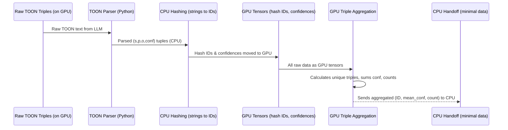

# Chapter 8: GPU-side Triple Aggregation

In the [previous chapter](07_token_oriented_object_notation__toon__.md), we learned how **Token-Oriented Object Notation (TOON)** ensures that our Large Language Model (LLM) consistently outputs clean, structured facts (triples) like `TRIPLE source:"Alice" predicate:"went to" target:"Paris" confidence:0.95`. Now that we have these facts, what's next?

The LLM might extract the same fact multiple times, perhaps because it's mentioned in different sentences or paragraphs. For example, "Alice went to Paris" could be found repeatedly. If we just add every single extracted triple to our knowledge graph, it would be redundant and inefficient. We need a way to count these duplicates and get an overall picture for each unique fact.

### What Problem Does GPU-side Triple Aggregation Solve?

Imagine you've sent your document to the LLM for knowledge extraction, and it comes back with hundreds of thousands of individual triples. Many of these might be duplicates, or slightly different mentions of the same core fact. We also have a "confidence score" for each triple, indicating how sure the LLM is about that fact.

We need to answer questions like:
*   "How many times was the exact fact 'Alice went to Paris' mentioned?"
*   "What is the average confidence score for the fact 'Alice went to Paris' across all its mentions?"

If we were to transfer all these raw, potentially duplicated triples from the GPU (where the LLM lives) to the slower CPU just to count them up and calculate averages, it would be a huge bottleneck. This transfer of large amounts of data between the GPU and CPU is very slow and can cause delays or even crashes.

**GPU-side Triple Aggregation** solves this problem by acting like an "on-site data sorting and counting center" that operates *entirely within the GPU's fast environment*. It efficiently identifies unique triples, counts their occurrences, and calculates their average confidence scores using the GPU's parallel processing power. Only the final, summarized results (a much smaller dataset) are sent back to the CPU for building the interactive graph, significantly speeding up the entire process.

### Key Concepts of GPU-side Triple Aggregation

Let's break down the main ideas behind this efficient GPU operation:

1.  **GPU (Graphics Processing Unit):** As we learned in [Chapter 3: GPU-First KG Pipeline](03_gpu_first_kg_pipeline_.md), the GPU is excellent at doing many simple calculations at the same time. This makes it perfect for tasks like comparing many triples or adding up many numbers in parallel.

2.  **Hashing Triples:** To quickly identify if two triples are identical, we convert each part of the triple (source, predicate, target) from text into a unique numerical ID, called a "hash." This is much faster for a computer to compare than text strings. Then, we combine these three hash IDs into a single "super-hash" for the entire triple `(source_hash, predicate_hash, target_hash)`.

3.  **Parallel Operations:** The GPU can look at thousands of these super-hashes simultaneously. It quickly finds all the unique super-hashes (representing unique triples) and, at the same time, counts how many times each one appears and sums up their confidence scores.

4.  **Aggregation:** This is the process of taking all the individual mentions of a triple (e.g., three instances of "Alice went to Paris" with different confidence scores) and combining them into one summary: "Alice went to Paris" (appeared 3 times, average confidence 0.92).

5.  **Minimizing CPU-GPU Transfer:** This is the core philosophy. By doing the aggregation directly on the GPU, we avoid sending a massive list of raw, unaggregated triples to the CPU. Instead, only the much smaller list of *unique* aggregated triples is transferred back, saving a lot of time and memory.

### How to Use GPU-side Triple Aggregation

As a user, you **do not directly interact** with GPU-side Triple Aggregation. It's an internal, automatic step within the [GPU-First KG Pipeline](03_gpu_first_kg_pipeline_.md).

When you upload a document to `gpu-app.py` through the [Flask Web Interface](01_flask_web_interface_.md):
1.  The document is processed into chunks.
2.  The [Quantized LLM Inference](06_quantized_llm_inference_.md) extracts raw triples in [Token-Oriented Object Notation (TOON)](07_token_oriented_object_notation__toon__.md).
3.  **Immediately after extraction, these raw triples are fed into the GPU-side Triple Aggregation system.** This happens automatically, on the GPU.
4.  Only after the aggregation is complete, the final, summarized results are passed to the CPU for visualization.

You simply see the final, neatly aggregated knowledge graph, where each displayed relationship reflects the total count and average confidence.

### How GPU-side Triple Aggregation Works Under the Hood

Let's trace what happens to the raw TOON triples once the LLM outputs them:



In this flow, the `TOON Parser` (from [Chapter 7: Token-Oriented Object Notation (TOON)](07_token_oriented_object_notation__toon__.md)) first processes the LLM's raw text output. Then, the real heavy lifting for aggregation begins on the GPU.

#### Diving into the Code (Simplified `gpu-app.py` examples)

Let's look at the crucial parts of `gpu-app.py` that handle this efficient aggregation.

1.  **Hashing Strings to Numbers (CPU):**
    Before we send data to the GPU for aggregation, we convert the text components of each triple (source, predicate, target) into unique numerical "hash IDs" on the CPU. This is much more efficient for the GPU to process. We also keep a map (`hash_to_text`) to remember what each number means for when we display the final graph.

    ```python
    # gpu-app.py (simplified)
    import xxhash # A fast hashing library

    def hash64(s: str) -> int:
        """Converts a string (like 'Alice') into a unique 64-bit number."""
        return xxhash.xxh64(s, seed=0).intdigest()

    # ... inside the gpu_worker_loop, after parsing LLM output ...
    batch_hash_arrays = []
    hash_to_text: Dict[int,str] = {} # This maps hash IDs back to original text

    for s, p, o, conf in triples_from_toon_parser: # From parsed LLM output
        hs = hash64(s) # Convert source string to hash ID
        hr = hash64(p) # Convert predicate string to hash ID
        ho = hash64(o) # Convert target string to hash ID
        
        src_h.append(hs); dst_h.append(ho); rel_h.append(hr); confs.append(float(conf))
        
        # Store the mapping from hash ID back to original text
        hash_to_text.setdefault(hs, s)
        hash_to_text.setdefault(hr, p)
        hash_to_text.setdefault(ho, o)
    batch_hash_arrays.append((src_h, dst_h, rel_h, confs)) # Store for GPU processing
    ```
    Here, each text component of the triple is turned into a unique numerical ID. We collect these hash IDs and their confidence scores. The `hash_to_text` dictionary is vital for converting these numbers back to readable words later.

2.  **Preparing Data for GPU (on GPU):**
    All these lists of hash IDs and confidences from multiple LLM output batches are then combined into large `torch.Tensor` objects, which are special arrays that live directly on the GPU.

    ```python
    # gpu-app.py (simplified - inside aggregate_triples_gpu function)
    import torch # The library for GPU operations

    # Concatenate all lists from different batches into single, large tensors on the GPU
    src_all = torch.cat(src_tensors, dim=0) # e.g., [H_Alice, H_Bob, H_Alice]
    dst_all = torch.cat(dst_tensors, dim=0) # e.g., [H_Paris, H_Alice, H_Paris]
    rel_all = torch.cat(rel_tensors, dim=0) # e.g., [H_went_to, H_met, H_went_to]
    conf_all = torch.cat(conf_tensors, dim=0) # e.g., [0.9, 0.8, 0.95]
    ```
    This step gathers all the individual pieces of numerical data into huge, organized arrays directly on the GPU, setting the stage for very fast processing.

3.  **Aggregating on the GPU (The Core Logic):**
    This is where the GPU's power shines. We create a "composite key" for each triple, which is a single number that uniquely represents the combination of `(source_hash, predicate_hash, target_hash)`. Then, using powerful GPU operations, we efficiently find unique triples, count their occurrences, and sum their confidences.

    ```python
    # gpu-app.py (simplified - inside aggregate_triples_gpu function)

    # 1. Create a single "super-hash" for each (source, predicate, target) combination
    # These constants (1315423911, etc.) are just large numbers for good mixing
    keys = (src_all * 1315423911) ^ (dst_all * 2654435761) ^ (rel_all * 97531)

    # 2. Find all unique super-hashes (i.e., unique triples)
    unique_keys, inv = torch.unique(keys, return_inverse=True)
    num_unique = unique_keys.size(0)

    # 3. Prepare tensors to store summed confidences and counts for each unique triple
    sum_conf = torch.zeros(num_unique, dtype=torch.float32, device=device)
    counts = torch.zeros(num_unique, dtype=torch.int64, device=device)

    # 4. Use GPU's scatter_add to sum confidences and count occurrences in parallel
    sum_conf.scatter_add_(0, inv, conf_all) # Sums all confidences for each unique key
    counts.scatter_add_(0, inv, torch.ones_like(inv, dtype=torch.int64, device=device)) # Counts occurrences

    # 5. Calculate average confidence
    mean_conf = sum_conf / counts.to(torch.float32)
    ```
    In this block, the GPU takes all the individual triple super-hashes, identifies every unique one, and for each unique triple, it quickly adds up all their confidence scores and counts how many times they appeared. Finally, it calculates the average confidence. This all happens very rapidly thanks to the GPU's parallel architecture.

4.  **Minimal CPU Handoff and Final Preparation:**
    Only the final, aggregated results (the unique triple hash IDs, their average confidence, and their counts) are transferred back to the CPU. The CPU then uses the `hash_to_text` dictionary to convert these numerical IDs back into readable words.

    ```python
    # gpu-app.py (simplified - inside gpu_worker_loop, after aggregation)

    # Convert numerical hash IDs back to human-readable text using our hash_to_text map
    rows = []
    for src_h, dst_h, rel_h, mean_conf, count in aggregated_results: # aggregated_results is from GPU
        s = hash_to_text.get(src_h, str(src_h)) # "Alice" instead of numerical ID
        p = hash_to_text.get(rel_h, str(rel_h))
        o = hash_to_text.get(dst_h, str(dst_h))
        rows.append({"source": s, "predicate": p, "target": o, "confidence": mean_conf, "count": count})
    
    # This 'rows' data (now readable and summarized) is then used
    # to build the final interactive graph (as discussed in
    # [Interactive Graph Visualization](02_interactive_graph_visualization_.md)).
    ```
    The CPU now has a clean, summarized list of all unique facts extracted from the document, along with their average confidence and total occurrences. This compact dataset is then used to construct the interactive knowledge graph you see in your browser.

### Conclusion

**GPU-side Triple Aggregation** is a powerful and crucial optimization within our `knowledge-graph` project. By efficiently processing and summarizing raw knowledge triples directly on the GPU, we minimize slow data transfers to the CPU, ensuring that even large documents can be processed quickly and without running into memory issues. This abstraction makes our [GPU-First KG Pipeline](03_gpu_first_kg_pipeline_.md) truly fast and scalable, delivering clean, insightful knowledge graphs to you in record time.

---

Generated by [AI Codebase Knowledge Builder]