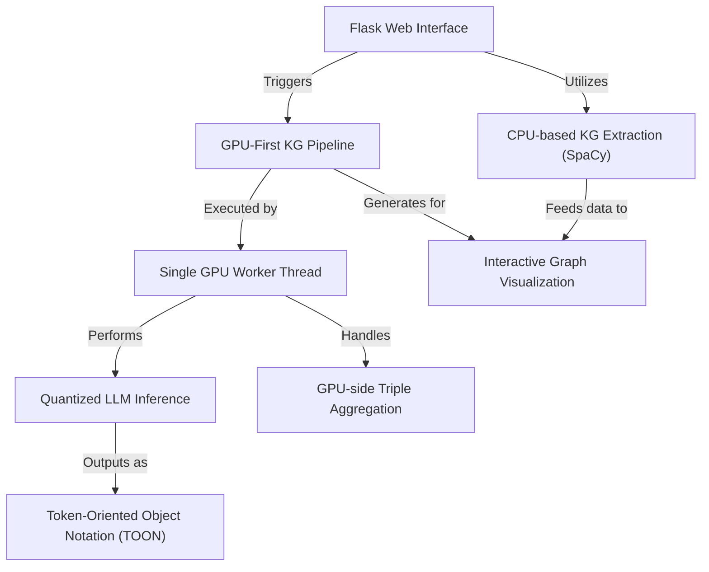

# Tutorial: knowledge-graph

This project is an *experimental, GPU-first system* for building and visualizing **knowledge graphs**. It allows users to upload text documents through a *Flask web interface*, which then processes them using either a simpler **CPU-based extraction** or an advanced **GPU-optimized pipeline**. The GPU pipeline leverages *quantized Large Language Models* (LLMs) to extract relationships in a strict **TOON format**, efficiently aggregating them **GPU-side** within a **single worker thread**. Finally, it generates an **interactive graph visualization** for exploration in the browser.

**Source Repository:** [https://github.com/Dr-Westworld/knowledge-graph](https://github.com/Dr-Westworld/knowledge-graph)

## Chapters

1. [Flask Web Interface
](01_flask_web_interface_.md)
2. [Interactive Graph Visualization
](02_interactive_graph_visualization_.md)
3. [GPU-First KG Pipeline
](03_gpu_first_kg_pipeline_.md)
4. [CPU-based KG Extraction (SpaCy)
](04_cpu_based_kg_extraction__spacy__.md)
5. [Single GPU Worker Thread
](05_single_gpu_worker_thread_.md)
6. [Quantized LLM Inference
](06_quantized_llm_inference_.md)
7. [Token-Oriented Object Notation (TOON)
](07_token_oriented_object_notation__toon__.md)
8. [GPU-side Triple Aggregation
](08_gpu_side_triple_aggregation_.md)

---

Generated by [AI Codebase Knowledge Builder]